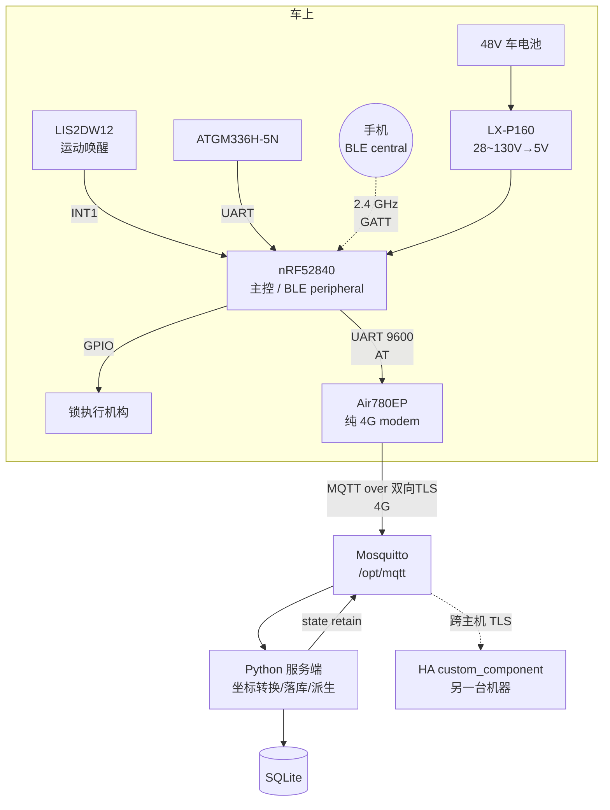

# 电瓶车定位 + 手机 BLE 开锁：技术方案（施工用）

> 状态：2026-09-01 整合定稿，同日补入契约与代码。**这是唯一的施工依据**，
> 面向写代码/焊板子的人：引脚映射、Kconfig、DTS、APDU 报文、AT 序列、分期验收标准。
>
> **同目录下的七份配套文档**：
> - [`HARDWARE.md`](HARDWARE.md) — 给用户看的摘要：买什么、怎么接、要拍板什么
> - [`MQTT-CONTRACT.md`](MQTT-CONTRACT.md) — **契约 v1**，本文 §9.3 那张空白表已由它填满
> - [`SERVER.md`](SERVER.md) — 服务端怎么跑（含 docker）、amqtt 的坑、测试覆盖
> - [`WEB.md`](WEB.md) — 内置网页界面：地图、登录、高德 key、坐标系
> - [`FIRMWARE.md`](FIRMWARE.md) — 固件怎么编、还缺什么
> - [`HA.md`](HA.md) — Home Assistant 集成：装哪、9 个实体、怎么验的
> - [`ADR-004-ble-unlock.md`](ADR-004-ble-unlock.md) — **开锁改 BLE 的决策记录**：AOSP/Zephyr 源码出处、功耗手算、中继攻击评估、留给你拍板的四件事
>
> ⚠ 契约相关的结论以 `MQTT-CONTRACT.md` 为准（它比本文 §9 新）；
> 硬件与功耗结论以本文为准。§11 的状态列已更新。
>
> 此前的 `PLAN.md` / `ADR-001` / `ADR-002` / `ADR-003` 已移入 [`archive/`](archive/)，
> 只作为原始论证的查证出处，见 [`archive/README.md`](archive/README.md)。
> **开锁方式已于 2026-09-02 从手机 NFC 改为手机 BLE，见
> [`ADR-004-ble-unlock.md`](ADR-004-ble-unlock.md)** —— 它取代 ADR-003 的
> §2 / §3.4 / §4.3 / §7.1，以及本文 §2 全节、§3.3、§3.5、§5.1、§5.4。
> 供电、GNSS、运动唤醒、4G 链路、MQTT 契约、服务端与 HA 一个字都没变。
> 本文里 `[未核实]` / `[推断]` 标记保留自原文，含义不变：**没有第一手资料背书的结论，施工前要自己验。**

## §0 一句话方案

nRF52840 做主控，Air780EP 降级成纯 4G AT modem，LIS2DW12 做运动唤醒，
ATGM336H 做定位；48V 车电池经成品降压模块取电，不做备份电芯；
开锁走 **手机 BLE**（nRF52840 当 GATT peripheral、手机当 central），只管安卓（iOS 可做，未做）。

四个「放弃」都是主动取舍，不是遗漏：
放弃读卡器/实体卡、放弃 NFC、放弃备份电芯与硬件欠压保护、放弃「走近自动开锁」。
每一条的理由分别在 §2.1、ADR-004 §0、§4.4、§5.5。

---

## §1 系统架构



角色分工，一句话一个：

| 器件 | 角色 | 为什么是它 |
| --- | --- | --- |
| nRF52840 | 主控 + BLE peripheral + 密码学 | 片上 BLE（不占引脚）+ CryptoCell-310 硬件 HMAC，见 §2.1 §5 |
| Air780EP | 纯 4G modem，跑 AT 固件 | 只负责把字节送上 MQTT，不再跑业务，见 §8 |
| LIS2DW12 | 运动唤醒 | 低功耗且 Zephyr 驱动有 `.trigger_set`，见 §3.7 |
| ATGM336H-5N | GNSS | 支持北斗；NEO-7M 在协议层没有北斗且已 EOL |
| LX-P160 | 48V→5V | 用户已选定的成品模块，见 §3.1 |

---

## §2 手机 BLE 开锁

> 完整的取舍论证、AOSP/Zephyr 源码出处、中继攻击评估在
> [`ADR-004-ble-unlock.md`](ADR-004-ble-unlock.md)。本节只保留施工要用的东西。

### §2.1 链路：谁是 central

设备是 **peripheral**（`CONFIG_BT_PERIPHERAL=y`），**只广播、只等连接，
从不扫描、从不发起连接**；手机是 central，连上来写 APDU。

保持这个方向不是技术限制（BLE 两个方向都行），而是**状态机不用改**：
`unlock.c` 的 `selected` / `nonce_valid` / `cur_nonce` 三个状态原本就是
「等手机发下一条命令」的形状，那是 NFC 时代手机当读卡器留下的。

**报文一字未改** —— 同一套 ISO7816-4 APDU、同一个 HMAC-SHA256 挑战应答（§5.2）、
同一份 `unlock.c` 三重校验。换的只是载体：

| | NFC（旧） | BLE（现） |
| --- | --- | --- |
| 收命令 | `NFC_T4T_EVENT_DATA_IND` 回调 | CMD 特征的 GATT write 回调 |
| 回应答 | `nfc_t4t_response_pdu_send()` | `bt_gatt_notify()` 到 RSP 特征 |
| 会话开始/结束 | `FIELD_ON` / `FIELD_OFF` | `connected` / `disconnected` |
| 门控 | `nfc_t4t_emulation_start/stop()` | `bt_le_adv_start/stop()` |

### §2.2 GATT 表与 Kconfig

| 特征 | UUID 低 16 位 | 属性 | 用途 |
| --- | --- | --- | --- |
| 服务 | `0001` | — | 只放在**扫描响应**里，不放广播包，见 §2.4 |
| CMD | `0002` | `WRITE`（write request） | 手机写整条 C-APDU |
| RSP | `0003` | `NOTIFY`，`BT_GATT_PERM_NONE` | 车回 R-APDU |

UUID 基址 `2c1327ba-a717-4314-827e-92532d7a xxxx`（随机生成的 v4）。

**没有独立的 nonce 读特征。** 直觉上 GET CHALLENGE 更像「客户端拉」，用 read
还能省掉写 CCCD 那一个往返；但 read 回调里生成 nonce 意味着**任何人连上来读一下
就能作废合法用户的 nonce** —— `nonce_valid` 会变成远程可 DoS 的状态位。
所以三步命令全部走 CMD 写，nonce 只在收到合法 GET CHALLENGE 时生成。

```ini
CONFIG_BT=y
CONFIG_BT_PERIPHERAL=y
CONFIG_BT_MAX_CONN=1          # 不只是省资源：§2.5 的无锁论证依赖它
CONFIG_BT_DEVICE_NAME="ebike"
CONFIG_BT_SMP=n               # 见 §5.5：NoInputNoOutput 下 LESC 只能退化成 Just Works
CONFIG_BT_SETTINGS=n          # 不开 SMP 就没有 LTK/IRK 要落盘，别让 BT 碰 counter 那块分区
CONFIG_BT_L2CAP_TX_MTU=40     # 见下面的 MTU 算式
CONFIG_BT_BUF_ACL_RX_SIZE=44
CONFIG_PSA_CRYPTO=y
CONFIG_PSA_WANT_GENERATE_RANDOM=y
CONFIG_PSA_WANT_ALG_HMAC=y
CONFIG_PSA_WANT_ALG_SHA_256=y
CONFIG_PSA_WANT_KEY_TYPE_HMAC=y   # ← 原稿写的 KEY_TYPE_AES 是错的
CONFIG_PSA_CRYPTO_DRIVER_CC3XX=y
CONFIG_SETTINGS=y
CONFIG_SETTINGS_NVS=y
```

### §2.3 MTU 必须调，默认值差得不止一点

- ATT MTU 默认 **23**（`host/att_internal.h:23` 的 `BT_ATT_DEFAULT_LE_MTU`）；
  写请求可写载荷 = ATT_MTU − 3（1 B opcode + 2 B handle）= **20 字节**。
- 最长 C-APDU 是 UNLOCK：`80 10 00 00 Lc [uid(4)||counter(4)||mac(16)] 00` = **30 字节**。
  即使剥掉 ISO7816 外壳只发 24 字节 body 也装不下 20。
- 本地上限 = `MIN(BT_L2CAP_RX_MTU, BT_L2CAP_TX_MTU)`（`att_internal.h:38`），
  其中 `BT_L2CAP_RX_MTU = CONFIG_BT_BUF_ACL_RX_SIZE − 4`（`l2cap.h:47` + `:41`）。
  ⇒ `TX_MTU=40`（40−3=37 ≥ 30 ✓）+ `ACL_RX_SIZE=44`（44−4=40 ≥ 40 ✓）。

**保留整条 APDU 不剥壳**：`unlock_handle_apdu()` 一行都不用改。
那 5 字节 ISO7816 头换来的是「传输层可替换」这个性质本身 ——
这次换传输能只花一个模块的代价，正是因为上一轮把协议定在了 APDU 层。

⚠ 副作用：`ACL_RX_SIZE > 27` 会让 `BT_DATA_LEN_UPDATE` 变 default y，
进而 `BT_CTLR_DATA_LENGTH=y`，SDC 的 per-link 缓冲跟着涨。这是划算的 ——
换掉的是应用层分包逻辑，而分包会让「nonce 一次性」的安全论证被半条报文复杂化。

⚠ **手机侧仍要 `requestMtu()`**：MTU 交换由 central 发起，我们是 server；
`CONFIG_BT_GATT_AUTO_UPDATE_MTU` 只对 GATT client 有效。

### §2.4 广播：只放 Flags，服务 UUID 放扫描响应

广播包（AD）只放 `BT_DATA_FLAGS`，服务 UUID 放**扫描响应**（SD）。
理由是防盗产品不该对着街上广播「我是一台可以被 BLE 开锁的车」；
而安卓的 BLE 扫描是主动扫描（发 SCAN_REQ），`ScanRecord` 由广播包与扫描响应
**合并**而成，所以 `ScanFilter.setServiceUuid()` 仍然匹配得到 ——
被动嗅探只看到一个裸 Flags。

广播间隔取 **100~150 ms**（`BT_GAP_ADV_FAST_INT_MIN_2`/`MAX_2`），
`BT_LE_ADV_OPT_CONN`（Zephyr < 4.0 是 `CONNECTABLE|ONE_TIME`）——
连上就停广播、不自动恢复，恢复由 `recycled` 回调按状态机决定。

**静止 5 分钟后关广播的理由是防跟踪，不是省电。** 广播 100~150 ms 间隔约
**130 µA**、1 s 间隔约 **16 µA**（ADR-004 §3.1 的手算，`[未核实]`），
都远低于它取代的 NFCT ACTIVATED（**400 µA**），也完全淹没在 4G 模组
500~1500 µA 的功耗地板下（§4.1b）。折到 48V 20Ah 车电池是 0.0013 %/天。
改动机的时候别把这条推理丢掉 —— 否则会有人为了「省电」把间隔调到 2 s，
白白牺牲发现时延。

### §2.5 写回调不能跑密码学：必须 defer

GATT 写回调**同步跑在协议栈自己的协作式工作队列线程 `"BT RX WQ"` 上**
（`host/att.c:2145-2147` 直接调 `attr->write(...)`；队列在
`host/hci_core.c:124-156`，`BT_RX_PRIO` 默认 8）。官方指导逐字：
*"Keep callbacks short, and defer work that is long-running or blocks indefinitely
to an application-owned thread or work queue."*

所以 `on_cmd_write()` **只 `memcpy` + `k_work_submit_to_queue()`**，
`unlock_handle_apdu()` 跑在 `ble_unlock.c` 自有的 work queue 上。三条理由：

1. **DoS**：攻击者可以无限灌 UNLOCK 写请求，每条都要一次 CC310 HMAC；
   不 defer 就会拖垮同队列上的所有 BT 处理（含连接维持）。
   **这是 NFC 侧不存在的攻击面**（NFC 得贴上来），而且**未认证可达**（§5.5）。
2. **不用 system workqueue**：nvstore 的 counter 延迟落盘挂在那上面，
   而 flash 写被 `SOC_FLASH_NRF_RADIO_SYNC_MPSL` 排到 MPSL timeslot 之后。
   别让开锁应答排在一次擦写后面。
3. 分离之后写回调可以立刻 `return len`（Write Response 秒回），应答走 notify 天然异步。

**并发不变量（改代码前必读）**：`unlock.c` 的 `cur_nonce`/`nonce_valid`/`selected`
是无锁静态状态。它们安全的**唯一**理由是「所有访问都只发生在 `unlock_workq`
那一个线程里」。所以连 `unlock_session_reset()` 这种看着无害的调用**也走同一个队列**
（`ble_unlock.c` 的 `session_reset()`）—— 连接/断开回调在 BT RX WQ 上、
静止关广播在 uplink 线程上，直接调就是在第二、第三个线程上写同一批变量。
延迟几毫秒作废 nonce 没有安全影响（nonce 本来就用过即废）。

`CONFIG_BT_MAX_CONN` 一旦 > 1，这个论证失效（会有两条并发 APDU 流），必须补锁。

`on_cmd_write()` 里的 `busy` 原子标志同理不是防御性代码：写回调立刻返回、应答异步，
手机完全可以在上一条还在算的时候发下一条（ATT 只保证「一请求一响应」，
不保证我们处理完了），没有它第二条写会踩掉正在处理的缓冲。

### §2.6 安卓侧：两道门都没有，但有位置权限的账要算

**NFC 时代的两道门（息屏/锁屏不发场、App 必须前台）在 BLE 上一条都没有** ——
`GattService.java` 里 grep `Keyguard|isInteractive|isScreenOn|PowerManager` 零匹配，
`ScanManager` 的屏幕状态只用于降频。⇒ **锁屏、息屏下 GATT 连接与读写都能做。**
开锁步数从 4 步（亮屏 → 解锁 → 开 App → 贴车）降到 **2 步**（亮屏 → 点开锁）。

代价在权限上，版本边界卡得很干净：

| | Android 12+（API 31） | Android 11 及以下 |
| --- | --- | --- |
| 权限 | `BLUETOOTH_SCAN` + `BLUETOOTH_CONNECT` | + **`ACCESS_FINE_LOCATION`** |
| 加 `neverForLocation` 后免位置 | ✅ | ❌ 源码层面没有这个分支 |
| 系统定位开关必须开 | ❌ 不依赖 | ✅ **必须开** |

**主连接路径按 MAC 直连，绕开上面全部**：`getRemoteDevice(String)` 标着
`@RequiresNoPermission`，之后 `connectGatt()` 只要 `BLUETOOTH_CONNECT` ——
不需要 `BLUETOOTH_SCAN`、不需要位置权限、不需要定位开关、不需要亮屏解锁。
扫描只在**首次配对**用一次，且**必须带 `ScanFilter`**（无过滤扫描在息屏或
定位关闭时会被静默挂起，App 收不到任何回调）。

App 侧三个必须写对的地方（出处见 ADR-004 §2.5）：`onServicesDiscovered` 之前不能读写；
同时只能有一个 GATT 操作在飞（`mDeviceBusy` 是框架硬锁，必须自己做串行队列）；
每个 `BluetoothGatt` 用完 `close()`（32 client/app 上限，超限只有一条 `Log.w`）。

### §2.7 运动唤醒是唯一的外部唤醒源

**BLE 唤不醒设备**：radio 在 System OFF 下断电，手机连不上一台已关机的车。
所以 **LIS2DW12 的运动中断（§3.7）是唯一的外部唤醒源**，
BLE 广播只在设备已经因为运动或定时器而醒着时才存在。

这一条和 NFC 时代的结论形状相同（那时是「NFC 场唤醒虽然存在但不划算」），
但原因不同：NFC 是**不划算**（SENSE 只 +0.10 µA，但 ACTIVATED 要 400 µA），
BLE 是**根本不可能**。

进 System OFF 之前要 `ble_unlock_shutdown()`（停广播 + `bt_disable()`），
且**必须在 `nvstore_flush()` 之前** —— radio 是 EasyDMA master，
而 `SOC_FLASH_NRF_RADIO_SYNC_MPSL` 会让 flash 写等 MPSL timeslot，
radio 开着时那次 flush 的最坏延迟不可控。见 `main.c` 的 `enter_system_off()` 第 1 步。

---

## §3 硬件

### §3.1 供电前端：从 48V 车电池取电

```
PACK+ (58.8V worst) → [F1 保险丝 250~500 mA，耐压 ≥100 V DC]
                    → [Q1 P-MOS 理想二极管 + 栅源齐纳]
                    → [D1 SMBJ58A 到 PACK-]
                    → [U1 LX-P160 模块] → 5V → 开发板 VBAT 焊盘
```

四个器件各自的理由：

- **F1 保险丝**必须选**直流耐压 ≥100 V** 的型号。常见的 250 V AC 保险丝直流分断能力远低于标称，
  48V 系统的最坏情况（充满 58.8 V + 充电器纹波）不能拿交流参数糊过去。
- **Q1 P 沟道 MOSFET 理想二极管**做反接保护，**不要用串联肖特基**。
  ADR-001 的板子上就吃过这个亏：一颗本该是肖特基的位置装了硅二极管，
  反向漏流从 4 µA 变成 60 µA——在一个 µA 级预算里这是致命的。P-MOS 方案压降和漏流都可以忽略。
- **D1 SMBJ58A** TVS，钳位 93.6 V，低于 LX-P160 的 130 V 输入上限，留出了余量。
- **U1 LX-P160**：用户已选定的成品模块，28~130 V 输入，输出固定 5 V。
  这替换掉了 ADR-002 定的 LM5164 分立方案，功耗预算因此重建（§4）。

另有一条容易漏的：**铝电解电容的漏流按 `0.01CV` 估**。在这个预算里，
一颗大电解的漏流可以和整机静态电流同一量级，选型时要算进去。

### §3.2 5V 怎么灌进开发板

灌到 **VBAT 焊盘**，不是 VBUS。原因牵扯到开发板上的电源路径（§3.4）：
VBUS 进 TP4054 充电 IC，而本方案没有电芯，走 VBUS 会让充电 IC 一直在一个没有电池的回路里工作。
VBAT 直接汇入 VDDH 前的理想二极管节点，是本方案唯一正确的注入点。

⚠ **更不能灌 VCC / EXTVCC。** 这两块板都是 nRF52840 由 **VDDH** 供电、
LDO 挂在 VDDH 下游当外设轨，joric 的 nRFMicro wiki 对这一类板子直接写
`VCC pin: output-only`，以及 `RAW (4.2 V charger) and VCC (3.3 V output) are the separate circuits`。
**往 VCC/EXTVCC 灌电什么都没供上，只是在反灌一个 LDO 的输出。必须灌 VBAT / RAW / BATTERY+。**

**nRF52840 的 VDDH 绝对最大值 5.5 V `[未核实-原厂]`**。5 V 注入只剩 0.5 V 余量，
LX-P160 的输出精度与瞬态过冲都吃在这 0.5 V 里。**这条建议在采购后用示波器实测确认。**

### §3.3 2.4 GHz 天线：板载，什么都不用做

**BLE 用板载天线，无需任何射频工作。** 这一节原本是「NFC 环形天线」，
整节随 ADR-004 作废，因为它要求的东西全部消失了：

| 原本要做的 | 现在 |
| --- | --- |
| 绕 13.56 MHz 环形天线或买成品天线板 | 不需要，板载 2.4 GHz 天线已调好 |
| 用 VNA / 示波器收敛两颗调谐电容（**方案给不出定值**） | 不需要 |
| 写 `UICR.NFCPINS.PROTECT`（**一次性写入**，只能靠 `--recover` 改回，
  而 `--recover` 会连带擦掉 `REGOUT0`，见 §3.4） | **不需要，这个不可逆动作整个消失** |
| 采购 NFC 天线 + 电容（§7.2） | 从 BOM 里删掉 |
| 外壳上「NFC 天线贴在你希望手机去碰的那一面」 | 不再是约束 |

⇒ **P0.09/P0.10 回到通用 GPIO 池，引脚余量从 19 变成 21**（§3.5）。
本工程不把 uart0 挪回那两个脚 —— 已核过的引脚分配没有理由再动一次，
它们现在是余量（overlay 文件头有同样的说明）。

仍然有效的一条外壳约束：**非金属外壳**。原因从「金属挡 13.56 MHz」变成
「金属挡 2.4 GHz 和 GNSS」，结论不变。

### §3.4 开发板逐项核实（nRF52840 ProMicro 克隆板）

用的是国产 nice!nano 兼容克隆板，**不是原厂 DK**。逐项核实的结论：

**J3 排针的引脚顺序**（逆向工程 KiCad 工程 `sasodoma/nrf52840-promicro`：
头两个焊盘由 `promicro.kicad_pcb` 的 net65→J3 pad1、net61→J3 pad2 确认，
完整 13 个焊盘的顺序是通读 netlist 数出来的）：

```
P0.09 → P0.10 → P1.11 → P1.13 → P1.15 → P0.02 → P0.29 → P0.31 → EXTVCC → RESET → GND → VBAT → VBAT
```

**末尾两个 VBAT 焊盘接的是同一个网络**（`promicro.kicad_sch` 里 y=172.72 与 y=175.26
两段导线落在同一个 VBAT 电源符号上），5 V 灌哪一个都一样。

**背面 SWD 焊盘的丝印是 `CLK` / `DIO`**（实物核对）。`CLK` = SWCLK，`DIO` = SWDIO。
归档的 `ADR-001 §5.3` 把它们写成 `SWC` / `SWD`，**以这里为准**。
J-Link 另外两根线，若背面没有一并引出就从 J3 取：**GND = 第 11 个焊盘、
VTref = 第 9 个焊盘（EXTVCC，板载 LDO 的 3.3 V 输出）**。
`RESET` 是第 10 个焊盘，和 GND 相邻 —— 既是「镊子双击短接进 UF2 bootloader」
的那两个点，也是要做 connect-under-reset 时接 J-Link nRESET 的地方
（`nrfjprog --recover` 本身不需要它）。

⚠ **VTref 不要接 VBAT。** 它只是电平参考、不给板子供电，而 VBAT 在装车时是 5 V，
SWD 引脚是 3.3 V 域（§3.2）。另外将来若真按本节的省电建议开机拉低 P0.13 关掉
ME6217，EXTVCC 会掉到 0 V —— 那时调试要么保留 LDO，要么在 J-Link 侧固定 3.3 V 电平。

**板上电源拓扑**：

```
VBUS → TP4054 VCC；TP4054 BAT → VBAT
VBAT + VBUS ──[NPQ2 P-FET + NBD1 BAT60B "W5" + NPR7]──→ VDDH
VDDH → ME6217C33 VIN；ME6217 CE ← POWER_PIN = P0.13；ME6217 VOUT → EXTVCC
```

**必须处理的三件事**：

1. **UICR 是否被前一任固件改过**。本方案**不用 NFC 引脚**（ADR-004），所以
   `UICR.NFCPINS` 不需要写；但二手板或刷过其它固件的板子可能已经被改过，
   那会让 P0.09/P0.10 不是普通 GPIO。开机前先读一眼，必要时恢复：
   ```
   nrfjprog -f NRF52 --memrd 0x1000120C     # 读 UICR.NFCPINS 确认现状
   nrfjprog -f NRF52 --recover              # 只在确实被改过时才需要
   nrfjprog -f NRF52 --program nice_nano_bootloader-0.6.0_s140_6.1.1.hex --chiperase
   ```
   **一旦做了 `--recover`，重刷 bootloader 不是可选步骤**：板子依赖
   `UICR_REGOUT0_VALUE = UICR_REGOUT0_VOUT_3V3`，`--recover` 擦掉 UICR 后
   REGOUT0 回落到 1.8 V，不重刷就起不来。
   **手上这块板子已经实测过了（2026-09-04，见下）：NFCPINS 已开放、REGOUT0 已经是
   3.3 V → 不需要 `--recover`，也不要做。**
2. **pinctrl 冲突**。ZMK 的 `spi1_default` 把 MOSI 放在 **P0.10**，
   上游 `promicro_nrf52840-pinctrl.dtsi` 的 uart0 是 **TX=P0.09 / RX=P0.10**。
   本方案的 overlay 已经把 uart0 挪到 P0.06/P0.08 并关掉 spi1，
   那两个脚留作余量（见 §3.5）。
3. **睡眠电流是个抽奖**。同款克隆板已知的几个坑：ME6211C33 静态 60 µA；
   `POWER_PIN` 的 R4 实测过 0.42 µA / 7~8 µA / ~750 µA 三种结果；
   D1 装成硅二极管而非肖特基 → +56 µA；R10-R11 未贴。
   **拿到板子第一件事是测静态电流，不要相信任何标称值。**
   （**2026-09-04 仍未测** —— 那次上机只做了 SWD 通路与芯片体检。）

**2026-09-04 首次上机实测（J-Link SWD）**

四线接法（背面 `CLK` / `DIO`，加 J3 第 11 焊盘 GND、第 9 焊盘 EXTVCC 作 VTref）
**实测可用**，读 flash / UICR / 内核寄存器全程无错。顺带把 J3 的第 9、第 11 两个焊盘
从「netlist 数出来的」升级成实测确认（VTref 读到 3.300 V、链路稳定）；
其余 11 个焊盘的顺序仍然只有 netlist 依据。

| 项 | 实测值 | 结论 |
| --- | --- | --- |
| 探针 | `VID_1366&PID_0101`；`J-Link ARM-OB STM32 compiled Aug 22 2012`；HW V7.00；S/N 报 `-1` | 山寨 OB。时钟只能取 `16 MHz/n, n≥4` → **上限 4000 kHz**，填 8000 会被静默降回 4000 |
| `VTref` | 3.300 V | 板载 ME6217 的 3.3 V 输出正常 |
| SW-DP / AHB-AP / CPUID | `0x2BA01477` / `0x24770011` / `0x410FC241` | Cortex-M4 r0p1，**是真 nRF52840** |
| `FICR.INFO.PART` / `VARIANT` / `PACKAGE` | `0x00052840` / `"AAC0"` / `0x2004` | nRF52840 QIAA、AAC0 批次，不是翻新片 |
| `FICR.INFO.RAM` / `FLASH` | `0x100` / `0x400` | 256 KB RAM / 1024 KB flash，足量 |
| `UICR.NFCPINS` `0x1000120C` | `0xFFFFFFFE` | 前一任固件已把 NFC 保护关掉，**P0.09/P0.10 已经是普通 GPIO** |
| `UICR.REGOUT0` `0x10001304` | `0xFFFFFFFD`（VOUT = 0b101） | **已经是 3.3 V 档**，不用写 |
| `UICR.APPROTECT` `0x10001208` | `0xFFFFFFFF` | 未锁，SWD 可自由访问（§11 #14） |
| `UICR.PSELRESET[0]/[1]` | 两份都是 `0x00000012` | 硬件复位脚是 **P0.18** |
| `UICR.NRFFW[0]/[1]` | `0x000F4000` / `0x000FE000` | bootloader 起始 + MBR 参数页，和下面那张 flash 布局对得上 |
| `FICR.DEVICEID` | `8ED4F884 C77A8827` | 记下来，将来认板子用 |

**flash 现状**：`0xF4000` 是 `UF2 Bootloader 0.6.0` / `Board-ID: nRF52840-nicenano` /
`Model: nice!nano`，配 S140 6.1.1 —— **正好是本工程要求的那一版，不用换**。
`0x26000` 的 app 是 Adafruit Arduino 环境残留（`Feather nRF52840 Express`、
`Adafruit_LittleFS`、`/adafruit/bond_prph`），刷我们的 UF2 直接覆盖即可。
`0xEC000` storage 区与 `0xFE000` 全 `FF`。

⚠ **J-Link Commander 的 `testwspeed` / `testcspeed` 在这块板子上禁用**，`erase` 同理。
`testwspeed` 默认往 `0x00000000` 写 128 KB 递增图案，**会擦掉 MBR + SoftDevice**。
这次已经踩过一次：`0x0–0x20000` 被覆盖，事后用官方
`nice_nano_bootloader-0.6.0_s140_6.1.1.hex` 回刷 + `verifybin` 才恢复
（未被触及的 `0x20000–0x25DE7` 与 release 镜像 **0 字节差异**，证明板上原本就是这个镜像；
app 区与 bootloader 区刷前刷后 SHA256 一致）。只读探测用 `mem32` / `savebin`，
写 flash 用 `loadbin` + `verifybin` 并显式给地址范围。操作细节见
[`FIRMWARE.md`](FIRMWARE.md) §2b。

**这次没验的**：静态电流（上面第 3 条，也是 R1 的主项）、RTT 日志通路
（当前 flash 里的 Adafruit 残留固件不产生 RTT 输出，见 [`FIRMWARE.md`](FIRMWARE.md) §2b）。

**工具链**（已核实）：board target `promicro_nrf52840/nrf52840/uf2`，
`CONFIG_USE_DT_CODE_PARTITION=y`，`CONFIG_BUILD_OUTPUT_UF2=y`，UF2 family `0xADA52840`。
Flash 布局：SoftDevice `0x0–0x26000` / app `0x26000 + 0xC6000` / storage `0xEC000 + 0x8000` /
bootloader `0xF4000 + 0xC000`。**不要用 MCUboot**——会和板子自带的 Adafruit bootloader 打架。

### §3.5 GPIO 分配

**先看这条**：SoC 有 48 个 GPIO，**这块板只把 21 个引到排针**，其余的
只到芯片焊盘、板上哪儿都不通。而 devicetree 只知道 SoC 有没有这个脚，
**填一个没引出的脚 `west build` 照过** —— 2026-09-04 对着
`sasodoma/nrf52840-promicro` 的 netlist 逐脚复核时，overlay 里抓到三个
这样的脚（见下面「踩过的坑」）。引出脚白名单：

```
J2 十个：P0.06 P0.08 P0.17 P0.20 P0.22 P0.24 P1.00 P0.11 P1.04 P1.06
J3 八个：P0.09 P0.10 P1.11 P1.13 P1.15 P0.02 P0.29 P0.31
J4 三个：P1.01 P1.02 P1.07
```

板内占用、不引出：**P0.00/P0.01**（Y2 晶振）、**P0.13**（ME6217 CE，§3.4
的省电建议要拉低它）、**P0.15**（板载蓝 LED）。J3 第 10 个焊盘是 RESET
（`UICR.PSELRESET` 实测 = P0.18，§3.4），不能当 GPIO。

**实际分配**（脚号取自编译产物 `zephyr.dts`，不是从 overlay 源码读的）：

| 功能 | 引脚 | 焊盘 | 备注 |
| --- | --- | --- | --- |
| GNSS UART TX/RX | P0.06 / P0.08 | J2.2 / J2.3 | ATGM336H，9600 |
| Air780EP UART TX/RX | P0.17 / P0.20 | J2.6 / J2.7 | 9600 baud 锁死，见 §8 |
| I2C（LIS2DW12）SCL/SDA | P0.22 / P0.24 | J2.8 / J2.9 | TWIM0，地址 0x19 |
| Air780EP MAIN_RI | **P1.01** | J4.1 | 直连（AGPIO4 在 LDO_AON 域，PIN100 接地后 3.3 V），低有效 120 ms 脉冲，内部上拉 |
| Air780EP MAIN_DTR | **P1.02** | J4.2 | 开漏只拉低（AGPIOWU2 单脚驱动仅 30 µA），唤醒/退出 PSM+ |
| GNSS 电源门控 | P0.11 | J2.11 | 驱动一个开关管，**具体型号方案未给** |
| 电池分压门控 | **P0.10** | J3.2 | 与 ADC 脚同在 J3；见 §3.6 |
| LIS2DW12 INT1 | P1.11 | J3.3 | **必须用 PORT 事件，不能用 IN 事件**，见 §4.2 |
| 锁位置反馈开关 | P1.13 | J3.4 | 判断锁是否真的动了 |
| 锁执行机构 | P1.15 | J3.5 | 经驱动，**具体型号方案未给** |
| 电池电压采样 ADC | P0.31 (AIN7) | J3.8 | 门控的 **21:1** 分压（4.7M+4.7M / 470k），见 §3.6 |

**合计 14 个引脚**（上一版 13：PWRKEY P1.00 随硬件接地而删除，
RI P1.01 / DTR P1.02 新增，P1.00 回到余量池）。
**ADR-001 里那个 `LM5164 PGOOD` 引脚已删除** —— 换成 LX-P160 成品模块后不存在。

⚠ **PWRKEY 那一行为什么没有了**：PWRKEY 已在硬件上**直接接地**
（上电即开机，模组随 VBAT 自启）。手册对这种接法明写「在上电开机模式下，
**将无法关机**」（UM1.0.7 §5.3.4.1.2）—— 曾经的 `modem_pwrkey` 节点
（P1.00）必须删：它的 init 是 `GPIO_OUTPUT_INACTIVE`，接到已接地的
PWRKEY 上就是 3.3 V 对地**硬短路**。固件侧的连带改动见 §8.3。

**RI/DTR 的直连判据**（脚号已定，§11 #18 那条硬门禁关闭）：
RI 的 Pad Name 是 `AGPIO4`、DTR 是 `AGPIOWU2`，都在 **LDO_AON** 域 ——
而合宙文档明说 `pm.ioVol()` 「对 VDD_EXT 和 LDO_AON 同时修改、所有 IO
电平保持一致」，PIN100 接地后两者都是 3.3 V。所以 RI 的
$V_{OH} = 0.8 \times 3.3 = 2.64\ \text{V} >$ nRF 的 $V_{IH} = 2.31\ \text{V}$，
**直连可行、零外围器件**（早期「必须加三极管」的结论是把 RI 误当成
WAKEUP 类 —— 那一类才是 LDO_1.8V 域的 2 V 固定电平）。两条约束：
DTR 必须开漏（AGPIOWU 单脚驱动仅 30 µA）；RI 线上不要挂任何外部分压 /
LED / 上拉（LDO_AON 的 AGPIO 合计预算 5 mA），上拉用 nRF 的内部上拉。

**余量 7 个**：P0.02(AIN0) P0.09 P0.29(AIN5) P1.00 P1.04 P1.06 P1.07。

⚠ **上游板级 DTS 会悄悄抢走排针脚**，overlay 末尾统一关掉：

| 节点 | 抢走的脚 | 危害 |
| --- | --- | --- |
| `i2c1` | P1.04/P1.06 = J2.12/J2.13 | **真丢**：`CONFIG_I2C_NRFX_TWIM=y` 让 twim1 实例化，`pm_device_driver_init()` 的 RESUME 会 `pinctrl_apply_state(DEFAULT)`，开机就把两个脚配成 I2C。ELF 里 `__device_dts_ord_*` 实测存在过 |
| `spi2` | P1.01/P1.02/P1.07 = 整个 J4 | 当前 `CONFIG_SPI` 没开所以还没丢，谁开了 SPI 就会连带吃掉三个脚 |
| `pwm0` | P0.15（板载蓝 LED，不引出） | **刻意不关**：不占排针脚，而 `pwmleds`/`mcuboot-led0` 引用着它 |

**踩过的坑（2026-09-04 修）**：`batt_gate` 曾是 **P0.04**（只到 U1.J1）、
`modem_pwrkey` 曾是 **P0.12**（只到 U1.U1）、`modem_ri` 曾是 **P0.26**
（只到 U1.G1）。前两个有代码在用 —— 门控接不上就没法采样，PWRKEY 接不上
就是整条 4G 链路起不来。P0.04 大概是从正品 nice!nano 的 `BATIN/P0.04`
或克隆板那份**画错的原理图**抄来的：`archive/ADR-001 §5.6` 早就记了
「R10/R11 铜箔实际走到 **P0.24** 不是 P0.04」。而 P0.24 现在是 i2c0 SDA，
所以那两个 0201 焊盘**永远不要贴件** —— 贴上就是往 I2C 数据线上挂分压器。
`server/tests/test_firmware_contract.py` 现在把白名单、脚位互斥、
`i2c1`/`spi2` 关闭状态、门控与分压器同脚这四件事钉成断言（5 条，
全部做过变异体验证）。

**ADC 只有 3 个真脚**：P0.02(AIN0)=D19、P0.29(AIN5)=D20、P0.31(AIN7)=D21。
⚠ ZMK 的 `arduino_pro_micro_pins.dtsi` 里那些 A6~A10 别名（P0.22/P1.00/P1.04/P1.06/P0.09）
**只是 Pro Micro 的引脚命名，不是 SAADC 通道**，别当模拟脚用。

⚠ **正品 nice!nano 与克隆板的可用集不同**：TinyGo 的 `board_nicenano.go`
把 `D026 = P0_26`、`D012 = P0_12` 列成正品的背面焊盘，所以正品上那两个脚
是可用的。本工程用克隆板（§3.4），按 21 算。别把两块板的白名单混用。

### §3.6 电池电压采样：21:1 分压 + 门控

两件独立的事，别混：**比例**决定芯片会不会烧，**门控**决定功耗。

#### 比例：21:1，由三个上限定死

| 约束 | 数值 | 来源 |
| --- | --- | --- |
| 引脚电压上限 | **VDD = 3.3 V** | nRF52840 PS v1.1 Table 172（推荐工作条件 1.7/3.0/3.6 V）；本板 `REGOUT0 = 3V3` |
| 引脚绝对最大 | VDD+0.3 = 3.6 V | 同上 Table 173。**这是「短时暴露不永久损坏」，不是可用范围** |
| ADC 源阻抗 | **≤ 800 kΩ** 才够 40 µs 采集 | 同上 §6.23.10.1，tACQ 表：10k→3 µs / 40k→5 µs / 100k→10 µs / 200k→15 µs / 400k→20 µs / 800k→40 µs |
| 单只电阻耐压 | 0603 厚膜 **75 V** / 0402 **50 V** | 厚膜片阻通用规格书的 Max. RCWV |

按 3.3 V 算，58.8 V 需要 **≥ 17.82:1**。取 **21:1**：

```
PACK+ ──[4.7 MΩ]──[4.7 MΩ]──┬── P0.31 (AIN7)
                            │
                        [470 kΩ]
                            │
                       [门控 N-MOS] ── PACK-
```

| 项 | 值 |
| --- | --- |
| 58.8 V 时引脚电压 | 2800 mV（1% 电阻最坏偏差下 2856 mV，余 444 mV） |
| 顶到 3.3 V 需要电池到 | **68 V** —— 到不了 |
| 源阻抗 Rs = 9.4M ‖ 470k | **448 kΩ** ≤ 800 kΩ ✓ |
| 常通电流（门控失效时） | 5.96 µA |
| 单只上臂承受 | 28 V（拆两只的唯一理由） |
| 分辨率 | 18.5 mV/LSB —— 远小于 ADC 自己 ±3% 的 gain 误差 |

**为什么上臂拆成两只 4.7M 而不是一只 9.4M/10M**：单只要担 56 V，而 0603
的 Max. RCWV 只有 75 V、0402 只有 50 V。拆两只之后每只 28 V，封装随便选。

**为什么不用 20M/1M**（漏流更小）：Rs 会变成 952 kΩ，超过 800 kΩ，
那个 40 µs 采集时间就不成立了 —— 读数会偏低，而且偏多少取决于引脚电容，
是个查不出来的误差。

**⚠ 上一版这里写的是 1M+1M（2:1），58.8 V 会往 P0.31 灌 29.4 V —— 焊上就烧。**
现在这个错误由 `battery.c` 顶部的 `BUILD_ASSERT` 拦住：配错编不过，
错误信息直接说「will destroy the SoC」。第二条断言拦源阻抗。两条都实测触发过。

**换电池规格必须重算**：改 `battery.c` 的 `PACK_MAX_MV`，断言会告诉你比例够不够。

#### 门控：省的是 6 µA，不是 29 µA

21:1 分压常通是 **5.96 µA** —— 和 nRF52840 自己 GPIOTE PORT 的 2.36 µA（§4.2）
同一量级，所以仍然值得门控，但它不再是「比整机静态电流大一个量级」的大头了。
分压器低端串一个小信号 N-MOS，只在采样的那 ~1 ms 打开。

`battery_read_mv()` 里那个「**无论采样成不成功都关门控**」的 `gate_rc` 分支
是必需的：漏关一次就是永久多 6 µA，而这个错误在日志里看不见，
只会在几个月后表现为电池掉得比预期快。

⚠ **`CONFIG_VOLTAGE_DIVIDER=n` 必须显式写在 `prj.conf` 里。** overlay 的
`vbatt` 节点 compatible 是 `voltage-divider`，而上游
`drivers/sensor/voltage_divider/Kconfig` 是 `default y` +
`depends on DT_HAS_VOLTAGE_DIVIDER_ENABLED` —— 只要节点存在就会被编进来，
然后它的 `pm_device_driver_init()` 会在启动时跑 RESUME、**把门控打开并留着**。
现在只是因为 `battery_init()` 跑得更晚又拉回低才没事，那是初始化顺序的巧合。
`battery.c` 用的 `VOLTAGE_DIVIDER_DT_SPEC_GET` 和 `voltage_divider_scale_dt()`
都是纯宏/static inline，不需要那个驱动。

### §3.7 LIS2DW12 运动检测

**选型理由**（三个候选都查过驱动源码）：

| 候选 | 结论 |
| --- | --- |
| **LIS2DW12** | 选它。Zephyr 有完整驱动含 `.trigger_set`；I2C 只占 2 线 + 1 中断。**1 µA @ODR 12.5 Hz / LP mode 1 / low-noise off / Vdd 1.8 V / 25 °C**（0.38 µA @1.6 Hz），掉电 50 nA |
| ADXL362 | **0.27 µA** Wake-Up Mode 更省，但只有 SPI，占 5 个引脚（4 线 + INT）而不是 3 个。省下的那 0.7 µA 换不来 4 个 GPIO |
| BMA400 | Zephyr 驱动**没有 `.trigger_set`**，用不了触发接口 |
| KX023 | Zephyr 里根本没有驱动 |
| LM393 模块（震动开关） | TI SLCS005AH §5.8：`VCC=5 V, RL=∞, 25 °C` 下 ICC 典型 0.45 mA / 最大 1 mA，整模块 `[推断]` 2~4 mA。**比整机预算大三个量级，直接否掉** |

**接线**（脚号见 §3.5 的实际分配表）：

| 传感器脚 | 接到 | 焊盘 |
| --- | --- | --- |
| VDD + VDD_IO | 3.3 V（板载 ME6217 输出，实测 3.300 V） | J3.9 = EXTVCC |
| GND | GND | J2.1/J2.4/J2.5 任一 |
| SCL | P0.22（TWIM0） | J2.8 |
| SDA | P0.24（TWIM0） | J2.9 |
| INT1 | P1.11 | J3.3 |
| **SA0 / SDO** | **VDD_IO** → 地址 0x19 | — |
| **CS** | **拉高**（强制 I2C 模式，必须） | — |
| INT2 | 不接（见下面的路由定论） | — |

**SA0 接 VDD_IO 不是为了选地址，是为了不漏电。** 该脚内部上拉，数据手册
Table 2 给 **20.4~54.4 kΩ**；接地的话 3.3 V 直接经它导通，白烧
**110~160 µA** —— 比传感器本身大 100 倍。Zephyr 有
`disconnect-sdo-sa0-pull-up` 属性（原文用途 `to save current leakage`），
但接 VDD_IO 更简单，本方案接 VDD_IO。

**3.3 V 从板载 LDO 取，固件不关它。** ADR-002 §3.5 曾要求「开机拉低 P0.13
关掉 ME6217 省 100 µA」，ADR-003 §4.2 留了「除非 LIS2DW12 需要 3.3 V」的口子。
**现在的实际状态是不关**：固件里没有任何一行碰 P0.13（全 `firmware/nrf52840`
搜过），而克隆板的 `R4` 是 10 MΩ 上拉到 VDDH、ME6217 的 CE 高有效，
所以不驱动就是默认开着。代价是 ~100 µA 静态,在 LX-P160 的 0.5~1.5 mA
尺度下可接受（ADR-003 §5 的预算已按此计算）。
⚠ 正品 nice!nano 的官方文档写「P0.13 置高关闭 VCC」，与克隆板原理图推出的
极性**相反**。本工程用克隆板，**不要主动驱动 P0.13**；接传感器前先量一下
J3.9 有没有 3.3 V。

**I2C 不装外部上拉，用 nRF52840 的内部上拉。** 这一条 2026-09-04 才落地，
之前 overlay 里**两种上拉都没有** —— 而那不是「靠外部电阻」的设计选择，
是个 I2C 完全不通的状态：nrfx 的 `TWIM_PIN_INIT`（nrfx_twim.c:68）本来会配
`NRF_GPIO_PIN_PULLUP`，但 Zephyr 的 twim 驱动传 `skip_gpio_cfg = true`
（i2c_nrfx_twim.c:306），那段整个被跳过，引脚配置完全由 pinctrl 决定。
现在 `i2c0_default`/`i2c0_sleep` 都加了 `bias-pull-up`，
实测 pincfg 从 `0x0C000018`（pull=NONE）变成 `0x0C000618`（pull=UP）。

两条硬约束，`test_firmware_contract.py` 各有一条断言钉住：

| 约束 | 数字 |
| --- | --- |
| **必须留在 100 kHz** | RPU 最坏 16 kΩ（PS v1.1 GPIO 电气规格 11/13/16 kΩ）。t_r = 0.847·R·C：16 kΩ + 30 pF ≈ 407 ns ≤ 100 kHz 的 1000 ns ✓；400 kHz 只有 300 ns，要求 C ≤ 22 pF，做不到 |
| **总线电容 ≤ 74 pF** | 16 kΩ 下正好 1000 ns。短杜邦线挂一个 LIS2DW12 够（焊盘 3 pF + 传感器约 20 pF + 线材几 pF）。再挂器件或线拉长就装外部 2.2~4.7 kΩ 并删掉 `bias-pull-up` |

功耗上没有代价：上拉只在线被拉低时流 3.3 V / 13 kΩ = 254 µA，
而 I2C 空闲是高电平、几分钟才采样几百微秒，平均是皮安级。

**INT1 必须配成推挽输出、高有效，不能用开漏加上拉。** 理由是 nRF52840 手册唯一的那条定性警告：
`When a pin is configured as digital input, increased current consumption occurs when
the input voltage is between VIL and VIH`。推挽保证引脚永远不停在线性区，
也省掉外部上拉的静态电流。这条和 §4.2 的「必须用 PORT 事件不能用 IN 事件」是同一个问题的两面。
⚠ **但这是靠芯片复位默认值成立的，不是配置出来的**：`CTRL6.pp_od`（推挽/开漏）
和 `CTRL6.h_lactive`（极性）Zephyr 驱动**一次都没写**（整个
`drivers/sensor/st/lis2dw12` 搜过，只有 HAL 头里有函数声明，驱动侧零调用），
也没有对应的 DTS 属性。结论是对的，换传感器型号时别以为这条自动满足。

**DTS**（注意属性名是 `irq-gpios`，**不是** `int1-gpios`）：

```dts
&i2c0 {
    clock-frequency = <I2C_BITRATE_STANDARD>;   /* 100 kHz，见上面的上拉约束 */

    lis2dw12: lis2dw12@19 {
        compatible = "st,lis2dw12";
        reg = <0x19>;
        irq-gpios = <&gpio1 11 GPIO_ACTIVE_HIGH>;   /* 注意属性名是 irq-gpios */
        int-pin = <1>;
        odr = <12>;                  /* 12.5 Hz */
        range = <2>;                 /* ±2 g，一格 31.25 mg */
        power-mode = <LIS2DW12_DT_LP_M1>;
        wakeup-duration = <LIS2DW12_DT_WAKEUP_2_ODR>;
    };
};

&pinctrl {
    i2c0_default: i2c0_default {
        group1 {
            psels = <NRF_PSEL(TWIM_SDA, 0, 24)>,
                    <NRF_PSEL(TWIM_SCL, 0, 22)>;
            bias-pull-up;        /* 总线唯一的上拉来源，不是优化 */
        };
    };
    /* i2c0_sleep 同样要 bias-pull-up，见上 */
};
```

⚠ overlay 里 `motion_int`（`gpio-keys` 容器）和 `lis2dw12` 的 `irq-gpios`
**是同一根物理线**（都是 P1.11）。两处声明是故意的：传感器驱动按边沿触发配它，
而进 System OFF 前应用层必须把它重配成 level sense（GPIOTE 在 System OFF 下
断电，只有 SENSE→DETECT 能唤醒），那需要一个独立于传感器驱动的
`gpio_dt_spec`。见 `main.c` 的 `enter_system_off()`。

阈值寄存器 `WAKE_UP_THS`(34h) 的 1 LSB = FS/64，±2 g 下即 **31.25 mg**。
**注意阈值不是 devicetree 属性，只能运行时设**——Zephyr 侧用 `SENSOR_ATTR_UPPER_THRESH`
（单位 mg，驱动内部用 `MG_TO_WK_THS_LSB` 换算）；持续时间才是 DTS 的 `wakeup-duration`（1 LSB = 1/ODR）。
电瓶车**从 100~200 mg + `wakeup-duration` = 2~3 个 ODR 周期起调**，用来滤掉单次敲击。
触发只用 `SENSOR_TRIG_MOTION`（动了）；静止不用硬件事件，见下。

**INT1/INT2 路由已定论（2026-09-02，读 NCS v3.4.0 驱动源码）**，
解决了原文档的自相矛盾（ADR-002 §1.4/§1.7 说「INT2 不用」，§1.6 说
STATIONARY 走 `int2_sleep_chg`）：

| 触发 | 驱动写的寄存器位 | 落在哪个脚 |
| --- | --- | --- |
| `SENSOR_TRIG_MOTION` | `ctrl4_int1_pad_ctrl.int1_wu` | **INT1**（已接） |
| `SENSOR_TRIG_STATIONARY` | `ctrl5_int2_pad_ctrl.int2_sleep_chg` | **INT2**（没接线） |

两处 `route_set` 是不同寄存器（`lis2dw12_trigger.c:77-98`）—— 所以
**ADR-002 §1.6 对、§1.4/§1.7 错**。本板只接 INT1，STATIONARY 的中断线
物理上不存在，而 `sensor_trigger_set()` 仍然**返回 0**（驱动只写寄存器，
从不检查引脚接没接）。

**本实现的选择：软件计时判静止**（`CONFIG_EBIKE_STILL_AFTER_S`，默认 30 s）。
`motion.c` **刻意不注册** STATIONARY —— 注册它只多写一个寄存器位，
代价是让读代码的人以为硬件静止检测可用。上一版就栽在这里：`main.c` 的
`moving` 只在 STILL 分支清，事件永不到达 → **车动过一次之后 BLE 广播永远
关不掉**，§2.4 那条防跟踪保证静默失效，而日志里看不出任何异常。

要换回硬件方案得先动硬件，两条路（需要时在 R2 拍板）：

- 接第二根线到 INT2（§3.5 有 8 个余量脚，建议 P1.01/P1.02/P1.07，
  别占 P0.02/P0.29 那两个模拟脚）；
- 写 `CTRL_REG7.int2_on_int1` 把 INT2 事件并到 INT1（芯片支持，HAL 有
  `lis2dw12_all_on_int1_set()`）—— **但 Zephyr 驱动从不调它，也没有 DTS
  属性**，要自己在 `motion_init()` 里越过驱动直接写 I2C。

---

## §4 功耗预算

### §4.1 更正：ADR-002 的自放电估算错了 1000 倍

ADR-002 §3.6 写「静态功耗会让车电池每天掉 2.2 %」。**这个数字错了三个数量级。**
错因是分母：48V 20Ah 电池是 **960 Wh ≈ 1.44 kWh** 级别，原稿按 **1.44 Wh** 算。

正确的量级表（以 960 Wh 为基准）：

| 整机静态电流 | 每天自放电 |
| --- | --- |
| 10 µA | 0.0012 % |
| 100 µA | 0.012 % |
| **1 mA** | **0.12 %** |
| 5 mA | 0.6 % |

**方向是保守错误**——实际比原稿说的好 1000 倍，所以原稿基于「2.2 %/天」做的
备份电芯、硬件欠压保护等补救措施都失去了前提。这也是 §4.4 敢于全部放弃它们的依据。

### §4.1b 功耗地板是 4G 模组定的，不是 nRF52840

这一条必须先说，否则后面所有 µA 级的抠算都会给人错误印象：

> **总功耗地板是 4G 模组决定的（~0.5~1.5 mA），不是 nRF52840（3 µA）。**

选了 PRO 档（§8.3）之后，**整机平均电流就在 mA 量级**，对应 §4.1 表里的 0.12 %/天。
nRF52840 那 3 µA 的超低功耗**只有在「模组完全关机、只靠 nRF 定时唤醒」的模式下才兑现**。

所以功耗目标分两档写，不要混：

| 场景 | 目标 | 对应自放电 |
| --- | --- | --- |
| **模组 PRO 常驻**（可远程查询） | ~0.5~1.5 mA | 0.06~0.18 %/天 |
| **模组关机 / PSM+，nRF 定时唤醒** | **< 200 µA** | < 0.024 %/天 |

**§4.2 / §4.3 里那些 µA 级的抠算只对第二档有意义**——但它们仍然必须做，
因为第二档是长期停放时的状态，而长期停放正是最需要省电的场景。

PRO 档还有一个容易被平均值掩盖的特征：**每次唤醒后有 3~15 s 的尾巴，期间约 22 mA**，
基站才允许它重新睡。官方 30 分钟实测平均值约 **1.544 mA**（5 分钟一次 160 B TCP 心跳）。

**0.18 %/天意味着停放三个月掉约 16 %**。对一辆冬天几个月不骑的车，这是用户能感知的，
所以 §8.3 的双档策略不是优化项而是必需项。

### §4.2 nRF52840 自己的电流账（原厂数据）

| 状态 | 电流 |
| --- | --- |
| System OFF | 0.40 µA |
| System ON + 256K RAM 保持 + RTC | 3.16 µA |
| **GPIOTE PORT 事件** | **2.36 µA** |
| **GPIOTE IN 事件** | **17.37 µA ← 陷阱** |
| BLE 可连接广播 @1 s 间隔 | `[未核实]` ~16 µA（手算，ADR-004 §3.1） |
| BLE 可连接广播 @100~150 ms（本方案取值） | `[未核实]` ~130 µA（同上） |
| ~~NFC SENSE~~ / ~~NFCT ACTIVATED~~ | ~~+0.10 µA~~ / ~~400 µA~~ —— 已不适用（ADR-004） |

**GPIOTE 必须配 PORT 事件而不是 IN 事件**，差 15 µA。这是最容易踩的一脚。

广播那两行的量级关系值得记住：**它取代的 NFCT ACTIVATED 是 400 µA，
所以换 BLE 是省电而不是费电**；而两个广播档位都被 §4.1b 的模组地板
（500~1500 µA）淹没，所以**广播间隔按时延选，不按功耗选**（§2.4）。
⚠ 这两个数字是按产品规格书的 TX/RX 电流与包时长手算的，不是原厂给的整机值。
真机要用 PPK2 实测。同一份规格书还有一条：**不开 DC/DC 的话 TX 电流从 4.8 mA
变成 10.6 mA**，广播功耗直接翻倍以上。

还有一条 CryptoCell 的坑，原厂原文：
`The device will not enter the System ON IDLE mode until CRYPTOCELL has been disabled`。
**每次 HMAC 算完必须显式关掉 CryptoCell**，否则整机再也睡不下去。
另外 **CryptoCell 的 DMA 只能访问 SRAM**——密钥和缓冲区不能放在 flash 常量区。

### §4.3 其余静态项

- **ME6217C33 LDO**：`ISS1` 典型 100 µA / 最大 130 µA。这是当前预算里最大的单项，
  超过 §4.1 的 200 µA 目标的一半。**注意 ADR-002 里那个「60 µA」不是 LDO 的**，
  是装错的硅二极管的反向漏流，两件事别混。
- **LDO 替换的取舍**：可以换更低 Iq 的 LDO，但**不要照抄原稿提到的 TPS62840——它实际是 buck 不是 LDO**，
  原稿只是拿它当 Iq 量级的比喻。另一条更土的路是直接用一颗 0.3 V 压降的二极管代替，
  代价是电压精度和纹波。
- **分压采样**：门控后可忽略；不门控是 5.96 µA（§3.6，21:1 分压）。
- **铝电解漏流**：按 `0.01CV` 估（§3.1）。

### §4.4 为什么不做备份电芯、不做硬件欠压保护

两条都是用户明确决定的取舍，**不是遗漏**：

- **不做备份电芯**。代价是清楚的：电池被拔或被剪线之后设备立刻死，**收不到「断电」和「被拖走」告警**。
  ADR-002 曾把这称作「**这是设计缺陷，不是取舍**」，并援引 Teltonika FMB920 的
  `unplug detection` / `towing detection` 作为对照，方案是 170 mAh 电芯 + 2× LM66100（各 150 nA），
  `[推断]` 约 900 次上报 ≈ 5 分钟间隔下 3 天。**本方案接受这个缺陷。**
- **不做硬件欠压保护**。48V 电池组自己有 BMS，再叠一层硬件切断是重复且增加静态电流。
  改为**软件兜底**（§6）：电压低于阈值就降低上报频率并在 HA 里报警，把决定权交给用户。

**一个必须记住的文档缺口**：ADR-002 把 ADR-001 §5.7 整节标成「不适用」时，
连带划掉了备份电芯自己的**低温充电安全要求**（0 °C 以下给锂电池充电会析锂，是起火风险）。
**将来如果重新加电芯，这条要求必须重新捡回来**，NTC 温度检测不能省。
同一节里还有一个未解决的矛盾：TP4054 充电 IC 没有 NTC 也没有 CE 引脚，
而 BOOST 跳线短接后是 10k∥2k ≈ 1.67k → 约 600 mA，与厂商页面标的 300 mA 对不上。
原文的结论逐字保留：**「在一个和起火相关的参数上，两个数字对不上——BOOST 就别桥了。」**

---

## §5 开锁安全

### §5.1 底线：不能被复制、不能被重放

物理钥匙可以配，**本方案的底线是「嗅探到一次完整开锁交互也不能再开一次」**。
这排除了任何「读一个固定 ID / 收一个固定报文就开锁」的设计。

这条底线在 BLE 上和在 NFC 上一模一样，因为它是**报文层**的性质（§5.2 的
三重校验），与载体无关。**但底线之外少了一层**：NFC 的 ~4 cm 作用距离
原本免费提供「攻击者必须站在车前」这个物理约束，BLE 没有。
代价的完整评估在 §5.5。

顺带保留一条历史结论（现在只作为「为什么不用标签持有即可用的模型」的注脚）：
Mifare Classic 的 CRYPTO1 早就被完整破解，Radboud 论文逐字

> the (48 bit) cryptographic keys to be relatively easily retrieved… we can compute, off-line, the secret key within a second…

而 NTAG424 的 SUN 好一些但仍是「标签持有即可用」模型。
**本方案两者都不用** —— 秘密在手机 App 里，开锁要一次现场挑战应答。

### §5.2 挑战应答协议

手机主动发命令、车回应答（§2.1 说明了为什么保留这个方向）。三步，
载体是 BLE 的 GATT write / notify，**报文仍是 ISO7816-4 APDU**：

```
1) SELECT AID          : 00 A4 04 00 07  F0 45 42 49 4B 45 01  00
2) GET CHALLENGE       : 00 84 00 00 10
   ← 车回 nonce(16 字节) || 90 00
3) UNLOCK              : 80 10 00 00 Lc [ user_id(4) || counter(4) || mac(16) ] 00
   ← 车回 90 00（开锁）或 69 82（拒绝）
```

MAC 的计算：

```
mac = HMAC-SHA256(secret, nonce || counter || cmd)[0..15]
```

车上侧的三重校验，**三条全过才开锁**：

1. `psa_mac_verify()` 验 MAC（CryptoCell-310 硬件算，见 §4.2 的关闭要求）；
2. `counter` **严格递增**——等于或小于已存值就拒；
3. `nonce` **一次性**——用过即废，不接受同一个 nonce 的第二次应答。

`nonce` 由 `psa_generate_random()` 产生（TRNG 硬件源）。
拒绝一律回 `69 82`，**不区分失败原因**，不给攻击者区分信道。

### §5.3 密钥管理

- **per-user secret**，不是全车一把钥匙。`user_id` 4 字节，撤销一个用户只需删它那把。
- 存在 nRF52840 的 `SETTINGS_NVS` 里（§2.2 的 Kconfig 已开）。
- **下发**：在线时（4G 可用）由服务端通过 MQTT 下发（§9）。
- **counter 也要持久化**，掉电后不能回零，否则重放防护失效。
- ⚠ **不要让 BLE 去分摊那块 flash**：`CONFIG_BT_SETTINGS=n` 的理由之一就是
  counter 住在同一个 32 kB storage 分区里，而那块分区每页只有 10000 次擦写寿命。
  counter 是「错了就有人偷走车」的那个字节，不该和蓝牙绑定信息抢寿命。

### §5.4 剩下的三个安全缺口

1. **物理攻击面**。设备本身在车上，拆开就能读 flash（nRF52840 的 APPROTECT 可以开，
   但克隆板的 bootloader 会不会绕开这条 `[未核实]`）。**2026-09-04 实测：出厂
   `UICR.APPROTECT = 0xFFFFFFFF`，即当前完全没锁，SWD 能直接把整片 flash 读走**
   （§3.4）—— 也就是说这个攻击面现在是敞开的，不是理论风险。
2. **离线首次配对**。设备从没上过 4G 时怎么拿到第一把 secret，方案未定。
3. **锁死风险的逃生口**。手机没电 / 手机丢 / 4G 挂 / 设备挂，**必须保留机械钥匙**。
   这不是可选项，是安全需求（见 §7 BOM）。
   ⚠ 改 BLE 之后这一条**更重要**：多了「蓝牙被用户关掉」和「权限被系统回收」
   两种失效模式，而 Android 13 起 App 不能自己开蓝牙
   （`BluetoothAdapter.enable()` 在 targetSdk ≥ 33 时一律返回 false），
   只能弹系统框请求。Android 12 起还有 app hibernation：几个月不用会自动
   撤销权限 —— 正好发生在你一冬天没骑车、最需要它工作的那天。

### §5.5 中继攻击：换 BLE 付出的那笔代价

**必须写在这里，不能只留在 ADR 里。**

ADR-003 §3.4 曾把 NFC 的 ~4 cm 作用距离称为「最强的防御 —— 这是它相对蓝牙
10~20 m 的核心优势」，并指出「蓝牙方案要专门做 Proximity Check 防中继，NFC 白送」。
**改 BLE 之后这一层没有了。**

**§5.2 的三重校验完全不受影响，但它也完全不防中继。** 三重校验保证的是
「录到一次交互不能重放第二次」；**中继不是重放** —— 攻击者不解密、不理解报文，
只是把链路层比特实时转发，让真手机在几百米外诚实地完成一次全新的挑战应答，
于是三条校验全过、车回 `90 00`。

NCC Group 2022-05 的 BLE link-layer relay 已在 Tesla Model 3/Y 与
Kwikset/Weiser Kevo 智能锁上实证，逐字：

> By forwarding data from the baseband at the link layer, the hack gets past known
> relay attack protections, **including encrypted BLE communications**, because it
> circumvents upper layers of the Bluetooth stack and the need to decrypt

> even when the vendor has taken defensive mitigations like encryption and **latency bounding**

**测距类缓解在 nRF52840 上不成立**：

- **Channel Sounding（BT 6.0）这颗芯片没有。** `dts/arm/nordic/nrf52840.dtsi`
  的 radio 节点没有 `ble-cs-supported`，因此 `HAS_HW_NRF_RADIO_CS` 为假，
  NCS 不会 `select BT_CTLR_CHANNEL_SOUNDING_SUPPORT`，`CONFIG_BT_CHANNEL_SOUNDING`
  的依赖不满足 —— **编不出来**，不是「性能不够」。
- **RSSI 能读**（`BT_HCI_OP_READ_RSSI`，SDC 支持 `BT_CTLR_CONN_RSSI`），
  **但放大型中继直接击穿它**：中继设备用大功率发射就能让 RSSI 看起来很近。
  RSSI 只挡懒人中继，不能当安全边界。
- **往返时延门限**：BLE 连接间隔是几十毫秒量级，NCC 明说他们绕过了 latency bounding。

**所以本方案的对策是「不给中继可用的入口」：**

> **不做「走近自动开锁」。开锁必须由手机上的显式动作触发。**

这正是 NCC 自己给的第 2 条缓解，逐字：*"System makers should give customers the
option of providing a second factor for authentication, or **user presence
attestation (e.g., tap an unlock button in an app on the phone)**"*；
第 3 条更直接：*"Users of affected products should disable passive unlock
functionality that does not require explicit user approval"*。

这不是「先不做」。**自动开锁是中继攻击唯一的实际入口**：没有它，
攻击者中继出来的链路一端是车、另一端是一个不会自动应答的手机，
攻击链断在人这一环。要做的话见 ADR-004 §6 决策 A —— 那是一次
「便利换安全」的显式取舍，不能默默打开。

---

## §6 欠压的软件兜底

放弃硬件欠压保护之后（§4.4），保护逻辑全在固件里：

1. 定期用门控分压（§3.6）采一次电池电压；
2. 低于第一阈值：降低上报频率，并把「电池快没了」这个状态上报，
   **让用户能在 HA 里看到**；
3. 低于第二阈值：只保留最低限度功能（能开锁、能被查询），停止周期上报；
4. 再低：主动进 System OFF，只留运动唤醒。

阈值具体取值依赖实际电池组的 BMS 截止点，**采购后实测确定**。
注意这一路只保护「别把车电池抽空」，**不保护设备自己**——设备没有独立电源（§4.4）。

**采样链坏了不算欠压（合理性下限 20 V）。** 这一条是必需的，不是保险：
整数换算链是 `(raw * 600 * 6 >> 12) * 21`，**一个 ADC LSB = 370 mV 电池电压**，
而原来「读失败」的判据只有 `mv <= 0` —— 只有一个 LSB 宽。于是 `raw = 2`
（满量程的 0.05%，在悬空/断线的高阻输入上是常态，ADC 自身 ±3% gain 误差和
几个 LSB 的偏移误差都在这个量级）换算成 21 mV，直接命中上面第 4 级。

症状是**假欠压**：车电池好好的，车却自己进 System OFF，摇一下醒来报一轮
又睡回去，上报的 `lowbatt` 里写着 `v=0.0`。日志和报文都指向「电池空了」，
真实故障却在采样链上（分压线没接、门控 MOS 常闭、电阻虚焊）。

20 V 的依据是物理的：整机由 LX-P160 供电，**它的输入下限是 28 V**（§3.1）——
车电池真的低于 28 V 时这块板子根本不在运行。所以「板子在跑 + 采到 20 V
以下」只可能是采样链故障。`battery.c` 有 `BUILD_ASSERT(MIN_PLAUSIBLE_MV <
CONFIG_EBIKE_LOW_VOLT_3)` 保证下限不会反过来吞掉真实的深度欠压，
行为断言在 `firmware/tests/battery_floor`（9 条，含变异体验证）。

---

## §7 硬件清单（BOM）

### §7.1 供电前端

| 项 | 规格 | 数量 | 用途 |
| --- | --- | --- | --- |
| U1 降压模块 | **LX-P160**，28~130 V → 固定 5 V | 1 | 48V 取电，用户已选定 |
| F1 保险丝 + 座 | 250~500 mA，**直流耐压 ≥100 V** | 1 | 见 §3.1 |
| Q1 P 沟道 MOSFET | 耐压 ≥100 V，低 R<sub>DS(on)</sub>，**型号未定** | 1 | 理想二极管防反接 |
| Q1 栅源齐纳 | 10~15 V，**型号未定** | 1 | 保护 Q1 栅极 |
| D1 TVS | **SMBJ58A**，钳位 93.6 V | 1 | 浪涌抑制 |
| 铝电解 / 陶瓷电容 | 按模块手册，注意 `0.01CV` 漏流 | 若干 | 输入输出滤波 |

### §7.2 主控与外设

| 项 | 规格 | 数量 | 用途 |
| --- | --- | --- | --- |
| 主控板 | nRF52840 ProMicro / nice!nano 克隆板 | 1 | 见 §3.4 的全部注意事项 |
| 加速度计 | **LIS2DW12**（模块或裸片） | 1 | 运动唤醒，SA0 接 VDD_IO，CS 拉高 |
| ~~I2C 上拉电阻~~ | — | **0** | **不用买**：走 nRF52840 内部上拉（RPU 11~16 kΩ），代价是锁在 100 kHz + 只挂这一个器件（§3.7）。扩展 I2C 才需要 2.2~4.7 kΩ × 2 |
| GNSS 模块 | **ATGM336H-5N** | 1 | 支持北斗 |
| GNSS 电源门控开关管 | **型号未定** | 1 | 见 §3.5 |
| 4G 模组 | **Air780EP**，刷 AT 固件 | 1 | 见 §8 |
| ~~NFC 环形天线 + 2 颗调谐电容~~ | — | 0 | **删除**：BLE 用板载天线（§3.3） |
| 锁执行机构 | **型号未定**（电磁锁 / 电机锁） | 1 | |
| 锁驱动电路 | **型号未定**（MOS 或半桥 + 续流） | 1 | |
| 锁位置反馈开关 | 微动开关 | 1 | 确认锁真的动了 |
| 电压采样分压 | **4.7 MΩ × 2 + 470 kΩ × 1**，1% | 3 | 21:1，门控，见 §3.6 |
| 分压门控 MOSFET | 小信号 N-MOS | 1 | 见 §3.6 |
| **机械钥匙逃生口** | — | 1 | **安全需求，不可省**，见 §5.4 |
| 非金属外壳 | 塑料 / ABS | 1 | 金属壳会屏蔽 2.4 GHz 与 GNSS |

### §7.3 ADR-003 全文没提但方案实际依赖的项

**这几项原方案漏了，采购前必须补齐**：

| 项 | 说明 |
| --- | --- |
| **SIM 卡** | Air780EP 要能上网，还要选流量套餐 |
| **4G 天线** | 模组自带 IPEX 座，天线要单买 |
| **GNSS 天线** | ATGM336H 需要有源或无源天线，要考虑安装位置和净空 |
| **接线端子 / 线束** | 从电池组接出来的那一段，以及各模块之间的连线 |

### §7.4 调试工具

| 项 | 用途 |
| --- | --- |
| J-Link（或 CMSIS-DAP） | SWD 烧录。~~`nrfjprog --recover`~~ —— **这块板子实测不需要**（§3.4）。手上这只是山寨 J-Link OB，**速度上限 4000 kHz**，脚本要带 `exec DisableAutoUpdateFW` |
| 杜邦线 / 排针 | 接 J3 |
| **示波器** | 测 VDDH 瞬态（§3.2）、静态电流（§3.4，**仍未测**） |
| ~~VNA~~ | **不再需要** —— NFC 天线调谐工作随 ADR-004 消失（§3.3） |

### §7.5 已放弃、不要采购

| 项 | 放弃原因 |
| --- | --- |
| FM17622 读卡器 IC + 实体卡 | 开锁走手机 BLE，读卡器与实体卡都不需要（§2.1） |
| 备份电芯 + 2× LM66100 + NTC 充电管理 | 用户决定不做主动备份（§4.4） |
| 串联肖特基二极管 | 改 P-MOS 理想二极管，反向漏流（§3.1） |
| LM5164 + 其全部外围 | 改 LX-P160 成品模块（§3.1） |
| 硬件欠压切断电路 | 改软件兜底（§6） |
| 开发板上的 TP4054 相关跳线 | 没有电芯，**BOOST 跳线尤其别桥**（§4.4） |
| 开发板 NBD1 二极管 | 装的是硅不是肖特基，+56 µA（§3.4） |

---

## §8 Air780EP 作为纯 4G modem：AT 链路

### §8.1 固件与串口

- 刷 **AT 固件 `AirM2M_780EP_V1011_LTE_AT`**（2025-01-17）。
  **这会覆盖 LuatOS，没有双人格**——刷了 AT 就不能再跑 Lua 脚本。用 Luatools 刷（BOOT+RST 进下载模式）。
  官方原话：`4G模组中必须烧录正确的AT固件才能支持AT命令功能`。
- AT 只在 **MAIN_UART / UART1** 出来：**pin 37 TXD / pin 36 RXD / pin 38 GND**。
- **波特率锁死 9600**。`AT+IPR` 默认 0 = 自适应（脆弱，要连发几个 `AT` 训练），
  而**两种低功耗模式都要求 9600** 才能可靠唤醒，所以 9600 是唯一合理的固定值：
  `AT+IPR=9600;&W` 出厂设一次。
- AT 命令手册 V1.6.8，274 页，覆盖 780E/600E/700E/780EL/780EP。
- **PWRKEY 已在硬件上接地**：模组随 VBAT 上电自启，**无法关机**
  （§8.3 的整节重写就是这个前提）。主控侧没有任何电源控制脚，
  重启 = `AT+CFUN=1,1`，省电 = `AT+POWERMODE`（PSM+，DTR 退出）。

用得到的命令覆盖面（已核实，够用）：

| 功能 | 命令 |
| --- | --- |
| MQTT | `AT+MCONFIG`（含 LWT）→ `AT+MIPSTART` / `AT+SSLMIPSTART` → `AT+MCONNECT` → `AT+MSUB` / `AT+MPUBEX` |
| MQTT over TLS | `AT+FSCREATE` + `AT+FSWRITE` 写证书进模组 FS → `AT+SSLCFG="cacert"/"seclevel"/"hostname",88,...` |
| TCP/UDP | `AT+CSTT` → `AT+CIICR` → `AT+CIFSR` → `AT+CIPSTART` → `AT+CIPSEND`；`AT+CIPMODE=1` 是真透传 |
| HTTP(S) | `AT+HTTPINIT` / `AT+HTTPSSL` / `AT+HTTPPARA` / `AT+HTTPACTION` / `AT+HTTPREAD`；`AT+HTTPGETTOFS` 直接下到模组 FS |
| 时间 | `+NITZ:` URC 拿运营商时间（**免费、无往返**；`AT+CTZU`/`AT+CTZR` 缺省都已开，且 CTZR 只读不能设），或 `AT+CNTP` + `AT+CCLK?`。⚠ **±zz 单位是 1/4 小时、hh:mm:ss 是本地时间**，见 `modem.c` 的 `parse_modem_time()` |
| 基站定位 | `AT+CIPGSMLOC=1,1`（免费）或 `AT+AIRLBS`（付费，含 WiFi 融合） |
| 休眠 | `AT+CSCLK=0/1/2/3` + `AT+WAKETIM`，或 `AT+POWERMODE="PRO"/"PSM+"/"CLOSE"` |
| 唤醒主控 | `AT+CFGRI=1` → MAIN_RI 出 120 ms 低脉冲；`AT^WAKEUPHEX` 过滤只对魔术串响应 |

### §8.2 MQTT over 双向 TLS，全在模组里跑

证书写进模组文件系统，TLS 由模组自己完成，nRF52840 只递明文字节：

```
AT+FSCREATE / AT+FSWRITE                       # 把 CA / 客户端证书写进模组 FS
AT+SSLCFG="cacert"/"seclevel"/"hostname",...   # 配 TLS
AT+MCONFIG                                     # 配 client id / user / pass / will
AT+SSLMIPSTART                                 # 加密连接（明文是 AT+MIPSTART）
AT+MCONNECT
AT+MSUB / AT+MPUBEX                            # 订阅 / 发布（EX 版支持二进制）
AT+MQTTMODE=1                                  # HEX 模式，二进制安全
```

**限制**：单包 **4100 字节**，topic **256 字节**。schema 设计要留在这个框里（§9）。

### §8.3 唤醒握手要几根线（PWRKEY 已接地，2026-09-04 重写）

| 方向 | 机制 | nRF 侧成本 |
| --- | --- | --- |
| nRF → 模组 | UART RX 字节（文档说「发一个 AT 往往不够，要连发几个」），或 MAIN_DTR 拉低 ~100 ms（CSCLK=1 档唤醒；**PSM+ 档拉低 = 退出、释放 = 重进**） | **P1.02，开漏** |
| 模组 → nRF | **MAIN_RI**，需 `AT+CFGRI=1` → 出 120 ms 低脉冲 | **P1.01，直连** |
| 冷启动 | **不需要**：PWRKEY 硬件接地，模组随 VBAT 自启。代价：**无法关机**（UM1.0.7 §5.3.4.1.2），省电档只能走 PSM+、恢复只能 `AT+CFUN=1,1` 软重启 | 0 |

**必须用 `AT^WAKEUPHEX="<hex>"` 把 RI 限定到魔术下行串。**
否则每一条例行 URC 都会把 nRF 从 System OFF 里拽出来，功耗预算直接崩。

固件侧已随接线定稿（`modem.c`）：

- `modem_wake()` / `modem_hold_awake()`：DTR 拉低/保持，退出 PSM+ 的那条路；
- `modem_ri_pending()`：RI 边沿中断只置标志，真正的读取在 `modem_poll()`；
- `wait_modem_ready()`：开机训练只剩「连发 AT 等模组自启后应答」；
- 重连阶梯 3 级 = `AT+CFUN=1,1` 软重启（旧的 CPOWD+PWRKEY 路已删：
  关掉的模组没人能开回来）；
- `modem_disconnect()` **不再发 AT+CPOWD**（同理），只拆会话 ——
  模组留在全功能档空耗 ~20 mA，是 PSM+ 切换落地前的**已知未了项**。

ADR-001 §3.3 的结论是 5 根（含可选的 DTR），ADR-003 §4.4 的引脚预算表只列了 4 根（无 DTR）。
**本方案 5 根**（UART ×2 + RI + DTR，§3.5 的 14 脚已含）。

### §8.4 PRO vs PSM+：这个产品决定要重新回答

官方数据（已核实）：

| 模式 | 服务器 4G 下行唤醒 | 平均电流 |
| --- | --- | --- |
| 常规 | 支持，<1 s | 4.6 mA |
| **PRO** | **支持，1~2 s** | ~0.4~1.5 mA（依 DRX 和心跳） |
| **PSM+** | **不支持**（离线/飞行模式，**RAM 掉电**） | ~3 µA |

ADR-001 §3.4 的原话是 **「要远程开锁/远程定位就必须用 PRO，不能用 PSM+。」**
PSM+ 下模组是离线的，服务器根本找不到它；而且 RAM 掉电，
每次醒来要重新附着网络 + 重建 TLS + 重连 MQTT。

**但这个理由在本方案下缩水了一半。** ADR-001 写这句话时，开锁是走 4G 下行的；
本方案的开锁改成了**完全离线的手机 BLE 挑战应答（§5.2），不需要 4G**。
所以 PRO 现在只为**远程定位查询**服务，不再为开锁服务。

**本方案的决定：做成双档，默认 PSM+ / 模组关机，用户主动查询或布防时切 PRO。**

- 日常停放：只有 nRF 醒着看**振动（§3.7）**、跑 BLE 广播、定时开模组上报。
  （ADR-001 原文这里写的「看 BLE」现在成立了，但形状不同：BLE 不是唤醒源，
  它只在 nRF 已经醒着时才有广播 —— 见 §2.7。）
- 用户在 HA 里点「现在在哪」：需要一次下行触达 → 切 PRO。
  **如果接受「等下一次定时上报」的时延，可以连 PRO 都不要，功耗地板直接降到 µA 级。**
  这是 §11 里的一个待决项，取决于你能接受多长的查询时延。

### §8.5 AT 状态机的真实代码量

要自己写：URC 驱动的行/提示符解析（要处理裸 `>` 提示符，
`CONNECT OK` / `CONNACK OK` / `SUBACK` / `SEND OK` 都是带外 URC，
还有 `CIPSEND` / `MPUBEX` 那个吃字节的 `\r` vs `\r\n` 陷阱）、
每操作的超时重试、断线重连阶梯（`+PDP DEACT` / `CLOSED` / `TCP ERROR` → `CIPSHUT` → 全量重拨）、
睡眠仲裁器（每次写 AT 前判断模组醒没醒）、二进制转义决策、一次性证书灌入。

**`[推断] 2000~4000 行 C`（Zephyr 之上），调试痛点集中在睡眠/URC 竞争窗口，不是顺利路径。**

换来的是一套成熟的 MQTT + 双向 TLS + HTTP + NTP + LBS + FOTA 栈不用自己写，
且所有 TLS 敏感操作留在模组内——**nRF 侧不用管证书链、不占 flash、不占 RAM**。

### §8.6 两条被排除的省事路线，以及一个悬置的选型

- **airlink 不可用**：官方支持列表是
  `Air780EPM / EGP / EX2 / ECP / ECH / EHM / EHV / EGH / EGG / EHU / EHN / Air8000 / Air8101 / Air1601 / 1602`——
  **780EP 不在其中**。而且 airlink 只文档化了 LuatOS↔LuatOS，
  第三方主机要自己重新实现 magic `0xA1B1CA66` + CRC16-MODBUS + 命令表。
- **iRTU 不可用**：老的 dtu.openluat.com 已 EOL（只覆盖 Air724/780E/780EX/780EG），
  新的 iRTU 5.0.4 固件列表同样不含 780EP；且**它的 TLS 只有「无证书最简单的加密」，
  没有 CA / 客户端证书配置——对一把锁是硬性不合格**。

**换 Air780EPM 这件事处于悬置状态，不是被驳回。** ADR-001 §3.7 称它「值得认真考虑」——
同族 EC718P、8MB flash，换了之后 **AT 状态机可以整个删掉**，
改用 `airlink` 的 `sdata` 不透明通道。ADR-003 全文一次都没有讨论或否决它。

> **2026-09-01：你定了不换。** 继续用 Air780EP 自己写 AT 状态机。
> 这条决定的后果，写清楚以免将来忘：
> - §8.5 那 2000~4000 行要自己写完。当前实现的完成度和缺口清单见
>   [`FIRMWARE.md`](FIRMWARE.md) §3，缺的最要紧的是**断线重连阶梯**和**睡眠仲裁器**。
> - 睡眠仲裁器原先卡在 §11 #18（MAIN_DTR 脚号无来源）——**脚号已定**
>  （§8.7：DTR P1.02 开漏），`modem_wake()`/`modem_hold_awake()` 两条
>  GPIO 原语已进 `modem.c`；剩下的「每次写 AT 前判断模组醒没醒」的
>  仲裁逻辑仍未写，见 `FIRMWARE.md` §3。
> - airlink 和 iRTU 两条省事路线继续不可用（上面两条的理由不变）。
> - §11 #19 就此关闭。

**这个决定越晚做代价越大**：AT 状态机一旦写了就是沉没成本，而它正是 §8.5 那 2000~4000 行
最难调的代码。~~**建议在 R6 开工前把它拍死。**~~ **已拍死：不换（见上）。**

### §8.7 本节的未核实项（硬门禁与普通项分开）

**硬门禁（布板前必须解决）**：

- ~~MAIN_DTR / MAIN_RI 的具体脚号至今无来源~~ **已解决（2026-09-04）**：
  DTR = PIN19（Pad `AGPIOWU2`）、RI = PIN20（Pad `AGPIO4`），出处
  `Air780EP_GPIO_table.pdf` p1。两者都在 LDO_AON 域，PIN100 接地后与
  主控同为 3.3 V —— **均可直连**（判据与约束见 §3.5 的 RI/DTR 段、
  §8.3 的接线表）。overlay 已定稿：RI P1.01 直连、DTR P1.02 开漏，
  `server/tests/test_firmware_contract.py` 钉成断言。
- **[未核实] AT 固件 V1011 上 `CSCLK=3` 与 `AT^WAKEUPHEX` 到底可不可用。**
  文档要求 `CSCLK=3` 平台 sw ≥V1026、`POWERMODE` ≥V1143、`AT^WAKEUPHEX` ≥V1131，
  但**AT 固件版本号（V1011）与平台版本号（V1143）是两套编号，无法从文档对齐**。
  低功耗教程演示了 `POWERMODE` 在 V1010 上工作，另两个未确认。
  **`AT^WAKEUPHEX` 不可用的话，§8.3 那句「功耗预算直接崩」就会实际发生，且没有替代过滤手段。**
  **这条要提前到 R0/R1 验，只需一根 UART 线 + 一块模组**，不要等到 R6。

**普通未核实项**：

- **[推断]** 9600 baud ≈ 1 KB/s 上限——是算术不是文档数字。同一条链路做批量传输别想。
  好消息是 `AT+HTTPGETTOFS` 能让模组自己下载到内部 FS，不经过 nRF。
- **[推断]** `AT+CFGRI` + `AT^WAKEUPHEX` 是避免误唤醒的正确做法；文档只说机制存在。
- **[未核实]** PSM+ 典型电流官方页面自相矛盾：3 µA（模组页 + 低功耗页表格）
  vs 2.89/2.9 µA（POWERMODE 命令页）；上行响应时间 3 s（模组页）vs 1.5 s（低功耗页）。

### §8.8 本节遗留的两个空白

- **nRF52840 自己的固件升级路径全文没有写。** `AT+HTTPGETTOFS` 只解决模组自身固件。
  9600 锁死之后，nRF 的 OTA 怎么走（走模组下载再经 UART 灌？还是只支持 UF2 手动升级？）
  四份历史文档都没有答案。
- **双向 TLS 的客户端证书/私钥怎么进产线。** §8.2 的 `AT+FSCREATE`/`AT+FSWRITE`
  要走 9600 的链路写进模组 FS。**谁来做、私钥在产线上以什么形式存在，四份文档都没写。**

---

## §9 MQTT 契约与服务端

> 来源：`archive/PLAN.md` **§4（系统架构图 + 其后的散文）与 §5 分期表的 P2/P3 行**。
> **注意**：PLAN.md 自己的开头注记、ADR-003 §0 都写「PLAN.md §5 MQTT 契约 / §6 服务端 / §7 HA 集成」，
> 但 PLAN.md 只有 §0~§6，且 §5 是分期实施表、§6 是待拍板问题，**没有 §7**。
> 那套编号是错的，本文按实际位置引用。

### §9.1 服务端不是纯转发：五件设备端做不了的事

PLAN.md §4 原文：

> 服务端不是纯转发，承担五件设备端做不了的事：坐标系转换（`libgnss` 输出 WGS84）、
> 轨迹持久化（设备端**无缓存无重发**，`mqtt` 文档把"没有重发机制"重复了三遍）、
> AGPS 星历缓存分发、状态派生（移动/越界/离线）、以及跟 HA 解耦。

其中**轨迹持久化那条的理由是既成事实**：库层没有重发，
所以 broker 或服务端任一环节没接住的报文，在库层就没有第二次机会。

⚠ **但别把它读成「报文一定永久丢失」。** 同一份 PLAN.md 的 §5 P1 行里就写了
「`fskv` 补发队列」，验收是「实车静态 30 min 无丢报；**断网 5 min 后补发成功**」。
「无缓存无重发」描述的是 LuatOS `mqtt` **库这一层的原语**，不等于整机没有补发能力。

不过 `fskv` 属已作废的 LuatOS 单芯片方案，**当前 nRF/NCS 方案下并没有对应物**
（nRF 侧最接近的是 `settings`/NVS，但那是配置存储不是队列），
而 AT 路线下重发语义要靠 `AT+MPUBEX` + AT 状态机的重试阶梯（§8.5）自己实现。
所以「服务端必须落库」这个结论依然成立，**只是支撑它的原始引文已经不指向当前设备栈了**。

**[待解决]** 设备侧要不要做补发队列（用 NVS 存未确认的点）在本方案里没有决定。
不做的代价是断网期间的轨迹永久丢失；做的代价是 §8.5 那个状态机再复杂一层。

### §9.1b 三份框图的右半边其实不一致

ADR-003 §8 断言 **「右半边（MQTT → 服务端 → HA）一个字没变。」**
它的比较对象是 **ADR-001 §4 的框图**（原文「对比 ADR-001 §4 的框图」），不是 PLAN.md §4。
即便如此，逐字比对之后这句话与它自己的图仍不符：

| 项 | PLAN.md §4 | ADR-001 §4 | ADR-003 §8 |
| --- | --- | --- | --- |
| 设备→broker 边标注 | `MQTT QoS1` + `4G` | `MQTT over 双向TLS` | `MQTT over 双向TLS` |
| SRV 节点注记 | `坐标转换/落库/派生` | 仅 `Python 服务端` | 仅 `Python 服务端` |
| SQLite 节点 | 有 | **无** | **无** |
| `SRV -->|state retain| MQ` 回边 | 有 | **无** | **无** |
| broker→HA 边标注 | `跨主机 TLS` | **无标注** | `跨主机`（不含 TLS） |

**§1 的框图以 PLAN.md §4 为准**——SQLite 落库与 `state` retain 回发布只有它画出来了，
而这两件正是 §9.1 与 §9.4 的核心。ADR-003 那句「一个字没变」应理解为
「服务端/HA 这一段的**设计意图**不变」，不是逐像素一致。

### §9.2 传输安全

> ⚠ **本节的历史陈述已被 [`MQTT-CONTRACT.md`](MQTT-CONTRACT.md) §1 §2 取代，
> 逐条标注见下面的划线与括注。** 完整的更新说明在本节末尾那段引用里。

- ~~**设备 → broker：无条件双向 TLS**（§8.2）。设备侧证书写在模组 FS 里。~~
  **改为「TLS + 用户名口令」**（契约 §2）。理由：设备拆开就能读 flash（§5.4 #1），
  客户端私钥和口令在同一块 flash 里，mTLS 买不到额外安全。
  **mTLS 仍然支持**：`mqtt.mode = "cert"`，且已有端到端测试
  （`tests/test_certs.py::test_cert_mode_device_can_publish_and_subscribe`）。
- **HA ↔ broker（跨主机）**：PLAN.md §4 原文——
  > **跨主机 MQTT 如果过公网必须上 TLS(8883)。** 明文 1883 过公网等于把 MQTT 账号、
  > 全部车辆位置、以及开锁相关的遥测公开广播。内网/WireGuard 之间可以明文。

  **[待解决]** HA 主机与本机的网络关系（同内网 / WireGuard / 公网）没定。
  **但已经无害**：内置 broker 的 TLS listener 是无条件开的（默认 `0.0.0.0:8883`），
  容器里明文口根本不映射，所以走公网也安全（§11 #3）。
- ~~**`/opt/mqtt` broker 的现状与文档有落差**……双向 TLS 在 broker 侧目前缺 listener、
  缺证书挂载卷，R5 要一起补。~~
  **前提消失**：broker 改成服务端进程内置，listener 与证书都由服务端自己建
  （`ebike_server/broker.py` 的 `build_broker_config`）。`/opt/mqtt` 与本项目
  **已零代码关联**（全仓 grep `mosquitto` 只命中文档）。
- ~~**ACL 是必须的**……需要改 `/opt/mqtt/config/mosquitto.conf` 加 `acl_file`
  并重启 mosquitto，实施前会先跟你确认。~~
  **那个需要你批准的操作不存在了**：ACL 写在服务端配置里（契约 §3），
  不动任何在跑的服务。**ACL 本身仍然是必须的**，这一点没变。

> **2026-09-01 更新：这一整节的前提变了。**
> broker 改成**服务端进程内置**（`amqtt`），不再用 `/opt/mqtt` 的 Mosquitto，
> 所以「改在跑的服务并重启」这个需要你批准的操作**不再需要**。见
> [`MQTT-CONTRACT.md` §1](MQTT-CONTRACT.md)。
>
> 顺带核实到：**`/opt/mqtt` 的 Mosquitto 当前根本没在运行**——没有容器
> （`docker ps -a` 里无 mosquitto）、1883/9001 无监听，日志最后一行是
> `1788105895: mosquitto version 2.0.22 terminating`。
> 所以那个风险本来也不存在，但内置 broker 依然是对的选择，理由见契约 §1 那张表。
>
> **设备侧也从「无条件双向 TLS」降级成「TLS + 用户名口令」**（契约 §2）：
> 设备装在车上，拆开就能读 flash（§5.4 第 1 条已承认），
> 客户端证书私钥和口令在同一块 flash 里，mTLS 买不到额外安全，
> 只买来 §8.8 那个「产线私钥怎么灌」的难题。mTLS 仍然支持，配置一项就能开。

### §9.3 契约本身：**从来没有写下来过**

> **2026-09-01：本节描述的是当时的状态。契约现在有了，见
> [`MQTT-CONTRACT.md`](MQTT-CONTRACT.md)。** 下面的分析保留，因为它解释了
> 为什么定契约时不能从历史文档里抄——那里面什么都没有。

这一点必须说清楚，因为三份历史文档都反复强调「契约三次架构变更一字未改」「设备无关」，
听起来像是有一份稳定的规范。**实际上并没有。**
全项目可查到的契约级字面量只有四个：`state`（retain 主题）、`/track`（FastAPI 路由）、
`src=lbs`、`accuracy`。**没有任何完整 topic 名、没有任何 JSON 字段定义。**
`/opt/ebike-tracker/server` 目录是空的，也没有实现可以反查。

所谓「一字未改」，真实原因是**它一个字都没写过**。
P2 里那句「主题/schema 固化」至今仍是待办。

**因此本文不编造字段名。** 定 schema 是 R5 的第一件事，约束条件已经明确：

1. 单包 ≤ 4100 字节，topic ≤ 256 字节（§8.2）；
2. **设备 id 必须出现在 topic 层级里**，否则没法按前缀做 ACL 隔离；
3. 必须容纳 `src=lbs` 的降级点，且 `accuracy` 要能反映粗糙度差异（GNSS 与 LBS 同 schema 共存）；
4. 必须有下行通道给 per-user secret 下发（§5.3），含 QoS、确认、轮换流程；
5. `state` 主题 retain，以满足「重启 HA 立即有位置」；
6. 断网补发（若做，见 §9.1）时批量补多少条点才不撞 4100 字节上限，要和 schema 一起算；
   链路带宽 `[推断] 9600 ≈ 1 KB/s`（§8.7）也是同一个约束。

定 schema 时**一并要定下来的、目前全是空白的东西**：

| 空白项 | 现状 |
| --- | --- |
| **上行 topic 名** | 位置/遥测/告警主题一个都没命名 |
| **下行 topic 名** | 开锁指令、secret 下发、AGPS 注入主题全未命名 |
| **LWT（遗嘱消息）** | 主题 / payload / QoS / retain **全未定义**。原文只有 `AT+MCONFIG`（含 LWT）说明能力存在。**「离线」判定是靠 LWT 还是靠服务端超时，从来没写过** |
| **下行 QoS** | 只有上行明确 QoS1（架构图 `MQTT QoS1`）。下行与 HA 订阅的 QoS 都未定 |
| **模组关机期间下行怎么排队** | §8.4 的默认档是模组关机/PSM+，此时设备在 broker 上根本不在线。per-user secret 下发、AGPS 注入这些下行是靠 broker 侧 retain/离线队列等着，还是靠服务端自己缓存到设备下次上报，**从来没写过**。这条决定 secret 轮换的最坏时延 |
| **retain 范围** | 只明确了服务端重发布的 `state`。原始位置报文是否 retain、**设备退役时怎么清 retain** 都未定 |
| **keepalive / 心跳周期** | 未固化成契约值。ADR-001 给的 1.544 mA / 5 分钟 160 B 是功耗实测参考，不是契约 |
| **坐标转换的目标系** | 原文只说「`libgnss` 输出 WGS84」，**没写转成什么**（GCJ-02？BD-09？），也没写是新字段还是覆盖原字段 |
| **`state` 三态取值** | 「移动/越界/离线」的具体字符串未定 |
| **证书体系** | CA 签发与保管、每设备客户端证书的生成与灌入、`seclevel` 取值、`hostname` 校验用什么名、轮换与吊销——全未写（另见 §8.8） |

### §9.4 服务端与 HA 的组件划分

| 组件 | 位置 / 实现 |
| --- | --- |
| Broker | ~~Mosquitto，`/opt/mqtt`~~ → **`amqtt` 内置在服务端进程里**（契约 §1）。`/opt/mqtt` 已零代码关联 |
| 服务端 | Python，`/opt/ebike-tracker/server` ~~（**当前为空**）~~ → **已实现**，14 个模块，见 [`SERVER.md`](SERVER.md) |
| 网页界面 | **服务端内置**（`web.py` + `web_assets.py`），会话 cookie 鉴权，见 [`WEB.md`](WEB.md) |
| 数据库 | SQLite，6 张表（`loc` / `tele` / `event` / `pending_downlink` / `dev_state` / `meta`） |
| HA 集成 | `custom_component`，**在另一台机器上**，已实现 9 个实体，见 [`HA.md`](HA.md) |
| 设备侧上行 | MQTT QoS1 over 4G，~~双向 TLS~~ → **TLS + 用户名口令**（契约 §2；mTLS 可选，`mqtt.mode="cert"`） |

服务端处理链（PLAN.md P2 原文）：**`aiomqtt` → 校验 → 落库 → 坐标转换 → retain 重发布**，
对外 HTTP 是 **FastAPI + Bearer**。
HA 侧要写四个部件：`manifest` / `config_flow` / `coordinator` / 实体，**跨主机连 broker**，
不与服务端直接通信——这就是「跟 HA 解耦」的落地方式。

「重启 HA 立即有位置」这条验收标准**就是 retain 存在的理由**：
服务端 `state` retain 重发布与 HA 重启后立刻拿到位置是同一个设计的两端。
「误差圈可见」要求 `accuracy` 一路透传到实体属性。

~~**实体清单未列举 [待解决]**~~ → 已列举并实现（见下面的更新段）。

> **2026-09-01 更新：已实现，共 9 个实体，见 [`HA.md`](HA.md)。**
> `device_tracker`（含误差圈）+ 电压/电量/精度/定位方式/最后上报 5 个 sensor
> + 在线/移动中/车锁 3 个 binary_sensor。
> 在真 HA（2026.8.3 / Python 3.14.6）容器里跑起来验过，
> 「重启 HA 立即有位置」实测 **0.86 秒**。
> 服务端处理链的实际实现是 **amqtt 内置 broker → 校验 → 落库 → 坐标转换 → retain**，
> 不是 `aiomqtt`（那是外置 broker 时代的方案）。

### §9.5 基站定位降级

LBS 降级是 R9 的验收项之一：拔掉 GNSS 天线仍要出 `src=lbs` 的点，且 `accuracy` 反映粗糙度。
路径走 AT：`AT+CIPGSMLOC=1,1`（免费）或 `AT+AIRLBS`（付费，含 WiFi 融合）。

**注意**：PLAN.md §6 第 8 条说的 `lbsLoc2`「适配状态未知」是 **LuatOS API**，
属于已作废的单芯片方案，本方案刷 AT 固件后不存在这个 API。
但那一条的服务端后果依然有效：**如果模组自带的基站定位不可用，就要改服务端调第三方定位 API。**

---

## §10 分期实施：R0 ~ R9

| 阶段 | 内容 | 验收 |
| --- | --- | --- |
| **R0 环境** | NCS 工具链；`promicro_nrf52840/nrf52840/uf2` 点灯；~~J-Link 接通~~（✅ **2026-09-04 实测通了**，芯片体检结果见 §3.4）；**验 RTT 日志通路**（日志没有别的出口，见 [`FIRMWARE.md`](FIRMWARE.md) §2b）。**顺带：一根 UART 线接模组，验 `AT^WAKEUPHEX` 和 `CSCLK=3` 在 V1011 上到底能不能用**（§8.7） | blinky 跑起来，~~SWD 能连~~（已过）；**RTT 里看得到日志**；`AT^WAKEUPHEX` 返回 OK 而不是 ERROR |
| **R1 板子体检** | **实测静态电流**（仍未做）；查 D1 是不是肖特基；测 POWER_PIN/R4；~~确认 J3 引脚顺序~~（第 9/第 11 焊盘已实测，其余仍只有 netlist 依据，§3.4） | 拿到真实的 µA 数字，不是标称值 |
| **R2 传感器** | LIS2DW12 上 I2C（**不装外部上拉，走内部 RPU**，§3.7）；`SENSOR_TRIG_MOTION`（INT1，已确认可用）；~~读驱动源码定论 INT1/INT2~~（已定论，§11 #2）；**拍板 STATIONARY 要不要接第二根线** | `i2c scan` 看到 0x19（看不到就是 CS 没拉高，或线太长/挂了第二个器件超出内部上拉能力）；摇一下就有中断；单次轻敲不触发；静置 30 s 出一次 still。静止判定走软件计时，不依赖 INT2 |
| **R3 BLE** | GATT 服务起来（`ble_unlock.c`）；`requestMtu` 打通；安卓 App 按 MAC 直连 | 手机连上能收到 SELECT AID 的 `90 00`，且**锁屏状态下也能连**。**协议层已由 BabbleSim 提前验完**（8 条断言，见 [`FIRMWARE.md`](FIRMWARE.md) §5），R3 只剩「真手机 + 真射频」这一半 |
| **R4 开锁协议** | ~~§5.2 三步协议；PSA HMAC；counter/nonce 持久化~~（**仿真已验**）；真机上复核 counter 掉电不回零 | 重放一次抓包必须被拒（回 `69 82`）—— 仿真里已过，真机再验一次 flash 持久化那一段 |
| **R5 服务端 + HA** | ~~先定 schema~~（已定，见 [`MQTT-CONTRACT.md`](MQTT-CONTRACT.md)）；~~broker 加 8883 listener + acl_file~~（改内置 broker，不动 `/opt/mqtt`）；落库→坐标转换→retain；FastAPI + Bearer；**docker compose 封装**；HA 四件套 | 灌 20 条造的报文，`/track` 正确；`state` retain 生效；HA 地图上出现车，误差圈可见；重启 HA 立即有位置 |
| **R6 4G 链路** | 刷 AT 固件；写证书进模组 FS；补完 AT 状态机（`[推断] 2000~4000 行 C`，缺口见 [`FIRMWARE.md`](FIRMWARE.md) §3）→ MQTT over TLS。**布板前查 `Air780EP硬件手册V1.1.pdf` 确认 DTR/RI 脚号**（§8.7） | 设备真的把点发上了 broker |
| **R7 GNSS** | ATGM336H 上 UART；电源门控；AGPS | 室外能定位，室内门控省电有效 |
| **R8 供电前端 + 双档功耗** | F1/Q1/D1/LX-P160 装机；**示波器测 VDDH 瞬态**；模组 PRO/PSM+ 双档（§8.4）；两档整机静态电流 | 模组关机档 < 200 µA；PRO 档 ~0.5~1.5 mA（§4.1b） |
| **R9 收尾** | LBS 降级；欠压软件兜底（§6）阈值实测；告警自动化；烧录与部署文档 | 拔 GNSS 天线仍出 `src=lbs` 的点 |

两条顺序上的硬要求：

- **R1 优先于一切**——如果板子的静态电流是那个 750 µA 的抽奖结果，
  后面的功耗预算全部要重做，早知道比晚知道好。
- **`AT^WAKEUPHEX` 的可用性验证提前到 R0**——它只需要一根 UART 线和一块模组，
  但如果不可用，§8.3 那句「功耗预算直接崩」就会实际发生，而且没有替代的过滤手段。
  等到 R6 才发现，AT 状态机已经写完了。

---

## §11 待解决问题汇总

> **2026-09-01 更新**：#1 #4 #5 #6 #21 #25 已由 [`MQTT-CONTRACT.md`](MQTT-CONTRACT.md) 定掉，
> #24 因为「设备侧改用 TLS + 口令、不做 mTLS」而作废（契约 §2），
> #8 #9 的服务端部分已实现。下表保留原编号并标注状态，别重排号——
> 代码注释里引用的是这些编号。
>
> **2026-09-02 更新**：按审计结果修了服务端、HA 与固件的一批缺陷，
> #8 的阈值联动补齐，#26 之后新增 #27~#30（都是审计发现的，不是新需求）。
>
> **2026-09-02 晚**：固件第一次真编译（NCS v3.4.0）+ BabbleSim 跑通开锁通道，
> #2 由此定论（见下），另外暴露 6 个原来看不见的缺陷 ——
> 全部已修，逐条在 [`FIRMWARE.md`](FIRMWARE.md) §3c。

| # | 问题 | 阻塞谁 | 状态 |
| --- | --- | --- | --- |
| 1 | **MQTT topic 与报文 schema 从未定义**（§9.3） | R5 全部，且 topic 层级决定 ACL 粒度 | ✅ 契约 §4 §5 §6 §7 |
| 2 | **LIS2DW12 INT1/INT2 路由矛盾**（§3.7） | R2 | ✅ **2026-09-02 定论**（读 NCS v3.4.0 驱动源码）：MOTION 走 `ctrl4_int1_pad_ctrl.int1_wu` = **INT1**，STATIONARY 走 `ctrl5_int2_pad_ctrl.int2_sleep_chg` = **INT2**（`lis2dw12_trigger.c:77-98`）。ADR-002 §1.6 对、§1.4/§1.7 错。**本板只接 INT1，所以 STATIONARY 事件永不到达 —— 而 `sensor_trigger_set()` 仍返回 0**（驱动不检查引脚接没接）。当前不依赖它，静止判定用软件计时；三条出路记在 `motion.h` |
| 3 | **HA 主机与本机的网络关系**未定 → 跨主机 TLS 与否未定（§9.2） | R5 | 仍待你定；服务端已经无条件开 TLS listener，所以走公网也安全 |
| 4 | **broker 缺 8883 listener 和 acl_file**（§9.2） | R5；改配置前需确认 | ✅ 前提消失：broker 改成服务端内置，不再用 `/opt/mqtt`（契约 §1） |
| 5 | **ACL 规则形态、设备账号命名与配发方式**未定 | R5，与 #1 一起定 | ✅ 契约 §3；账号 = 设备 id，口令由 `ebike-server init` 生成 |
| 6 | **per-user secret 下行契约**未定义（§5.3 §9.3） | R4/R5，且走的是密钥材料 | ✅ 契约 §6.2 |
| 7 | ~~**HA 实体清单**未列举（§9.4）~~ | R5 | ✅ 9 个实体已实现并在真 HA（2026.8.3）里验过，见 [`HA.md`](HA.md) |
| 8 | **状态派生参数**未定：地理围栏存哪、离线超时阈值多少 | R5/R9 | ✅ 服务端配置；离线阈值 = 上报周期 × 3 + 120 s（契约 §4.2）。**2026-09-02 补齐联动**：`interval` 指令 ack 成功后回写周期并落库，重启从 `meta` 表恢复 —— 原来改了周期阈值不跟，调大会让健康的车被判离线 |
| 9 | **轨迹保留策略**未定：存多久、是否下采样、`/track` 分页 | R5 | 部分：保留天数与分页已实现，**下采样没做**。**2026-09-02 补上** `pending_downlink` 的保留期清理（只清已确认的行，未确认的永不删） |
| 10 | **Q1 P-MOS 及其栅源齐纳、GNSS 电源门控管、锁执行机构与驱动**都没给型号（§7） | R8 / 采购 | 仍待你定 |
| 11 | **I2C 上拉阻值**待实测（§7）。~~NFC 调谐电容~~ 随 §3.3 删除 | R2 | 仍待实测 |
| 13 | **离线首次配对**怎么拿第一把 secret（§5.4） | R4 | 仍待定；当前假设随固件烧录 |
| 14 | **APPROTECT 在克隆板 bootloader 下是否有效 `[未核实]`**（§5.4） | R4 之后 | 仍未核实。**2026-09-04 只确认了出厂现状 `UICR.APPROTECT = 0xFFFFFFFF`（未锁）**（§3.4）—— 「写进去之后 SWD 会不会真被挡住」还是没验，那要写 UICR 才知道，先不动 |
| 15 | **模组基站定位可用性**未实测，不可用则服务端调第三方 API（§9.5） | R9 | 仍待实测；`modem_lbs()` 已实现调用路径 |
| 16 | **SIM 卡套餐、4G/GNSS 天线、线束**都还没选（§7.3） | 采购 | 仍待你定 |
| 17 | **`AT^WAKEUPHEX` / `CSCLK=3` 在 AT 固件 V1011 上是否可用 `[未核实]`**（§8.7） | **提前到 R0**；不可用则功耗预算崩且无替代 | 仍未核实；`modem.c` 里失败会打 `LOG_ERR` |
| 18 | ~~**MAIN_DTR / MAIN_RI 具体脚号无来源 `[未核实]`**~~（§8.7） | **布板前硬门禁** | ✅ **2026-09-04 关闭**：DTR=PIN19、RI=PIN20（`Air780EP_GPIO_table.pdf` p1），均在 LDO_AON 域、PIN100 接地后 3.3 V **可直连**。overlay：RI **P1.01** 直连低有效 + 内部上拉、DTR **P1.02** 开漏；`modem.c` 已有 `modem_wake`/`modem_hold_awake`/`modem_ri_pending`，契约测试钉住开漏/直连约束（§3.5、§8.3） |
| 19 | ~~**换不换 Air780EPM**（§8.6）~~ | — | ✅ **2026-09-01 你定了：不换，继续用 Air780EP + 自己的 AT 状态机。** 代价是 §8.5 那 2000~4000 行要自己写完（当前进度见 [`FIRMWARE.md`](FIRMWARE.md) §3），且 airlink/iRTU 两条省事路线都用不上（§8.6） |
| 20 | **PRO 到底还需不需要**（§8.4）——开锁已离线，PRO 只为远程查询服务 | R8；取决于能接受多长查询时延 | 仍待你定；固件只有「连上/关机」两态，`tier` 指令会 ack 失败 |
| 21 | **LWT / 下行 QoS / retain 清除 / keepalive / 坐标转换目标系 / `state` 三态取值**全空白（§9.3 表） | R5，与 #1 同批 | ✅ 契约 §4.2（LWT 不判离线）、§4 表（QoS/retain）、§7（GCJ-02 新增字段不覆盖） |
| 22 | **设备侧要不要做补发队列**（§9.1）——`fskv` 已作废，nRF 侧无对应物 | R6 | 仍待定；契约 §5.2 已留好批量格式和 `q` 去重，缺的是固件侧存储 |
| 23 | **nRF52840 自己的 OTA 路径全文未写**（§8.8） | R9 | 仍待定；当前只支持 UF2 手动升级 |
| 24 | ~~**客户端证书/私钥怎么进产线**（§8.8）~~ | R6 / 量产前 | ✅ **前提作废**：契约 §2 把设备侧降级成「TLS + 用户名口令」，理由是设备拆开就能读 flash（§5.4 #1），证书私钥和口令的安全等级本来就一样 |
| 25 | **模组关机期间下行怎么排队**（§9.3 表） | R5/R6，决定 secret 轮换最坏时延 | ✅ 契约 §4.1：**服务端自己排队**（SQLite `pending_downlink`），不靠 broker retain——因为 retain 每 topic 只留一条，连续两次密钥轮换会丢掉第一把。最坏时延 = 一个上报周期 |
| **26** | **`amqtt` 的 retain 会漏给任何连上来的客户端**（契约 §4.3，本机实测） | **加第二辆车之前** | 新增。当前无害（只有 `state` retain，下行一律不 retain），多车下 bike02 会看到 bike01 的位置 |
| **27** | ~~**1M+1M 分压配 58.8 V 会烧 ADC 脚**~~ | ~~布板前~~ | ✅ **2026-09-03 已修**：改成 **21:1**（4.7M+4.7M / 470k），58.8 V→2800 mV（1% 最坏 2856 mV，上限 VDD 3.3 V）。三处同错（§3.6 / overlay / HARDWARE.md §2.1）全部更新。`battery.c` 加两条 `BUILD_ASSERT`（比例、源阻抗 ≤800 kΩ）把配错变成编译错误，都实测触发过；换算改走 `voltage_divider_scale_dt()`（int64，不再整数除）。⚠ 基准是 **VDD 3.3 V** 而不是原稿的 3.6 V —— 3.6 V 是绝对最大值，按它算等于零余量。**电池不是 48 V/58.8 V 的话改 `battery.c` 的 `PACK_MAX_MV`** |
| **28** | ~~**`at_cmd_expect` 的 resp 被终结码覆盖**~~ | R6 第一天 | ✅ **2026-09-02 已修**：数据行先写 `resp`、随后 `"OK"` 又覆盖一次 → `AT+CGREG?` 的 `strstr(resp,",1")` 恒不匹配 → `modem_connect` 必然 60 s 后 `-ENETUNREACH`；`AT+CSQ` 同理恒返回 -1。改为只写非终结码信息行 |
| **29** | ~~**`AT+MQTTMODE=1` 与两条 `AT+SSLCFG` 静默失败**~~ | R6 | ✅ **2026-09-02 已修**：`MQTTMODE` 决定 payload 是 HEX 还是裸字节，静默失败 → 每条上行都畸形；`seclevel` 静默失败 → TLS 退化成加密但不认证。三条都改成失败即中止连接 |
| **30** | ~~**mTLS 模式（`mqtt.mode="cert"`）从未跑通**~~ | 想用 mTLS 时 | ✅ **2026-09-02 已修**：上游 `UserAuthCertPlugin` 不设 `session.username`，ACL 查 `"anonymous"` → SUBSCRIBE 返回 0x80，设备收不到任何下行。新增 `DeviceCertAuthPlugin` 补上身份，两条端到端测试钉住 |

---

## §12 相对上一轮的净变化

相对 `archive/ADR-003`：

- 新增 §7 完整 BOM，并补上 ADR-003 全文未提的 SIM 卡、4G 天线、GNSS 天线、线束（§7.3）。
- 新增 §9/§10 的服务端与分期内容（原本散在 PLAN.md，且交叉引用是错的）。
- **纠正了「MQTT 契约稳定」这个叙事**：它其实从未被写下来（§9.3），
  并列出了定 schema 时必须一并填的 10 项空白。
- **纠正了「右半边一个字没变」**：三份框图的右半边实际有 5 处差异（§9.1b）。
- **纠正了「设备端无缓存无重发 → 报文永久丢失」**：PLAN.md 自己的 P1 行里有 `fskv` 补发队列，
  那句话说的是库层原语；但 `fskv` 已随 LuatOS 方案作废，nRF 侧无对应物（§9.1）。
- 核实了 `/opt/mqtt` 的真实配置，补上「缺 8883 listener 和 acl_file」这一条（§9.2）。
- **补上了 §4.1b：功耗地板是 4G 模组定的（~0.5~1.5 mA），不是 nRF52840 的 3 µA。**
  功耗目标因此分成两档写，原来那个「< 200 µA」只对模组关机档成立。
- **重新回答了 PRO vs PSM+**（§8.4）：ADR-001 说「要远程开锁就必须用 PRO」，
  但本方案的开锁已经完全离线，这个理由缩水了一半 → 改为默认 PSM+/关机、按需切 PRO。
- **把 Air780EPM 的选型从「悬置」变成一个带截止点的待决项**（§8.6、§11 #19）。
- **把两个 4G 侧的 `[未核实]` 升级成硬门禁**：`AT^WAKEUPHEX` 提前到 R0 验，
  DTR/RI 脚号布板前必须查手册（§8.7、§10）。
- 显式记住了 ADR-002 误删的低温充电安全要求（§4.4），以免将来加电芯时漏掉。
- 把两处符号名/属性名的更正固定下来：`CONFIG_PSA_WANT_KEY_TYPE_HMAC`、DTS 的 `irq-gpios`。
  （第三处 `CONFIG_NFC_T4T_NRFXLIB` 随 ADR-004 一起作废 —— 已不再用 NFC。）
- 删掉了 ADR-001 §4 引脚预算里的 `LM5164 PGOOD`（换成品模块后不存在）。
- 记下了两个全文都没写过的空白：nRF 自己的 OTA 路径、产线证书灌入流程（§8.8）。
- 补回了几条整合初稿漏掉、但会直接影响布板和调试的细节：不能灌 VCC/EXTVCC 的理由（§3.2）、
  GPIO 的余量账与「只有 3 个真 ADC 脚」（§3.5）、
  INT1 必须推挽（§3.7）、阈值只能运行时设与 100~200 mg 的起调值（§3.7）、
  INT1/INT2 矛盾的两处具体出处（§3.7）。

相对本文上一版（2026-09-01），2026-09-02 的净变化只有一件事：
**开锁从手机 NFC 改成手机 BLE**（[`ADR-004`](ADR-004-ble-unlock.md)）。

- §2 全节重写；§3.3 从「NFC 环形天线」变成「板载天线，什么都不用做」；
  §3.5 引脚余量 19 → 21；§4.2 电流表用广播替换 NFCT；
  §5.1/§5.4 补上失效模式；**新增 §5.5 中继攻击** —— 这是本次改动的主要代价，
  显式记账而不是悄悄丢掉；§7 删掉 NFC 天线/电容与 VNA；§10 的 R3 改成 BLE。
- **报文契约一字未改**：topic、字段、指令闭集、§5.2 的三步 APDU 全部不动。
  唯一变的是事件闭集里的一个名字（`nfc_err` → `ble_err`），那个事件从未被实际发出过。
- 因此 §9 服务端、HA 集成、`MQTT-CONTRACT.md` 的实质内容都不受影响，只改了文案。

2026-09-04 的净变化只有一件事：**第一次把主控板接上 J-Link 做了只读体检**。

- §3.4 新增实测表（探针型号与 4 MHz 上限、芯片身份、UICR 四项、flash 现状），
  并把「必须处理的三件事」里的第 1 条从待办改成「已确认不需要 `--recover`」。
- §3.4 新增 `testwspeed` / `testcspeed` / `erase` 禁令 —— 这次真的擦掉过
  MBR + SoftDevice，已用官方镜像回刷并逐字节校验恢复。
- §10 的 R0 拆细：「J-Link 接通」划掉，**新增「验 RTT 日志通路」** ——
  日志没有别的出口（`prj.conf` 关了 USB CDC ACM，两个 UARTE 被占满），
  这一项不过关等于后面全程盲调。R1 的「确认 J3 引脚顺序」部分完成。
- §11 #14 补上出厂现状（APPROTECT 未锁），但「锁上之后 SWD 是否真被挡住」仍未核实。
- **静态电流仍然没测** —— 那是 R1 的主项，也是这块克隆板最大的未知数。

