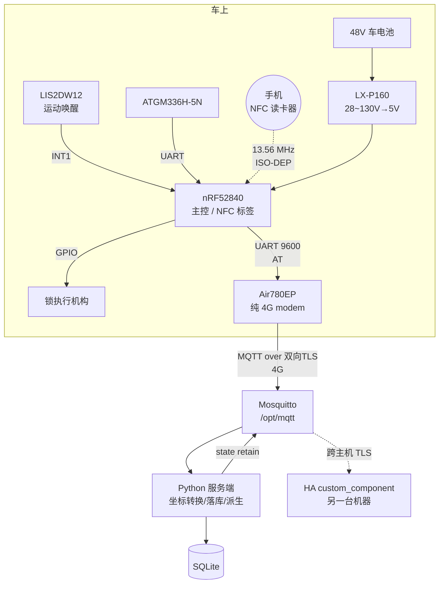

# 电瓶车定位 + 手机 NFC 开锁：技术方案（施工用）

> 状态：2026-09-01 整合定稿，同日补入契约与代码。**这是唯一的施工依据**，
> 面向写代码/焊板子的人：引脚映射、Kconfig、DTS、APDU 报文、AT 序列、分期验收标准。
>
> **同目录下的六份配套文档**：
> - [`HARDWARE.md`](HARDWARE.md) — 给用户看的摘要：买什么、怎么接、要拍板什么
> - [`MQTT-CONTRACT.md`](MQTT-CONTRACT.md) — **契约 v1**，本文 §9.3 那张空白表已由它填满
> - [`SERVER.md`](SERVER.md) — 服务端怎么跑（含 docker）、amqtt 的坑、测试覆盖
> - [`WEB.md`](WEB.md) — 网页界面：地图、登录、高德 key、坐标系
> - [`FIRMWARE.md`](FIRMWARE.md) — 固件怎么编、还缺什么
> - [`HA.md`](HA.md) — Home Assistant 集成：装哪、9 个实体、怎么验的
>
> ⚠ 契约相关的结论以 `MQTT-CONTRACT.md` 为准（它比本文 §9 新）；
> 硬件与功耗结论以本文为准。§11 的状态列已更新。
>
> 此前的 `PLAN.md` / `ADR-001` / `ADR-002` / `ADR-003` 已移入 [`archive/`](archive/)，
> 只作为原始论证的查证出处，见 [`archive/README.md`](archive/README.md)。
> 本文里 `[未核实]` / `[推断]` 标记保留自原文，含义不变：**没有第一手资料背书的结论，施工前要自己验。**

## §0 一句话方案

nRF52840 做主控，Air780EP 降级成纯 4G AT modem，LIS2DW12 做运动唤醒，
ATGM336H 做定位；48V 车电池经成品降压模块取电，不做备份电芯；
开锁只走 **手机 NFC**（nRF52840 的 NFCT 当标签、手机当读卡器），不走蓝牙，只管安卓。

四个「放弃」都是主动取舍，不是遗漏：
放弃读卡器/实体卡、放弃 BLE、放弃备份电芯与硬件欠压保护、放弃 iOS。
每一条的理由分别在 §2.1、§2.1、§4.4、§2.2。

---

## §1 系统架构



角色分工，一句话一个：

| 器件 | 角色 | 为什么是它 |
| --- | --- | --- |
| nRF52840 | 主控 + NFC 标签 + 密码学 | NFCT 外设 + CryptoCell-310 硬件 HMAC，见 §2.1 §5 |
| Air780EP | 纯 4G modem，跑 AT 固件 | 只负责把字节送上 MQTT，不再跑业务，见 §8 |
| LIS2DW12 | 运动唤醒 | 低功耗且 Zephyr 驱动有 `.trigger_set`，见 §3.7 |
| ATGM336H-5N | GNSS | 支持北斗；NEO-7M 在协议层没有北斗且已 EOL |
| LX-P160 | 48V→5V | 用户已选定的成品模块，见 §3.1 |

---

## §2 手机 NFC 开锁

### §2.1 链路：谁是读卡器

**nRF52840 的 NFCT 只能当标签，不能当读卡器。** 这是硬约束，决定了整个开锁方案的形状。
原厂产品规格书两句话（逐字）：

> The NFCT peripheral is an implementation of an NFC Forum compliant listening device NFC-A

> The NFCT peripheral contains a 13.56 MHz AM receiver and a 13.56 MHz load modulator

只有 AM 接收器和负载调制器，**没有载波发生器**——发不出场，就没法给无源卡供电。
Nordic 工程师 Bendik Heiskel 在 DevZone（Case ID 299844）的回复把这条钉死：

> The NFC peripheral can only be used as a tag. To read NFC tags a separate IC is needed.

所以只有一种可行分工：**手机当读卡器（发场、供电、发 APDU），车上的 nRF52840 当被动标签。**
这同时解释了为什么放弃实体卡：读实体卡需要额外读卡器 IC（原方案的 FM17622），
而手机 NFC 方案下这颗 IC 可以整个删掉。

放弃 BLE 的理由不同：BLE 要配对、要维护连接、开锁时延和后台唤醒都受手机系统调度摆布，
而 NFC 贴一下就是一次确定的物理动作，且复用的是已经在片上的 NFCT。

### §2.2 raw ISO-DEP：nfc_t4t_lib 的正确用法

用 nrfxlib 的 `nfc_t4t_lib`，**raw ISO-DEP 是默认模式**——`nfc_t4t_setup()` 第二参数传 `NULL`
就不做 NDEF 封装，直接收发 APDU：

```c
nfc_t4t_setup(t4t_callback, NULL);   /* 默认 = raw ISO-DEP */
nfc_t4t_emulation_start();           /* 锁定模式并开始监听 */
```

回调里收 `NFC_T4T_EVENT_DATA_IND`，用 `nfc_t4t_response_pdu_send()` 回。
单次 payload 上限 `NFC_T4T_MAX_PAYLOAD_SIZE = 0xFFF0`，对开锁报文来说绰绰有余。

Kconfig（**两处符号名是本方案更正过的，原稿是错的**）：

```ini
CONFIG_NFC_T4T_NRFXLIB=y      # ← 正确符号名。原稿的 CONFIG_NFC_T4T_LIB 不存在
CONFIG_NFC_PLATFORM=y
CONFIG_NFC_THREAD_CALLBACK=y
CONFIG_PSA_CRYPTO=y
CONFIG_PSA_WANT_GENERATE_RANDOM=y
CONFIG_PSA_WANT_ALG_HMAC=y
CONFIG_PSA_WANT_ALG_SHA_256=y
CONFIG_PSA_WANT_KEY_TYPE_HMAC=y   # ← 原稿写的 KEY_TYPE_AES 是错的
CONFIG_PSA_CRYPTO_DRIVER_CC3XX=y
CONFIG_SETTINGS=y
CONFIG_SETTINGS_NVS=y
```

### §2.3 安卓侧的两道门（这是方案最大的用户体验代价）

**门 1：屏幕必须亮且已解锁。** AOSP `NfcService` 里（逐字）：

```java
// minimum screen state that enables NFC polling
static final int NFC_POLLING_MODE = ScreenStateHelper.SCREEN_STATE_ON_UNLOCKED;
```

`ScreenStateHelper` 的档位是 `OFF_UNLOCKED=0x01 < OFF_LOCKED=0x02 < ON_LOCKED=0x04 < ON_UNLOCKED=0x08`，
门槛取在最高档。**息屏或锁屏状态下手机根本不发 NFC 场**，贴上去什么都不会发生。

**门 2：App 必须在前台。** `setReaderMode` 的调用方检查（逐字）：

```java
if (!privilegedCaller
        && !mForegroundUtils.registerUidToBackgroundCallback(NfcService.this, callingUid)) {
    Log.e(TAG, "setReaderMode: Caller is not in foreground and is not system process.");
    return;
}
```

`ForegroundUtils.isInForegroundLocked()` 判的是 `getUidImportance(uid) == IMPORTANCE_FOREGROUND`。

两道门叠起来，**实际开锁动作是：亮屏 → 解锁 → 打开 App → 贴车。** 这就是代价，没有绕法。
Android 15/16 的 NFC 新 API 查过了，对这两道门都没有松动。

### §2.4 Reader mode 的 flags 与三个运行时查询

```java
adapter.enableReaderMode(activity, callback,
        NfcAdapter.FLAG_READER_NFC_A              // 0x01
      | NfcAdapter.FLAG_READER_SKIP_NDEF_CHECK    // 0x80，不做 NDEF 探测，省一轮往返
      | NfcAdapter.FLAG_READER_NO_PLATFORM_SOUNDS // 0x100
      , extras);   // EXTRA_READER_PRESENCE_CHECK_DELAY ("presence")，默认 125 ms
```

拿到 `IsoDep` 之后，**三个查询必须在运行时做，不要假设**：

| 查询 | 为什么 |
| --- | --- |
| `getMaxTransceiveLength()` | 决定单帧能放多少字节 |
| `isExtendedLengthApduSupported()` | 决定能不能用扩展长度 APDU |
| `isSecureNfcEnabled()` / `isSecureNfcSupported()`（API 29） | Secure NFC 打开时行为不同 |

### §2.5 运动唤醒代替场唤醒

车上这一侧不能靠「有场就醒」来省电：NFC SENSE 只加 +0.10 µA 很便宜，
但 NFCT ACTIVATED 是 **400 µA**，长期挂着不划算，而且 §2.3 的门 1 意味着大部分时间根本没有场。
所以用 **LIS2DW12 的运动中断（§3.7）** 作为主唤醒源，NFC 只在设备已经因为运动而醒着时才有意义。

---

## §3 硬件

### §3.1 供电前端：从 48V 车电池取电

```
PACK+ (58.8V worst) → [F1 保险丝 250~500 mA，耐压 ≥100 V DC]
                    → [Q1 P-MOS 理想二极管 + 栅源齐纳]
                    → [D1 SMBJ58A 到 PACK-]
                    → [U1 LX-P160 模块] → 5V → 开发板 VBAT 焊盘
```

四个器件各自的理由：

- **F1 保险丝**必须选**直流耐压 ≥100 V** 的型号。常见的 250 V AC 保险丝直流分断能力远低于标称，
  48V 系统的最坏情况（充满 58.8 V + 充电器纹波）不能拿交流参数糊过去。
- **Q1 P 沟道 MOSFET 理想二极管**做反接保护，**不要用串联肖特基**。
  ADR-001 的板子上就吃过这个亏：一颗本该是肖特基的位置装了硅二极管，
  反向漏流从 4 µA 变成 60 µA——在一个 µA 级预算里这是致命的。P-MOS 方案压降和漏流都可以忽略。
- **D1 SMBJ58A** TVS，钳位 93.6 V，低于 LX-P160 的 130 V 输入上限，留出了余量。
- **U1 LX-P160**：用户已选定的成品模块，28~130 V 输入，输出固定 5 V。
  这替换掉了 ADR-002 定的 LM5164 分立方案，功耗预算因此重建（§4）。

另有一条容易漏的：**铝电解电容的漏流按 `0.01CV` 估**。在这个预算里，
一颗大电解的漏流可以和整机静态电流同一量级，选型时要算进去。

### §3.2 5V 怎么灌进开发板

灌到 **VBAT 焊盘**，不是 VBUS。原因牵扯到开发板上的电源路径（§3.4）：
VBUS 进 TP4054 充电 IC，而本方案没有电芯，走 VBUS 会让充电 IC 一直在一个没有电池的回路里工作。
VBAT 直接汇入 VDDH 前的理想二极管节点，是本方案唯一正确的注入点。

⚠ **更不能灌 VCC / EXTVCC。** 这两块板都是 nRF52840 由 **VDDH** 供电、
LDO 挂在 VDDH 下游当外设轨，joric 的 nRFMicro wiki 对这一类板子直接写
`VCC pin: output-only`，以及 `RAW (4.2 V charger) and VCC (3.3 V output) are the separate circuits`。
**往 VCC/EXTVCC 灌电什么都没供上，只是在反灌一个 LDO 的输出。必须灌 VBAT / RAW / BATTERY+。**

**nRF52840 的 VDDH 绝对最大值 5.5 V `[未核实-原厂]`**。5 V 注入只剩 0.5 V 余量，
LX-P160 的输出精度与瞬态过冲都吃在这 0.5 V 里。**这条建议在采购后用示波器实测确认。**

### §3.3 NFC 天线

nRF52840 的 NFC 需要一个 13.56 MHz 环形天线接到 NFC1/NFC2（P0.09/P0.10）。
两条路：绕自己的环形天线 + 2 颗调谐电容，或者直接买 PN532 模块常配的成品天线板。
**调谐电容值取决于最终天线的电感量，方案里给不出定值**，需要 VNA 或示波器实测收敛。
Nordic 有专门的调谐文档（DevZone `NFC tag antenna tuning`）。

**这两块板能这么接是因为芯片是裸片**：正品 nice!nano v2 与常见克隆用的都是
**nRF52840 QIAA(aQFN73) 裸片，不是预认证模组**——模组会把 NFC1/NFC2 埋掉。
两个焊盘物理相邻（J3 头两脚，见 §3.4），天线走线可以很短。
⚠ 但 **2.54 mm 排针焊盘不是调过阻抗的差分对**，天线必须自己调谐，不能指望「插上就行」。

用 NFC 引脚有一个不可逆动作：**UICR 的 `NFCPINS.PROTECT` 是一次性写入**，
把 P0.09/P0.10 从 GPIO 切成 NFC 之后要靠 `--recover` 才能改回来，
而 `--recover` 会连带擦掉 UICR 里的 `REGOUT0`（见 §3.4）。

### §3.4 开发板逐项核实（nRF52840 ProMicro 克隆板）

用的是国产 nice!nano 兼容克隆板，**不是原厂 DK**。逐项核实的结论：

**J3 排针的引脚顺序**（逆向工程 KiCad 工程 `sasodoma/nrf52840-promicro`：
头两个焊盘由 `promicro.kicad_pcb` 的 net65→J3 pad1、net61→J3 pad2 确认，
完整 13 个焊盘的顺序是通读 netlist 数出来的）：

```
P0.09 → P0.10 → P1.11 → P1.13 → P1.15 → P0.02 → P0.29 → P0.31 → EXTVCC → RESET → GND → VBAT → VBAT
```

**末尾两个 VBAT 焊盘接的是同一个网络**（`promicro.kicad_sch` 里 y=172.72 与 y=175.26
两段导线落在同一个 VBAT 电源符号上），5 V 灌哪一个都一样。

**板上电源拓扑**：

```
VBUS → TP4054 VCC；TP4054 BAT → VBAT
VBAT + VBUS ──[NPQ2 P-FET + NBD1 BAT60B "W5" + NPR7]──→ VDDH
VDDH → ME6217C33 VIN；ME6217 CE ← POWER_PIN = P0.13；ME6217 VOUT → EXTVCC
```

**必须处理的三件事**：

1. **UICR 解锁与 bootloader 重刷**。改过 NFCPINS 之后要恢复，序列是：
   ```
   nrfjprog -f NRF52 --memrd 0x1000120C     # 先读 UICR.NFCPINS 确认现状
   nrfjprog -f NRF52 --recover
   nrfjprog -f NRF52 --program nice_nano_bootloader-0.6.0_s140_6.1.1.hex --chiperase
   ```
   **重刷 bootloader 不是可选步骤**：板子依赖 `UICR_REGOUT0_VALUE = UICR_REGOUT0_VOUT_3V3`，
   `--recover` 擦掉 UICR 后 REGOUT0 回落到 1.8 V，不重刷就起不来。
2. **pinctrl 冲突**。ZMK 的 `spi1_default` 把 MOSI 放在 **P0.10**，
   上游 `promicro_nrf52840-pinctrl.dtsi` 的 uart0 是 **TX=P0.09 / RX=P0.10**——
   全部撞在 NFC 的两个引脚上。本方案必须在自己的 overlay 里把这两处挪开。
3. **睡眠电流是个抽奖**。同款克隆板已知的几个坑：ME6211C33 静态 60 µA；
   `POWER_PIN` 的 R4 实测过 0.42 µA / 7~8 µA / ~750 µA 三种结果；
   D1 装成硅二极管而非肖特基 → +56 µA；R10-R11 未贴。
   **拿到板子第一件事是测静态电流，不要相信任何标称值。**

**工具链**（已核实）：board target `promicro_nrf52840/nrf52840/uf2`，
`CONFIG_USE_DT_CODE_PARTITION=y`，`CONFIG_BUILD_OUTPUT_UF2=y`，UF2 family `0xADA52840`。
Flash 布局：SoftDevice `0x0–0x26000` / app `0x26000 + 0xC6000` / storage `0xEC000 + 0x8000` /
bootloader `0xF4000 + 0xC000`。**不要用 MCUboot**——会和板子自带的 Adafruit bootloader 打架。

### §3.5 GPIO 分配

| 功能 | 引脚 | 备注 |
| --- | --- | --- |
| NFC1 / NFC2 | P0.09 / P0.10 | 需写 UICR.NFCPINS，与 §3.4 的 pinctrl 冲突 |
| I2C（LIS2DW12） | TWIM0 SCL/SDA | 地址 0x19 |
| LIS2DW12 INT1 | 任一 GPIOTE 引脚 | **必须用 PORT 事件，不能用 IN 事件**，见 §4.2 |
| GNSS UART | UART TX/RX | ATGM336H |
| GNSS 电源门控 | 1 GPIO | 驱动一个开关管，**具体型号方案未给** |
| Air780EP UART | UART TX/RX | 9600 baud 锁死，见 §8 |
| Air780EP PWRKEY | 1 GPIO | 开集拉低 >1 s，内部已有 5.6 k，**不要外加上拉** |
| Air780EP RI（唤醒） | 1 GPIO 输入 | `AT+CFGRI` |
| 锁执行机构 | 1 GPIO | 经驱动，**具体型号方案未给** |
| 锁位置反馈开关 | 1 GPIO | 判断锁是否真的动了 |
| 电池电压采样 | 1 ADC + 1 GPIO | 门控的 1M+1M 分压，见 §4.3 |

合计 17~19 个引脚。**ADR-001 里那个 `LM5164 PGOOD` 引脚已删除**——换成 LX-P160 成品模块后不存在。

**总数余量**：板子一共 **21 个可用 GPIO**（正品左 10 + 右 8 + 背面 P1.01/P1.02/P1.07；
克隆 J2 十个 + J4 三个 + J3 八个，两块板都是逐个数 netlist 数出来的），
NFCT 吃掉 P0.09/P0.10 之后剩 **19 个**。所以锁只用 1~2 根线时有 2~4 个余量；
**如果锁要 3 根线（驱动 + 反馈 + 使能），就是 19/19 零余量**，
INT2 那根潜在的第二中断线（§3.7）也就没地方接了。

**ADC 只有 3 个真脚**：P0.02(AIN0)=D19、P0.29(AIN5)=D20、P0.31(AIN7)=D21。
⚠ ZMK 的 `arduino_pro_micro_pins.dtsi` 里那些 A6~A10 别名（P0.22/P1.00/P1.04/P1.06/P0.09）
**只是 Pro Micro 的引脚命名，不是 SAADC 通道**，别当模拟脚用。

### §3.6 电池电压采样必须门控

1M+1M 分压对 58.8 V 也是 **29 µA 常流**，比整机静态电流大一个量级。
所以分压器的低端串一个 MOSFET，只在要测的瞬间打开。这是 §4 功耗预算成立的前提之一。

### §3.7 LIS2DW12 运动检测

**选型理由**（三个候选都查过驱动源码）：

| 候选 | 结论 |
| --- | --- |
| **LIS2DW12** | 选它。Zephyr 有完整驱动含 `.trigger_set`；I2C 只占 2 线 + 1 中断。**1 µA @ODR 12.5 Hz / LP mode 1 / low-noise off / Vdd 1.8 V / 25 °C**（0.38 µA @1.6 Hz），掉电 50 nA |
| ADXL362 | **0.27 µA** Wake-Up Mode 更省，但只有 SPI，占 5 个引脚（4 线 + INT）而不是 3 个。省下的那 0.7 µA 换不来 4 个 GPIO |
| BMA400 | Zephyr 驱动**没有 `.trigger_set`**，用不了触发接口 |
| KX023 | Zephyr 里根本没有驱动 |
| LM393 模块（震动开关） | TI SLCS005AH §5.8：`VCC=5 V, RL=∞, 25 °C` 下 ICC 典型 0.45 mA / 最大 1 mA，整模块 `[推断]` 2~4 mA。**比整机预算大三个量级，直接否掉** |

**接线**：I2C 地址 0x19，要求 **SA0/SDO 接 VDD_IO**。
注意 SA0 有内部上拉，数据手册 Table 2 给的是 **20.4~54.4 kΩ**——
**如果把 SA0 接地，这个上拉会白烧 110~160 µA**。Zephyr 有 `disconnect-sdo-sa0-pull-up` 属性
（原文用途 `to save current leakage`），但接 VDD_IO 更简单，本方案接 VDD_IO。

**INT1 必须配成推挽输出、高有效，不能用开漏加上拉。** 理由是 nRF52840 手册唯一的那条定性警告：
`When a pin is configured as digital input, increased current consumption occurs when
the input voltage is between VIL and VIH`。推挽保证引脚永远不停在线性区，
也省掉外部上拉的静态电流。这条和 §4.2 的「必须用 PORT 事件不能用 IN 事件」是同一个问题的两面。

**DTS**（注意属性名是 `irq-gpios`，**不是** `int1-gpios`）：

```dts
&i2c0 {
    lis2dw12: lis2dw12@19 {
        compatible = "st,lis2dw12";
        reg = <0x19>;
        irq-gpios = <&gpio0 N GPIO_ACTIVE_HIGH>;   /* 注意属性名是 irq-gpios */
        int-pin = <1>;
        odr = <12>;                  /* 12.5 Hz */
        range = <2>;                 /* ±2 g，一格 31.25 mg */
        power-mode = <LIS2DW12_DT_LP_M1>;
        wakeup-duration = <LIS2DW12_DT_WAKEUP_2_ODR>;
    };
};
```

阈值寄存器 `WAKE_UP_THS`(34h) 的 1 LSB = FS/64，±2 g 下即 **31.25 mg**。
**注意阈值不是 devicetree 属性，只能运行时设**——Zephyr 侧用 `SENSOR_ATTR_UPPER_THRESH`
（单位 mg，驱动内部用 `MG_TO_WK_THS_LSB` 换算）；持续时间才是 DTS 的 `wakeup-duration`（1 LSB = 1/ODR）。
电瓶车**从 100~200 mg + `wakeup-duration` = 2~3 个 ODR 周期起调**，用来滤掉单次敲击。
触发用 `SENSOR_TRIG_MOTION`（动了）与 `SENSOR_TRIG_STATIONARY`（停了）两个；
静止判定时长在硅片里，`sleep-duration` 最多 15 × 512/ODR。

**已知矛盾，未解决（R2 阶段定论）**：INT1/INT2 的路由在原文档里自相矛盾。
ADR-002 §1.4 的接线表写「INT1 → 任意空闲 GPIO；**INT2 不用**」，§1.7 的 DTS 也只写
`int-pin = <1>`；但 §1.6 的状态机说 `SENSOR_TRIG_STATIONARY` 走的是 **`int2_sleep_chg`**。
两者不能同时成立。需要读 Zephyr `drivers/sensor/st/lis2dw12` 源码，
看 `CONFIG_LIS2DW12_SLEEP` 打开时驱动写的是 `CTRL4_INT1_PAD_CTRL` 还是 `CTRL5_INT2_PAD_CTRL`。
如果 STATIONARY 事件只出现在 INT2，就得多接一根线（§3.5 的余量装得下），
或者退回软件计时判静止。

---

## §4 功耗预算

### §4.1 更正：ADR-002 的自放电估算错了 1000 倍

ADR-002 §3.6 写「静态功耗会让车电池每天掉 2.2 %」。**这个数字错了三个数量级。**
错因是分母：48V 20Ah 电池是 **960 Wh ≈ 1.44 kWh** 级别，原稿按 **1.44 Wh** 算。

正确的量级表（以 960 Wh 为基准）：

| 整机静态电流 | 每天自放电 |
| --- | --- |
| 10 µA | 0.0012 % |
| 100 µA | 0.012 % |
| **1 mA** | **0.12 %** |
| 5 mA | 0.6 % |

**方向是保守错误**——实际比原稿说的好 1000 倍，所以原稿基于「2.2 %/天」做的
备份电芯、硬件欠压保护等补救措施都失去了前提。这也是 §4.4 敢于全部放弃它们的依据。

### §4.1b 功耗地板是 4G 模组定的，不是 nRF52840

这一条必须先说，否则后面所有 µA 级的抠算都会给人错误印象：

> **总功耗地板是 4G 模组决定的（~0.5~1.5 mA），不是 nRF52840（3 µA）。**

选了 PRO 档（§8.3）之后，**整机平均电流就在 mA 量级**，对应 §4.1 表里的 0.12 %/天。
nRF52840 那 3 µA 的超低功耗**只有在「模组完全关机、只靠 nRF 定时唤醒」的模式下才兑现**。

所以功耗目标分两档写，不要混：

| 场景 | 目标 | 对应自放电 |
| --- | --- | --- |
| **模组 PRO 常驻**（可远程查询） | ~0.5~1.5 mA | 0.06~0.18 %/天 |
| **模组关机 / PSM+，nRF 定时唤醒** | **< 200 µA** | < 0.024 %/天 |

**§4.2 / §4.3 里那些 µA 级的抠算只对第二档有意义**——但它们仍然必须做，
因为第二档是长期停放时的状态，而长期停放正是最需要省电的场景。

PRO 档还有一个容易被平均值掩盖的特征：**每次唤醒后有 3~15 s 的尾巴，期间约 22 mA**，
基站才允许它重新睡。官方 30 分钟实测平均值约 **1.544 mA**（5 分钟一次 160 B TCP 心跳）。

**0.18 %/天意味着停放三个月掉约 16 %**。对一辆冬天几个月不骑的车，这是用户能感知的，
所以 §8.3 的双档策略不是优化项而是必需项。

### §4.2 nRF52840 自己的电流账（原厂数据）

| 状态 | 电流 |
| --- | --- |
| System OFF | 0.40 µA |
| System ON + 256K RAM 保持 + RTC | 3.16 µA |
| **GPIOTE PORT 事件** | **2.36 µA** |
| **GPIOTE IN 事件** | **17.37 µA ← 陷阱** |
| NFC SENSE | +0.10 µA |
| NFCT ACTIVATED | 400 µA |

**GPIOTE 必须配 PORT 事件而不是 IN 事件**，差 15 µA。这是最容易踩的一脚。

还有一条 CryptoCell 的坑，原厂原文：
`The device will not enter the System ON IDLE mode until CRYPTOCELL has been disabled`。
**每次 HMAC 算完必须显式关掉 CryptoCell**，否则整机再也睡不下去。
另外 **CryptoCell 的 DMA 只能访问 SRAM**——密钥和缓冲区不能放在 flash 常量区。

### §4.3 其余静态项

- **ME6217C33 LDO**：`ISS1` 典型 100 µA / 最大 130 µA。这是当前预算里最大的单项，
  超过 §4.1 的 200 µA 目标的一半。**注意 ADR-002 里那个「60 µA」不是 LDO 的**，
  是装错的硅二极管的反向漏流，两件事别混。
- **LDO 替换的取舍**：可以换更低 Iq 的 LDO，但**不要照抄原稿提到的 TPS62840——它实际是 buck 不是 LDO**，
  原稿只是拿它当 Iq 量级的比喻。另一条更土的路是直接用一颗 0.3 V 压降的二极管代替，
  代价是电压精度和纹波。
- **分压采样**：门控后可忽略；不门控是 29 µA（§3.6）。
- **铝电解漏流**：按 `0.01CV` 估（§3.1）。

### §4.4 为什么不做备份电芯、不做硬件欠压保护

两条都是用户明确决定的取舍，**不是遗漏**：

- **不做备份电芯**。代价是清楚的：电池被拔或被剪线之后设备立刻死，**收不到「断电」和「被拖走」告警**。
  ADR-002 曾把这称作「**这是设计缺陷，不是取舍**」，并援引 Teltonika FMB920 的
  `unplug detection` / `towing detection` 作为对照，方案是 170 mAh 电芯 + 2× LM66100（各 150 nA），
  `[推断]` 约 900 次上报 ≈ 5 分钟间隔下 3 天。**本方案接受这个缺陷。**
- **不做硬件欠压保护**。48V 电池组自己有 BMS，再叠一层硬件切断是重复且增加静态电流。
  改为**软件兜底**（§6）：电压低于阈值就降低上报频率并在 HA 里报警，把决定权交给用户。

**一个必须记住的文档缺口**：ADR-002 把 ADR-001 §5.7 整节标成「不适用」时，
连带划掉了备份电芯自己的**低温充电安全要求**（0 °C 以下给锂电池充电会析锂，是起火风险）。
**将来如果重新加电芯，这条要求必须重新捡回来**，NTC 温度检测不能省。
同一节里还有一个未解决的矛盾：TP4054 充电 IC 没有 NTC 也没有 CE 引脚，
而 BOOST 跳线短接后是 10k∥2k ≈ 1.67k → 约 600 mA，与厂商页面标的 300 mA 对不上。
原文的结论逐字保留：**「在一个和起火相关的参数上，两个数字对不上——BOOST 就别桥了。」**

---

## §5 开锁安全

### §5.1 底线：不能被复制、不能被重放

物理钥匙可以配，NFC 卡可以克隆，**本方案的底线是「嗅探到一次完整开锁交互也不能再开一次」**。
这排除了任何「读一个固定 UID 就开锁」的设计。

顺带记下为什么放弃 Mifare Classic：CRYPTO1 早就被完整破解。
Radboud 论文的结论逐字：

> the (48 bit) cryptographic keys to be relatively easily retrieved… we can compute, off-line, the secret key within a second…

Luat 的示例代码甚至直接用出厂扇区尾 `000000000000FF078069FFFFFFFFFFFF`。
NTAG424 的 SUN 功能好一些，但它的 §9.3 自己就警告了适用边界，且仍是「标签持有即可用」模型。

### §5.2 挑战应答协议

手机是读卡器，所以是手机发命令、车回应答。三步：

```
1) SELECT AID          : 00 A4 04 00 07  F0 45 42 49 4B 45 01  00
2) GET CHALLENGE       : 00 84 00 00 10
   ← 车回 nonce(16 字节) || 90 00
3) UNLOCK              : 80 10 00 00 Lc [ user_id(4) || counter(4) || mac(16) ] 00
   ← 车回 90 00（开锁）或 69 82（拒绝）
```

MAC 的计算：

```
mac = HMAC-SHA256(secret, nonce || counter || cmd)[0..15]
```

车上侧的三重校验，**三条全过才开锁**：

1. `psa_mac_verify()` 验 MAC（CryptoCell-310 硬件算，见 §4.2 的关闭要求）；
2. `counter` **严格递增**——等于或小于已存值就拒；
3. `nonce` **一次性**——用过即废，不接受同一个 nonce 的第二次应答。

`nonce` 由 `psa_generate_random()` 产生（TRNG 硬件源）。
拒绝一律回 `69 82`，**不区分失败原因**，不给攻击者区分信道。

### §5.3 密钥管理

- **per-user secret**，不是全车一把钥匙。`user_id` 4 字节，撤销一个用户只需删它那把。
- 存在 nRF52840 的 `SETTINGS_NVS` 里（§2.2 的 Kconfig 已开）。
- **下发**：在线时（4G 可用）由服务端通过 MQTT 下发（§9）。
- **counter 也要持久化**，掉电后不能回零，否则重放防护失效。

### §5.4 剩下的三个安全缺口

1. **物理攻击面**。设备本身在车上，拆开就能读 flash（nRF52840 的 APPROTECT 可以开，
   但克隆板的 bootloader 会不会绕开这条 `[未核实]`）。
2. **离线首次配对**。设备从没上过 4G 时怎么拿到第一把 secret，方案未定。
3. **锁死风险的逃生口**。手机没电 / 手机丢 / 4G 挂 / 设备挂，**必须保留机械钥匙**。
   这不是可选项，是安全需求（见 §7 BOM）。

---

## §6 欠压的软件兜底

放弃硬件欠压保护之后（§4.4），保护逻辑全在固件里：

1. 定期用门控分压（§3.6）采一次电池电压；
2. 低于第一阈值：降低上报频率，并把「电池快没了」这个状态上报，
   **让用户能在 HA 里看到**；
3. 低于第二阈值：只保留最低限度功能（能开锁、能被查询），停止周期上报；
4. 再低：主动进 System OFF，只留运动唤醒。

阈值具体取值依赖实际电池组的 BMS 截止点，**采购后实测确定**。
注意这一路只保护「别把车电池抽空」，**不保护设备自己**——设备没有独立电源（§4.4）。

---

## §7 硬件清单（BOM）

### §7.1 供电前端

| 项 | 规格 | 数量 | 用途 |
| --- | --- | --- | --- |
| U1 降压模块 | **LX-P160**，28~130 V → 固定 5 V | 1 | 48V 取电，用户已选定 |
| F1 保险丝 + 座 | 250~500 mA，**直流耐压 ≥100 V** | 1 | 见 §3.1 |
| Q1 P 沟道 MOSFET | 耐压 ≥100 V，低 R<sub>DS(on)</sub>，**型号未定** | 1 | 理想二极管防反接 |
| Q1 栅源齐纳 | 10~15 V，**型号未定** | 1 | 保护 Q1 栅极 |
| D1 TVS | **SMBJ58A**，钳位 93.6 V | 1 | 浪涌抑制 |
| 铝电解 / 陶瓷电容 | 按模块手册，注意 `0.01CV` 漏流 | 若干 | 输入输出滤波 |

### §7.2 主控与外设

| 项 | 规格 | 数量 | 用途 |
| --- | --- | --- | --- |
| 主控板 | nRF52840 ProMicro / nice!nano 克隆板 | 1 | 见 §3.4 的全部注意事项 |
| 加速度计 | **LIS2DW12**（模块或裸片） | 1 | 运动唤醒，SA0 接 VDD_IO |
| I2C 上拉电阻 | 4.7 k 典型，**具体值待实测** | 2 | TWIM0 |
| GNSS 模块 | **ATGM336H-5N** | 1 | 支持北斗 |
| GNSS 电源门控开关管 | **型号未定** | 1 | 见 §3.5 |
| 4G 模组 | **Air780EP**，刷 AT 固件 | 1 | 见 §8 |
| NFC 环形天线 | 自绕，或 PN532 成品天线板 | 1 | 见 §3.3 |
| NFC 调谐电容 | **容值待实测**（依赖天线电感） | 2 | 见 §3.3 |
| 锁执行机构 | **型号未定**（电磁锁 / 电机锁） | 1 | |
| 锁驱动电路 | **型号未定**（MOS 或半桥 + 续流） | 1 | |
| 锁位置反馈开关 | 微动开关 | 1 | 确认锁真的动了 |
| 电压采样分压 | 1 MΩ × 2 | 2 | 门控，见 §3.6 |
| 分压门控 MOSFET | 小信号 N-MOS | 1 | 见 §3.6 |
| **机械钥匙逃生口** | — | 1 | **安全需求，不可省**，见 §5.4 |
| 非金属外壳 | 塑料 / ABS | 1 | 金属壳会屏蔽 NFC 与 GNSS |

### §7.3 ADR-003 全文没提但方案实际依赖的项

**这几项原方案漏了，采购前必须补齐**：

| 项 | 说明 |
| --- | --- |
| **SIM 卡** | Air780EP 要能上网，还要选流量套餐 |
| **4G 天线** | 模组自带 IPEX 座，天线要单买 |
| **GNSS 天线** | ATGM336H 需要有源或无源天线，要考虑安装位置和净空 |
| **接线端子 / 线束** | 从电池组接出来的那一段，以及各模块之间的连线 |

### §7.4 调试工具

| 项 | 用途 |
| --- | --- |
| J-Link（或 CMSIS-DAP） | SWD 烧录、`nrfjprog --recover`（§3.4 必需） |
| 杜邦线 / 排针 | 接 J3 |
| **示波器** | 测 VDDH 瞬态（§3.2）、静态电流（§3.4） |
| **VNA**（可选） | NFC 天线调谐（§3.3），没有的话用示波器 + 已知负载凑 |

### §7.5 已放弃、不要采购

| 项 | 放弃原因 |
| --- | --- |
| FM17622 读卡器 IC + 实体卡 | 改手机 NFC，读卡器整个不需要了（§2.1） |
| 备份电芯 + 2× LM66100 + NTC 充电管理 | 用户决定不做主动备份（§4.4） |
| 串联肖特基二极管 | 改 P-MOS 理想二极管，反向漏流（§3.1） |
| LM5164 + 其全部外围 | 改 LX-P160 成品模块（§3.1） |
| 硬件欠压切断电路 | 改软件兜底（§6） |
| 开发板上的 TP4054 相关跳线 | 没有电芯，**BOOST 跳线尤其别桥**（§4.4） |
| 开发板 NBD1 二极管 | 装的是硅不是肖特基，+56 µA（§3.4） |

---

## §8 Air780EP 作为纯 4G modem：AT 链路

### §8.1 固件与串口

- 刷 **AT 固件 `AirM2M_780EP_V1011_LTE_AT`**（2025-01-17）。
  **这会覆盖 LuatOS，没有双人格**——刷了 AT 就不能再跑 Lua 脚本。用 Luatools 刷（BOOT+RST 进下载模式）。
  官方原话：`4G模组中必须烧录正确的AT固件才能支持AT命令功能`。
- AT 只在 **MAIN_UART / UART1** 出来：**pin 37 TXD / pin 36 RXD / pin 38 GND**。
- **波特率锁死 9600**。`AT+IPR` 默认 0 = 自适应（脆弱，要连发几个 `AT` 训练），
  而**两种低功耗模式都要求 9600** 才能可靠唤醒，所以 9600 是唯一合理的固定值：
  `AT+IPR=9600;&W` 出厂设一次。
- AT 命令手册 V1.6.8，274 页，覆盖 780E/600E/700E/780EL/780EP。
- **PWRKEY 开集拉低 >1 s** 开机；模组内部已有 5.6 k 上拉，**不要外加上拉**。

用得到的命令覆盖面（已核实，够用）：

| 功能 | 命令 |
| --- | --- |
| MQTT | `AT+MCONFIG`（含 LWT）→ `AT+MIPSTART` / `AT+SSLMIPSTART` → `AT+MCONNECT` → `AT+MSUB` / `AT+MPUBEX` |
| MQTT over TLS | `AT+FSCREATE` + `AT+FSWRITE` 写证书进模组 FS → `AT+SSLCFG="cacert"/"seclevel"/"hostname",88,...` |
| TCP/UDP | `AT+CSTT` → `AT+CIICR` → `AT+CIFSR` → `AT+CIPSTART` → `AT+CIPSEND`；`AT+CIPMODE=1` 是真透传 |
| HTTP(S) | `AT+HTTPINIT` / `AT+HTTPSSL` / `AT+HTTPPARA` / `AT+HTTPACTION` / `AT+HTTPREAD`；`AT+HTTPGETTOFS` 直接下到模组 FS |
| 时间 | `AT+CTZR=1` 拿运营商 NITZ 时间（**免费、无往返**），或 `AT+CNTP` + `AT+CCLK?` |
| 基站定位 | `AT+CIPGSMLOC=1,1`（免费）或 `AT+AIRLBS`（付费，含 WiFi 融合） |
| 休眠 | `AT+CSCLK=0/1/2/3` + `AT+WAKETIM`，或 `AT+POWERMODE="PRO"/"PSM+"/"CLOSE"` |
| 唤醒主控 | `AT+CFGRI=1` → MAIN_RI 出 120 ms 低脉冲；`AT^WAKEUPHEX` 过滤只对魔术串响应 |

### §8.2 MQTT over 双向 TLS，全在模组里跑

证书写进模组文件系统，TLS 由模组自己完成，nRF52840 只递明文字节：

```
AT+FSCREATE / AT+FSWRITE                       # 把 CA / 客户端证书写进模组 FS
AT+SSLCFG="cacert"/"seclevel"/"hostname",...   # 配 TLS
AT+MCONFIG                                     # 配 client id / user / pass / will
AT+SSLMIPSTART                                 # 加密连接（明文是 AT+MIPSTART）
AT+MCONNECT
AT+MSUB / AT+MPUBEX                            # 订阅 / 发布（EX 版支持二进制）
AT+MQTTMODE=1                                  # HEX 模式，二进制安全
```

**限制**：单包 **4100 字节**，topic **256 字节**。schema 设计要留在这个框里（§9）。

### §8.3 唤醒握手要几根线

| 方向 | 机制 | nRF 侧成本 |
| --- | --- | --- |
| nRF → 模组 | UART RX 字节（文档说「发一个 AT 往往不够，要连发几个」），或 MAIN_DTR 拉低 ~50 ms（**仅 `CSCLK=1` 有效**） | UART 已有 |
| 模组 → nRF | **MAIN_RI**，需 `AT+CFGRI=1` → 出 120 ms 低脉冲 | +1 GPIO |
| 冷启动 | **PWRKEY 拉低 >1 s**（**模组上电不自启动！**） | +1 GPIO |

**必须用 `AT^WAKEUPHEX="<hex>"` 把 RI 限定到魔术下行串。**
否则每一条例行 URC 都会把 nRF 从 System OFF 里拽出来，功耗预算直接崩。

ADR-001 §3.3 的结论是 5 根（含可选的 DTR），ADR-003 §4.4 的引脚预算表只列了 4 根（无 DTR）。
**本方案按 4 根算**（§3.5），DTR 视 `CSCLK` 最终取值决定；§3.5 的余量装得下加回来。

### §8.4 PRO vs PSM+：这个产品决定要重新回答

官方数据（已核实）：

| 模式 | 服务器 4G 下行唤醒 | 平均电流 |
| --- | --- | --- |
| 常规 | 支持，<1 s | 4.6 mA |
| **PRO** | **支持，1~2 s** | ~0.4~1.5 mA（依 DRX 和心跳） |
| **PSM+** | **不支持**（离线/飞行模式，**RAM 掉电**） | ~3 µA |

ADR-001 §3.4 的原话是 **「要远程开锁/远程定位就必须用 PRO，不能用 PSM+。」**
PSM+ 下模组是离线的，服务器根本找不到它；而且 RAM 掉电，
每次醒来要重新附着网络 + 重建 TLS + 重连 MQTT。

**但这个理由在本方案下缩水了一半。** ADR-001 写这句话时，开锁是走 4G 下行的；
本方案的开锁改成了**完全离线的手机 NFC 挑战应答（§5.2），不需要 4G**。
所以 PRO 现在只为**远程定位查询**服务，不再为开锁服务。

**本方案的决定：做成双档，默认 PSM+ / 模组关机，用户主动查询或布防时切 PRO。**

- 日常停放：只有 nRF 醒着看**振动（§3.7）与 NFC**，定时开模组上报。
  （ADR-001 原文这里还写了「看 BLE」——本方案已放弃 BLE，此项不存在。）
- 用户在 HA 里点「现在在哪」：需要一次下行触达 → 切 PRO。
  **如果接受「等下一次定时上报」的时延，可以连 PRO 都不要，功耗地板直接降到 µA 级。**
  这是 §11 里的一个待决项，取决于你能接受多长的查询时延。

### §8.5 AT 状态机的真实代码量

要自己写：URC 驱动的行/提示符解析（要处理裸 `>` 提示符，
`CONNECT OK` / `CONNACK OK` / `SUBACK` / `SEND OK` 都是带外 URC，
还有 `CIPSEND` / `MPUBEX` 那个吃字节的 `\r` vs `\r\n` 陷阱）、
每操作的超时重试、断线重连阶梯（`+PDP DEACT` / `CLOSED` / `TCP ERROR` → `CIPSHUT` → 全量重拨）、
睡眠仲裁器（每次写 AT 前判断模组醒没醒）、二进制转义决策、一次性证书灌入。

**`[推断] 2000~4000 行 C`（Zephyr 之上），调试痛点集中在睡眠/URC 竞争窗口，不是顺利路径。**

换来的是一套成熟的 MQTT + 双向 TLS + HTTP + NTP + LBS + FOTA 栈不用自己写，
且所有 TLS 敏感操作留在模组内——**nRF 侧不用管证书链、不占 flash、不占 RAM**。

### §8.6 两条被排除的省事路线，以及一个悬置的选型

- **airlink 不可用**：官方支持列表是
  `Air780EPM / EGP / EX2 / ECP / ECH / EHM / EHV / EGH / EGG / EHU / EHN / Air8000 / Air8101 / Air1601 / 1602`——
  **780EP 不在其中**。而且 airlink 只文档化了 LuatOS↔LuatOS，
  第三方主机要自己重新实现 magic `0xA1B1CA66` + CRC16-MODBUS + 命令表。
- **iRTU 不可用**：老的 dtu.openluat.com 已 EOL（只覆盖 Air724/780E/780EX/780EG），
  新的 iRTU 5.0.4 固件列表同样不含 780EP；且**它的 TLS 只有「无证书最简单的加密」，
  没有 CA / 客户端证书配置——对一把锁是硬性不合格**。

**换 Air780EPM 这件事处于悬置状态，不是被驳回。** ADR-001 §3.7 称它「值得认真考虑」——
同族 EC718P、8MB flash，换了之后 **AT 状态机可以整个删掉**，
改用 `airlink` 的 `sdata` 不透明通道。ADR-003 全文一次都没有讨论或否决它。

> **2026-09-01：你定了不换。** 继续用 Air780EP 自己写 AT 状态机。
> 这条决定的后果，写清楚以免将来忘：
> - §8.5 那 2000~4000 行要自己写完。当前实现的完成度和缺口清单见
>   [`FIRMWARE.md`](FIRMWARE.md) §3，缺的最要紧的是**断线重连阶梯**和**睡眠仲裁器**。
> - 睡眠仲裁器卡在 §11 #18：**MAIN_DTR 脚号至今无来源**，布板前必须查
>   `Air780EP硬件手册V1.1.pdf`。
> - airlink 和 iRTU 两条省事路线继续不可用（上面两条的理由不变）。
> - §11 #19 就此关闭。

**这个决定越晚做代价越大**：AT 状态机一旦写了就是沉没成本，而它正是 §8.5 那 2000~4000 行
最难调的代码。~~**建议在 R6 开工前把它拍死。**~~ **已拍死：不换（见上）。**

### §8.7 本节的未核实项（硬门禁与普通项分开）

**硬门禁（布板前必须解决）**：

- **[未核实] MAIN_DTR / MAIN_RI 的具体脚号至今无来源。**
  `docs.openluat.com/4Gmodulepin/` 返回 404，只从 AT 手册 V1.6.8 §4.14/§4.17 拿到信号名。
  而且手册 V1.6.2 把唤醒脚从 `AP_WAKEUP_MODULE` 改成了 `MAIN_DTR`，
  780EP 的 `CSCLK` 网页仍写旧名（网页落后于 PDF）。
  **布板前必须查 `Air780EP硬件手册V1.1.pdf` 确认。**
- **[未核实] AT 固件 V1011 上 `CSCLK=3` 与 `AT^WAKEUPHEX` 到底可不可用。**
  文档要求 `CSCLK=3` 平台 sw ≥V1026、`POWERMODE` ≥V1143、`AT^WAKEUPHEX` ≥V1131，
  但**AT 固件版本号（V1011）与平台版本号（V1143）是两套编号，无法从文档对齐**。
  低功耗教程演示了 `POWERMODE` 在 V1010 上工作，另两个未确认。
  **`AT^WAKEUPHEX` 不可用的话，§8.3 那句「功耗预算直接崩」就会实际发生，且没有替代过滤手段。**
  **这条要提前到 R0/R1 验，只需一根 UART 线 + 一块模组**，不要等到 R6。

**普通未核实项**：

- **[推断]** 9600 baud ≈ 1 KB/s 上限——是算术不是文档数字。同一条链路做批量传输别想。
  好消息是 `AT+HTTPGETTOFS` 能让模组自己下载到内部 FS，不经过 nRF。
- **[推断]** `AT+CFGRI` + `AT^WAKEUPHEX` 是避免误唤醒的正确做法；文档只说机制存在。
- **[未核实]** PSM+ 典型电流官方页面自相矛盾：3 µA（模组页 + 低功耗页表格）
  vs 2.89/2.9 µA（POWERMODE 命令页）；上行响应时间 3 s（模组页）vs 1.5 s（低功耗页）。

### §8.8 本节遗留的两个空白

- **nRF52840 自己的固件升级路径全文没有写。** `AT+HTTPGETTOFS` 只解决模组自身固件。
  9600 锁死之后，nRF 的 OTA 怎么走（走模组下载再经 UART 灌？还是只支持 UF2 手动升级？）
  四份历史文档都没有答案。
- **双向 TLS 的客户端证书/私钥怎么进产线。** §8.2 的 `AT+FSCREATE`/`AT+FSWRITE`
  要走 9600 的链路写进模组 FS。**谁来做、私钥在产线上以什么形式存在，四份文档都没写。**

---

## §9 MQTT 契约与服务端

> 来源：`archive/PLAN.md` **§4（系统架构图 + 其后的散文）与 §5 分期表的 P2/P3 行**。
> **注意**：PLAN.md 自己的开头注记、ADR-003 §0 都写「PLAN.md §5 MQTT 契约 / §6 服务端 / §7 HA 集成」，
> 但 PLAN.md 只有 §0~§6，且 §5 是分期实施表、§6 是待拍板问题，**没有 §7**。
> 那套编号是错的，本文按实际位置引用。

### §9.1 服务端不是纯转发：五件设备端做不了的事

PLAN.md §4 原文：

> 服务端不是纯转发，承担五件设备端做不了的事：坐标系转换（`libgnss` 输出 WGS84）、
> 轨迹持久化（设备端**无缓存无重发**，`mqtt` 文档把"没有重发机制"重复了三遍）、
> AGPS 星历缓存分发、状态派生（移动/越界/离线）、以及跟 HA 解耦。

其中**轨迹持久化那条的理由是既成事实**：库层没有重发，
所以 broker 或服务端任一环节没接住的报文，在库层就没有第二次机会。

⚠ **但别把它读成「报文一定永久丢失」。** 同一份 PLAN.md 的 §5 P1 行里就写了
「`fskv` 补发队列」，验收是「实车静态 30 min 无丢报；**断网 5 min 后补发成功**」。
「无缓存无重发」描述的是 LuatOS `mqtt` **库这一层的原语**，不等于整机没有补发能力。

不过 `fskv` 属已作废的 LuatOS 单芯片方案，**当前 nRF/NCS 方案下并没有对应物**
（nRF 侧最接近的是 `settings`/NVS，但那是配置存储不是队列），
而 AT 路线下重发语义要靠 `AT+MPUBEX` + AT 状态机的重试阶梯（§8.5）自己实现。
所以「服务端必须落库」这个结论依然成立，**只是支撑它的原始引文已经不指向当前设备栈了**。

**[待解决]** 设备侧要不要做补发队列（用 NVS 存未确认的点）在本方案里没有决定。
不做的代价是断网期间的轨迹永久丢失；做的代价是 §8.5 那个状态机再复杂一层。

### §9.1b 三份框图的右半边其实不一致

ADR-003 §8 断言 **「右半边（MQTT → 服务端 → HA）一个字没变。」**
它的比较对象是 **ADR-001 §4 的框图**（原文「对比 ADR-001 §4 的框图」），不是 PLAN.md §4。
即便如此，逐字比对之后这句话与它自己的图仍不符：

| 项 | PLAN.md §4 | ADR-001 §4 | ADR-003 §8 |
| --- | --- | --- | --- |
| 设备→broker 边标注 | `MQTT QoS1` + `4G` | `MQTT over 双向TLS` | `MQTT over 双向TLS` |
| SRV 节点注记 | `坐标转换/落库/派生` | 仅 `Python 服务端` | 仅 `Python 服务端` |
| SQLite 节点 | 有 | **无** | **无** |
| `SRV -->|state retain| MQ` 回边 | 有 | **无** | **无** |
| broker→HA 边标注 | `跨主机 TLS` | **无标注** | `跨主机`（不含 TLS） |

**§1 的框图以 PLAN.md §4 为准**——SQLite 落库与 `state` retain 回发布只有它画出来了，
而这两件正是 §9.1 与 §9.4 的核心。ADR-003 那句「一个字没变」应理解为
「服务端/HA 这一段的**设计意图**不变」，不是逐像素一致。

### §9.2 传输安全

- **设备 → broker：无条件双向 TLS**（§8.2）。设备侧证书写在模组 FS 里。
- **HA ↔ broker（跨主机）**：PLAN.md §4 原文——
  > **跨主机 MQTT 如果过公网必须上 TLS(8883)。** 明文 1883 过公网等于把 MQTT 账号、
  > 全部车辆位置、以及开锁相关的遥测公开广播。内网/WireGuard 之间可以明文。

  **[待解决]** HA 主机与本机的网络关系（同内网 / WireGuard / 公网）没定，TLS 与否就没定。
- **`/opt/mqtt` broker 的现状与文档有落差**（已核实）：`allow_anonymous false` +
  `password_file` 已配好，但**没有 `acl_file`，也没有 8883 listener**——
  只有 `listener 1883` 和 `listener 9001 (websockets)`，docker-compose 也只映射这两个端口。
  所以双向 TLS 在 broker 侧目前**缺 listener、缺证书挂载卷**，R5 要一起补。
- **ACL 是必须的**。PLAN.md 文末原文：
  > **MQTT ACL** 需要改 `/opt/mqtt/config/mosquitto.conf` 加 `acl_file` 并重启 mosquitto。
  > 这动的是在跑的服务，实施前会先跟你确认。不加 ACL 的话任何一台设备被撬开就能读全部车辆位置。

  **这条承诺继续有效：改 mosquitto 配置前先跟你确认。**

> **2026-09-01 更新：这一整节的前提变了。**
> broker 改成**服务端进程内置**（`amqtt`），不再用 `/opt/mqtt` 的 Mosquitto，
> 所以「改在跑的服务并重启」这个需要你批准的操作**不再需要**。见
> [`MQTT-CONTRACT.md` §1](MQTT-CONTRACT.md)。
>
> 顺带核实到：**`/opt/mqtt` 的 Mosquitto 当前根本没在运行**——没有容器
> （`docker ps -a` 里无 mosquitto）、1883/9001 无监听，日志最后一行是
> `1788105895: mosquitto version 2.0.22 terminating`。
> 所以那个风险本来也不存在，但内置 broker 依然是对的选择，理由见契约 §1 那张表。
>
> **设备侧也从「无条件双向 TLS」降级成「TLS + 用户名口令」**（契约 §2）：
> 设备装在车上，拆开就能读 flash（§5.4 第 1 条已承认），
> 客户端证书私钥和口令在同一块 flash 里，mTLS 买不到额外安全，
> 只买来 §8.8 那个「产线私钥怎么灌」的难题。mTLS 仍然支持，配置一项就能开。

### §9.3 契约本身：**从来没有写下来过**

> **2026-09-01：本节描述的是当时的状态。契约现在有了，见
> [`MQTT-CONTRACT.md`](MQTT-CONTRACT.md)。** 下面的分析保留，因为它解释了
> 为什么定契约时不能从历史文档里抄——那里面什么都没有。

这一点必须说清楚，因为三份历史文档都反复强调「契约三次架构变更一字未改」「设备无关」，
听起来像是有一份稳定的规范。**实际上并没有。**
全项目可查到的契约级字面量只有四个：`state`（retain 主题）、`/track`（FastAPI 路由）、
`src=lbs`、`accuracy`。**没有任何完整 topic 名、没有任何 JSON 字段定义。**
`/opt/ebike-tracker/server` 目录是空的，也没有实现可以反查。

所谓「一字未改」，真实原因是**它一个字都没写过**。
P2 里那句「主题/schema 固化」至今仍是待办。

**因此本文不编造字段名。** 定 schema 是 R5 的第一件事，约束条件已经明确：

1. 单包 ≤ 4100 字节，topic ≤ 256 字节（§8.2）；
2. **设备 id 必须出现在 topic 层级里**，否则没法按前缀做 ACL 隔离；
3. 必须容纳 `src=lbs` 的降级点，且 `accuracy` 要能反映粗糙度差异（GNSS 与 LBS 同 schema 共存）；
4. 必须有下行通道给 per-user secret 下发（§5.3），含 QoS、确认、轮换流程；
5. `state` 主题 retain，以满足「重启 HA 立即有位置」；
6. 断网补发（若做，见 §9.1）时批量补多少条点才不撞 4100 字节上限，要和 schema 一起算；
   链路带宽 `[推断] 9600 ≈ 1 KB/s`（§8.7）也是同一个约束。

定 schema 时**一并要定下来的、目前全是空白的东西**：

| 空白项 | 现状 |
| --- | --- |
| **上行 topic 名** | 位置/遥测/告警主题一个都没命名 |
| **下行 topic 名** | 开锁指令、secret 下发、AGPS 注入主题全未命名 |
| **LWT（遗嘱消息）** | 主题 / payload / QoS / retain **全未定义**。原文只有 `AT+MCONFIG`（含 LWT）说明能力存在。**「离线」判定是靠 LWT 还是靠服务端超时，从来没写过** |
| **下行 QoS** | 只有上行明确 QoS1（架构图 `MQTT QoS1`）。下行与 HA 订阅的 QoS 都未定 |
| **模组关机期间下行怎么排队** | §8.4 的默认档是模组关机/PSM+，此时设备在 broker 上根本不在线。per-user secret 下发、AGPS 注入这些下行是靠 broker 侧 retain/离线队列等着，还是靠服务端自己缓存到设备下次上报，**从来没写过**。这条决定 secret 轮换的最坏时延 |
| **retain 范围** | 只明确了服务端重发布的 `state`。原始位置报文是否 retain、**设备退役时怎么清 retain** 都未定 |
| **keepalive / 心跳周期** | 未固化成契约值。ADR-001 给的 1.544 mA / 5 分钟 160 B 是功耗实测参考，不是契约 |
| **坐标转换的目标系** | 原文只说「`libgnss` 输出 WGS84」，**没写转成什么**（GCJ-02？BD-09？），也没写是新字段还是覆盖原字段 |
| **`state` 三态取值** | 「移动/越界/离线」的具体字符串未定 |
| **证书体系** | CA 签发与保管、每设备客户端证书的生成与灌入、`seclevel` 取值、`hostname` 校验用什么名、轮换与吊销——全未写（另见 §8.8） |

### §9.4 服务端与 HA 的组件划分

| 组件 | 位置 / 实现 |
| --- | --- |
| Broker | Mosquitto，`/opt/mqtt` |
| 服务端 | Python，`/opt/ebike-tracker/server`（**当前为空**） |
| 数据库 | SQLite |
| HA 集成 | `custom_component`，**在另一台机器上** |
| 设备侧上行 | MQTT QoS1 over 4G，双向 TLS |

服务端处理链（PLAN.md P2 原文）：**`aiomqtt` → 校验 → 落库 → 坐标转换 → retain 重发布**，
对外 HTTP 是 **FastAPI + Bearer**。
HA 侧要写四个部件：`manifest` / `config_flow` / `coordinator` / 实体，**跨主机连 broker**，
不与服务端直接通信——这就是「跟 HA 解耦」的落地方式。

「重启 HA 立即有位置」这条验收标准**就是 retain 存在的理由**：
服务端 `state` retain 重发布与 HA 重启后立刻拿到位置是同一个设计的两端。
「误差圈可见」要求 `accuracy` 一路透传到实体属性。

**实体清单未列举 [待解决]**：验收提到 device_tracker 语义（地图上出现车、误差圈可见），
§6 另外要求「电池快没了」能在 HA 里看到，所以至少还需要一个电池电压实体。
`/opt/ebike-tracker/homeassistant/custom_components/ebike_tracker` 目录已建但为空。

> **2026-09-01 更新：已实现，共 9 个实体，见 [`HA.md`](HA.md)。**
> `device_tracker`（含误差圈）+ 电压/电量/精度/定位方式/最后上报 5 个 sensor
> + 在线/移动中/车锁 3 个 binary_sensor。
> 在真 HA（2026.8.3 / Python 3.14.6）容器里跑起来验过，
> 「重启 HA 立即有位置」实测 **0.86 秒**。
> 服务端处理链的实际实现是 **amqtt 内置 broker → 校验 → 落库 → 坐标转换 → retain**，
> 不是 `aiomqtt`（那是外置 broker 时代的方案）。

### §9.5 基站定位降级

LBS 降级是 R9 的验收项之一：拔掉 GNSS 天线仍要出 `src=lbs` 的点，且 `accuracy` 反映粗糙度。
路径走 AT：`AT+CIPGSMLOC=1,1`（免费）或 `AT+AIRLBS`（付费，含 WiFi 融合）。

**注意**：PLAN.md §6 第 8 条说的 `lbsLoc2`「适配状态未知」是 **LuatOS API**，
属于已作废的单芯片方案，本方案刷 AT 固件后不存在这个 API。
但那一条的服务端后果依然有效：**如果模组自带的基站定位不可用，就要改服务端调第三方定位 API。**

---

## §10 分期实施：R0 ~ R9

| 阶段 | 内容 | 验收 |
| --- | --- | --- |
| **R0 环境** | NCS 工具链；`promicro_nrf52840/nrf52840/uf2` 点灯；J-Link 接通。**顺带：一根 UART 线接模组，验 `AT^WAKEUPHEX` 和 `CSCLK=3` 在 V1011 上到底能不能用**（§8.7） | blinky 跑起来，SWD 能连；`AT^WAKEUPHEX` 返回 OK 而不是 ERROR |
| **R1 板子体检** | **实测静态电流**；查 D1 是不是肖特基；测 POWER_PIN/R4；确认 J3 引脚顺序 | 拿到真实的 µA 数字，不是标称值 |
| **R2 传感器** | LIS2DW12 上 I2C；`SENSOR_TRIG_MOTION` / `STATIONARY`；**读驱动源码定论 INT1/INT2**（§3.7） | 摇一下就有中断，静止一段时间有 STATIONARY |
| **R3 NFC** | 写 UICR.NFCPINS；raw ISO-DEP 起来；安卓 App reader mode 打通 | 手机贴上去能收到 SELECT AID |
| **R4 开锁协议** | §5.2 三步协议；PSA HMAC；counter/nonce 持久化 | 重放一次抓包必须被拒（回 `69 82`） |
| **R5 服务端 + HA** | ~~先定 schema~~（已定，见 [`MQTT-CONTRACT.md`](MQTT-CONTRACT.md)）；~~broker 加 8883 listener + acl_file~~（改内置 broker，不动 `/opt/mqtt`）；落库→坐标转换→retain；FastAPI + Bearer；**docker compose 封装**；HA 四件套 | 灌 20 条造的报文，`/track` 正确；`state` retain 生效；HA 地图上出现车，误差圈可见；重启 HA 立即有位置 |
| **R6 4G 链路** | 刷 AT 固件；写证书进模组 FS；补完 AT 状态机（`[推断] 2000~4000 行 C`，缺口见 [`FIRMWARE.md`](FIRMWARE.md) §3）→ MQTT over TLS。**布板前查 `Air780EP硬件手册V1.1.pdf` 确认 DTR/RI 脚号**（§8.7） | 设备真的把点发上了 broker |
| **R7 GNSS** | ATGM336H 上 UART；电源门控；AGPS | 室外能定位，室内门控省电有效 |
| **R8 供电前端 + 双档功耗** | F1/Q1/D1/LX-P160 装机；**示波器测 VDDH 瞬态**；模组 PRO/PSM+ 双档（§8.4）；两档整机静态电流 | 模组关机档 < 200 µA；PRO 档 ~0.5~1.5 mA（§4.1b） |
| **R9 收尾** | LBS 降级；欠压软件兜底（§6）阈值实测；告警自动化；烧录与部署文档 | 拔 GNSS 天线仍出 `src=lbs` 的点 |

两条顺序上的硬要求：

- **R1 优先于一切**——如果板子的静态电流是那个 750 µA 的抽奖结果，
  后面的功耗预算全部要重做，早知道比晚知道好。
- **`AT^WAKEUPHEX` 的可用性验证提前到 R0**——它只需要一根 UART 线和一块模组，
  但如果不可用，§8.3 那句「功耗预算直接崩」就会实际发生，而且没有替代的过滤手段。
  等到 R6 才发现，AT 状态机已经写完了。

---

## §11 待解决问题汇总

> **2026-09-01 更新**：#1 #4 #5 #6 #21 #25 已由 [`MQTT-CONTRACT.md`](MQTT-CONTRACT.md) 定掉，
> #24 因为「设备侧改用 TLS + 口令、不做 mTLS」而作废（契约 §2），
> #8 #9 的服务端部分已实现。下表保留原编号并标注状态，别重排号——
> 代码注释里引用的是这些编号。

| # | 问题 | 阻塞谁 | 状态 |
| --- | --- | --- | --- |
| 1 | **MQTT topic 与报文 schema 从未定义**（§9.3） | R5 全部，且 topic 层级决定 ACL 粒度 | ✅ 契约 §4 §5 §6 §7 |
| 2 | **LIS2DW12 INT1/INT2 路由矛盾**（§3.7） | R2，需读 Zephyr 驱动源码 | 仍待定；`motion.c` 里那条 `LOG_WRN` 会在实物上给出答案 |
| 3 | **HA 主机与本机的网络关系**未定 → 跨主机 TLS 与否未定（§9.2） | R5 | 仍待你定；服务端已经无条件开 TLS listener，所以走公网也安全 |
| 4 | **broker 缺 8883 listener 和 acl_file**（§9.2） | R5；改配置前需确认 | ✅ 前提消失：broker 改成服务端内置，不再用 `/opt/mqtt`（契约 §1） |
| 5 | **ACL 规则形态、设备账号命名与配发方式**未定 | R5，与 #1 一起定 | ✅ 契约 §3；账号 = 设备 id，口令由 `ebike-server init` 生成 |
| 6 | **per-user secret 下行契约**未定义（§5.3 §9.3） | R4/R5，且走的是密钥材料 | ✅ 契约 §6.2 |
| 7 | ~~**HA 实体清单**未列举（§9.4）~~ | R5 | ✅ 9 个实体已实现并在真 HA（2026.8.3）里验过，见 [`HA.md`](HA.md) |
| 8 | **状态派生参数**未定：地理围栏存哪、离线超时阈值多少（离线阈值还依赖 §8.3 的上报间隔） | R5/R9 | ✅ 服务端配置；离线阈值 = 上报周期 × 3 + 120 s（契约 §4.2） |
| 9 | **轨迹保留策略**未定：存多久、是否下采样、`/track` 分页 | R5 | 部分：保留天数与分页已实现，**下采样没做** |
| 10 | **Q1 P-MOS 及其栅源齐纳、GNSS 电源门控管、锁执行机构与驱动**都没给型号（§7） | R8 / 采购 | 仍待你定 |
| 11 | **I2C 上拉阻值、NFC 调谐电容容值**待实测（§7） | R2 / R3 | 仍待实测 |
| 12 | **VDDH 5.5 V 上限 `[未核实-原厂]`**，5 V 注入只剩 0.5 V 余量（§3.2） | R8，示波器实测 | 仍未核实 |
| 13 | **离线首次配对**怎么拿第一把 secret（§5.4） | R4 | 仍待定；当前假设随固件烧录 |
| 14 | **APPROTECT 在克隆板 bootloader 下是否有效 `[未核实]`**（§5.4） | R4 之后 | 仍未核实 |
| 15 | **模组基站定位可用性**未实测，不可用则服务端调第三方 API（§9.5） | R9 | 仍待实测；`modem_lbs()` 已实现调用路径 |
| 16 | **SIM 卡套餐、4G/GNSS 天线、线束**都还没选（§7.3） | 采购 | 仍待你定 |
| 17 | **`AT^WAKEUPHEX` / `CSCLK=3` 在 AT 固件 V1011 上是否可用 `[未核实]`**（§8.7） | **提前到 R0**；不可用则功耗预算崩且无替代 | 仍未核实；`modem.c` 里失败会打 `LOG_ERR` |
| 18 | **MAIN_DTR / MAIN_RI 具体脚号无来源 `[未核实]`**（§8.7） | **布板前硬门禁**，必须查硬件手册 V1.1 | 仍无来源；overlay 里 P0.26 是**占位值** |
| 19 | ~~**换不换 Air780EPM**（§8.6）~~ | — | ✅ **2026-09-01 你定了：不换，继续用 Air780EP + 自己的 AT 状态机。** 代价是 §8.5 那 2000~4000 行要自己写完（当前进度见 [`FIRMWARE.md`](FIRMWARE.md) §3），且 airlink/iRTU 两条省事路线都用不上（§8.6） |
| 20 | **PRO 到底还需不需要**（§8.4）——开锁已离线，PRO 只为远程查询服务 | R8；取决于能接受多长查询时延 | 仍待你定；固件只有「连上/关机」两态，`tier` 指令会 ack 失败 |
| 21 | **LWT / 下行 QoS / retain 清除 / keepalive / 坐标转换目标系 / `state` 三态取值**全空白（§9.3 表） | R5，与 #1 同批 | ✅ 契约 §4.2（LWT 不判离线）、§4 表（QoS/retain）、§7（GCJ-02 新增字段不覆盖） |
| 22 | **设备侧要不要做补发队列**（§9.1）——`fskv` 已作废，nRF 侧无对应物 | R6 | 仍待定；契约 §5.2 已留好批量格式和 `q` 去重，缺的是固件侧存储 |
| 23 | **nRF52840 自己的 OTA 路径全文未写**（§8.8） | R9 | 仍待定；当前只支持 UF2 手动升级 |
| 24 | ~~**客户端证书/私钥怎么进产线**（§8.8）~~ | R6 / 量产前 | ✅ **前提作废**：契约 §2 把设备侧降级成「TLS + 用户名口令」，理由是设备拆开就能读 flash（§5.4 #1），证书私钥和口令的安全等级本来就一样 |
| 25 | **模组关机期间下行怎么排队**（§9.3 表） | R5/R6，决定 secret 轮换最坏时延 | ✅ 契约 §4.1：**服务端自己排队**（SQLite `pending_downlink`），不靠 broker retain——因为 retain 每 topic 只留一条，连续两次密钥轮换会丢掉第一把。最坏时延 = 一个上报周期 |
| **26** | **`amqtt` 的 retain 会漏给任何连上来的客户端**（契约 §4.3，本机实测） | **加第二辆车之前** | 新增。当前无害（只有 `state` retain，下行一律不 retain），多车下 bike02 会看到 bike01 的位置 |

---

## §12 相对上一轮的净变化

相对 `archive/ADR-003`：

- 新增 §7 完整 BOM，并补上 ADR-003 全文未提的 SIM 卡、4G 天线、GNSS 天线、线束（§7.3）。
- 新增 §9/§10 的服务端与分期内容（原本散在 PLAN.md，且交叉引用是错的）。
- **纠正了「MQTT 契约稳定」这个叙事**：它其实从未被写下来（§9.3），
  并列出了定 schema 时必须一并填的 10 项空白。
- **纠正了「右半边一个字没变」**：三份框图的右半边实际有 5 处差异（§9.1b）。
- **纠正了「设备端无缓存无重发 → 报文永久丢失」**：PLAN.md 自己的 P1 行里有 `fskv` 补发队列，
  那句话说的是库层原语；但 `fskv` 已随 LuatOS 方案作废，nRF 侧无对应物（§9.1）。
- 核实了 `/opt/mqtt` 的真实配置，补上「缺 8883 listener 和 acl_file」这一条（§9.2）。
- **补上了 §4.1b：功耗地板是 4G 模组定的（~0.5~1.5 mA），不是 nRF52840 的 3 µA。**
  功耗目标因此分成两档写，原来那个「< 200 µA」只对模组关机档成立。
- **重新回答了 PRO vs PSM+**（§8.4）：ADR-001 说「要远程开锁就必须用 PRO」，
  但本方案的开锁已经完全离线，这个理由缩水了一半 → 改为默认 PSM+/关机、按需切 PRO。
- **把 Air780EPM 的选型从「悬置」变成一个带截止点的待决项**（§8.6、§11 #19）。
- **把两个 4G 侧的 `[未核实]` 升级成硬门禁**：`AT^WAKEUPHEX` 提前到 R0 验，
  DTR/RI 脚号布板前必须查手册（§8.7、§10）。
- 显式记住了 ADR-002 误删的低温充电安全要求（§4.4），以免将来加电芯时漏掉。
- 把三处符号名/属性名的更正固定下来：`CONFIG_NFC_T4T_NRFXLIB`、
  `CONFIG_PSA_WANT_KEY_TYPE_HMAC`、DTS 的 `irq-gpios`。
- 删掉了 ADR-001 §4 引脚预算里的 `LM5164 PGOOD`（换成品模块后不存在）。
- 记下了两个全文都没写过的空白：nRF 自己的 OTA 路径、产线证书灌入流程（§8.8）。
- 补回了几条整合初稿漏掉、但会直接影响布板和调试的细节：不能灌 VCC/EXTVCC 的理由（§3.2）、
  NFC 焊盘不是阻抗差分对（§3.3）、21/19 个 GPIO 的余量账与「只有 3 个真 ADC 脚」（§3.5）、
  INT1 必须推挽（§3.7）、阈值只能运行时设与 100~200 mg 的起调值（§3.7）、
  INT1/INT2 矛盾的两处具体出处（§3.7）。

