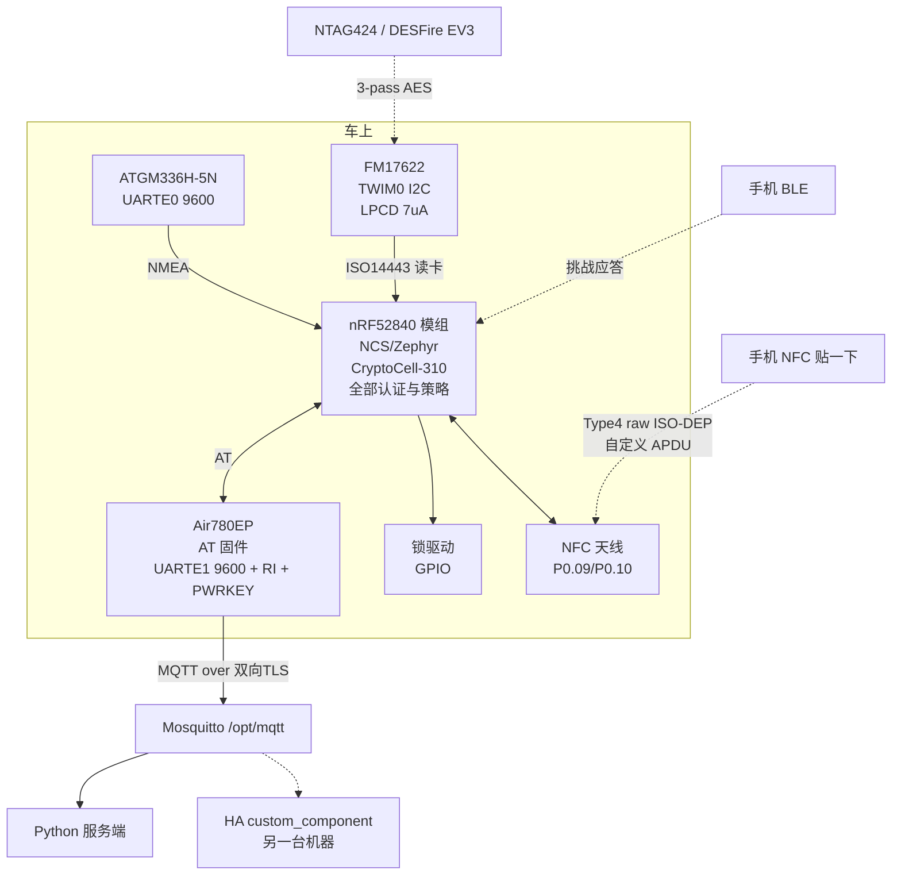

# 架构决策：nRF52840 做主控，Air780EP 降级为 4G 模组

状态：**已采纳**（部分被 [ADR-003](ADR-003-48v-nfc-only.md) 取代）
日期：2026-08-31

> **下游决策**：[ADR-002](ADR-002-power-and-motion.md) 定运动传感器与车电池取电；
> [ADR-003](ADR-003-48v-nfc-only.md) 改为 48V only + **不装 FM17622**，
> 开锁只走「手机 NFC 贴一下」，放弃 BLE 与实体卡。
> 因此本文 §0 与 §2.2 中「FM17622 保留」不再适用，§6 的 Q7~Q10 被 ADR-003 §10 的 R6~R8 取代。
> **§5.1~§5.6、§5.8~§5.10（板子核实、UICR 解锁、pinctrl、批次差异、工具链）全部仍然有效**，
> 只有 §5.7（充电管理）不适用——不再从 USB 充电。

已定：

- 主控 = **ProMicro nRF52840 开发板**（nice!nano V2 兼容）
- 4G = **Air780EP 保持**，刷 AT 固件当纯 modem
- NFC 读卡 = **FM17622 保留**（nRF52840 读不了卡，见 §0）

> **§5.7（充电管理）已被 [ADR-002](ADR-002-power-and-motion.md) 取代。**
> 供电改为从车电池降压取电，不使用板载充电电路，所以充电 IC 缺 NTC 这条不再是本项目的风险。
> 该节保留作为"为什么不用板载充电"的证据。
> ADR-002 同时更正了 §5.6 里 60 µA 那个数字的归属（是坏肖特基的反向漏流，
> ME6217 LDO 自己是 100 µA 典型）。

## 结论

**这个方案是对的，但有一个前提必须先纠正：nRF52840 不能读 NFC 卡。**

`nRF52840` 的 NFCT 外设**只有 NFC-A listen 模式（标签/被动端）**。产品手册 NFCT 章节
第一句原文：

> The NFCT peripheral is an implementation of an NFC Forum compliant listening device NFC-A.

特性列表里"操作模式"一栏只有一行：`NFC-A listen mode operation`。
整章不出现 reader / poller / initiator / PCD 任何一个词。

物理原因写在 Overview 里：

> The NFCT peripheral contains a 13.56 MHz AM receiver and a **13.56 MHz load modulator**.

**load modulator 只能扰动别人提供的场，它不能产生载波**，所以永远无法给一张无源卡供电。
**这是硅片限制，不是固件限制，任何 SDK 都解不开。**

Nordic 官方在 DevZone 上对完全相同的问题（标题 `Using the NRF52840 NFC to read smartcards`，
Case ID 299844）的回复，Nordic Semiconductor 员工 Bendik Heiskel 原话：

> The NFC peripheral can only be used as a tag. To read NFC tags a separate IC is needed.

Nordic 自己的 NCS 文档也这么说，并且给出的方案就是外挂读卡芯片：

> if you want to work in a fully embedded environment, you can use an Arduino-compatible
> NFC shield together with an nRF5 Development Kit to create your own polling device

他们甚至专门为此提供了 `ST25R3911B` 的 SPI 驱动和 `tag_reader` 示例——
**那个示例跑在 nRF52840 DK 上，但仍然必须插 X-NUCLEO-NFC05A1 扩展板。**

所以：

| 场景 | 可行性 |
| --- | --- |
| 手机贴上来刷 → nRF52840 | ✅ 可以（手机是 poller，nRF 是 tag） |
| 用户的 NFC 卡/扣 → nRF52840 | ❌ **不可能**，必须外挂读卡 IC |

**FM17622 保留，接 TWIM0。** 除此之外，你的方案在每一个维度上都更好。

---

## 1. 方案对比

| 维度 | 现方案（780EP 主控） | 新方案（nRF52840 主控） |
| --- | --- | --- |
| **开发语言** | 只能 LuatOS/Lua（780EP 不支持 C-SDK） | C，NCS/Zephyr，完整工具链 |
| **BLE** | 外挂 Air5101S，占 2 GPIO，透传管道无任何链路安全 | **原生 BLE 5，删掉一颗芯片** |
| **AES-CMAC** | **LuatOS 没有**，要在 Lua 里手写 RFC 4493 | **CryptoCell-310 硬件加速**，`PSA_ALG_CMAC` 一行调用 |
| **NFC 读卡** | FM17622 | FM17622（**不变**） |
| **NFC 被动标签** | 无此能力 | **Type 4 Tag raw ISO-DEP**，手机可直接刷 |
| **GNSS** | `libgnss` 通用 NMEA，但 AGPS 绑死 CASIC | 自己写 NMEA 解析，AGPS 无厂商绑定 |
| **休眠电流** | 0.38 mA（低功耗）/ 3 µA（PSM+，但 RAM 掉电） | **0.4 µA System OFF / 3.16 µA 保全 256K RAM** |
| **NFC 场唤醒** | 无 | **有，SENSE 态仅 100 nA** |
| **调试** | Luatools + print | J-Link 单步、RTT、Zephyr shell |
| **外设冲突** | 紧张（I2C0 撞 SPI1，SPI0 撞 I2C1） | 2×UARTE + 2×TWIM + 4×SPIM，本项目零冲突 |
| **代价** | — | **要在 nRF 侧写 AT 命令状态机**（见 §3） |

## 2. nRF52840 侧的收益，逐条核实

### 2.1 CryptoCell-310 补上了 LuatOS 最大的缺口

产品手册章节标题就是 `CRYPTOCELL — Arm TrustZone CryptoCell 310`。硬件加速原文列举：

> AES symmetric encryption: General purpose AES engine, 128 bits key size,
> Supported encryption modes: **ECB, CBC, CMAC/CBC-MAC, CTR, CCM/CCM\***

外加 SHA-1/SHA-256、HMAC、ECC（P-256、Ed25519/Curve25519、ECDH/ECDSA）、
RSA-2048、ChaCha20-Poly1305，以及 `compliant with FIPS 140-2, BSI AIS-31, and NIST 800-90B`
的真随机数发生器。

**AES-128-CMAC 是硬件模式**——这正是 NTAG424 DNA / DESFire EV2/EV3 三向认证和
安全报文需要的原语，也正是 LuatOS 完全没有、要在 Lua 里手写几百行的东西。

SDK 调用路径（全部核实）：

```
CONFIG_PSA_CRYPTO_DRIVER_CC3XX=y     # CryptoCell 驱动（仅 nRF52840/nRF91/nRF5340 可用）
CONFIG_PSA_WANT_KEY_TYPE_AES=y
CONFIG_PSA_WANT_ALG_CMAC=y
CONFIG_PSA_WANT_ALG_SP800_108_COUNTER_CMAC=y   # 想做每卡密钥分散就加这个
```

然后 `psa_mac_compute()` / `psa_mac_verify()` 配 `PSA_ALG_CMAC`（NFC 侧），
`PSA_ALG_HMAC(PSA_ALG_SHA_256)`（BLE 挑战应答），`psa_generate_random()` 出 nonce。

**还有一个防克隆的实招**：CryptoCell 有一个 128 位设备根密钥 `KDR`，
在 Secure LCS 下写入后**一次性、只写不可读**，应用程序永远看不到它的值却能用它做 AES。
对一把锁来说这是真正的抗克隆基础。

两个坑要注意：
- CryptoCell 的 DMA **只能访问 SRAM**（手册明确 `Flash: No / External flash (QSPI): No`），
  密钥和数据必须先拷到 RAM。
- **`The device will not enter the System ON IDLE mode until CRYPTOCELL has been disabled`**
  ——每次算完必须显式关掉，否则再也睡不下去。Nordic 的库会自动处理，但自己写寄存器就要记住。

### 2.2 Type 4 Tag raw ISO-DEP：手机可以直接刷卡开锁

这是个意料之外的收益。`nfc_t4t_lib` 有三种模式，第三种最有用：

> Use the raw ISO-DEP mode only when you need full control over the APDU exchange and do
> not want the library to emulate an NDEF tag file system.
> ... The library delivers all APDUs through the callback as `NFC_T4T_EVENT_DATA_IND`
> events. The application must respond by calling `nfc_t4t_response_pdu_send()`.

这是一个**完整的 ISO7816-4 APDU 通道**。手机可以 SELECT AID 然后跑任意自定义 APDU，
nRF52840 在应用层应答，CryptoCell 做 AES/CMAC。

**等于说 nRF52840 对手机而言就是一个安全元件。** 所以你会同时拥有三条开锁路径：

1. 手机 BLE → 挑战应答
2. **手机 NFC 贴一下 → 同样的挑战应答**（780EP 方案完全做不到）
3. 实体卡（NTAG424/DESFire）→ FM17622 读 → nRF 做 AES

### 2.3 休眠功耗低两个数量级，NFC 场唤醒几乎免费

产品手册电流表（典型值 @3 V, 25 °C）：

| 状态 | 电流 |
| --- | --- |
| System OFF，无 RAM 保持，复位唤醒 | **0.40 µA** |
| System OFF，保全 256 kB RAM | 1.86 µA |
| System ON，无 RAM 保持，RTC 唤醒 | 1.50 µA |
| **System ON，保全 256 kB RAM，RTC 唤醒** | **3.16 µA** ← 现实的"锁在睡觉"数字 |
| System ON，GPIOTE **PORT** 事件唤醒 | 2.36 µA |
| System ON，GPIOTE **IN** 事件唤醒 | **17.37 µA** ← 陷阱，锁位置检测要用 PORT 而不是 IN |
| **+ NFC 场检测武装（SENSE 态）** | **+0.10 µA** |
| NFCT ACTIVATED（瞬态） | 400 µA |
| TX 0 dBm，开 DC/DC | 4.8 mA（LDO 10.6 mA） |
| RX 1 Mbps，开 DC/DC | 4.6 mA（LDO 9.9 mA） |
| CPU CoreMark @64 MHz from flash，DC/DC | 3.3 mA（LDO 6.3 mA） |

**开 DC/DC 大约把射频和 CPU 电流砍一半，电池产品必须开。** 代价是两组外部 LC 滤波，
而且手册警告 `Do not enable the DC/DC regulator without an external LC filter being
connected as this will inhibit device operation, including debug access`。

NFC 场唤醒确认可用。POWER 章节的 System OFF 唤醒源列表原文有一条：

> The SENSE signal, optionally generated by the NFC module to wake-on-field.

代价 100 nA，在 0.40 µA 的地板上是噪声。但有两个坑：

- **从 System OFF 唤醒是一次复位**：`As a consequence of a reset, NFCT is disabled, and
  therefore the reset handler will have to activate NFCT again and set it up properly.`
  跨睡眠的状态必须放保持 RAM（1.86 µA）或 `GPREGRET`。
- `If the system is put into System OFF mode while a field is already present, the NFCT
  Low Power Field Detect function will wake the system up right away` ——
  手机搁在天线上会导致醒/睡死循环，要防。
- UICR 的 `NFCPINS.PROTECT` 必须设成 `NFC`，否则 `the NFCT peripheral will not operate
  as expected, as it will never leave the DISABLE state`。

### 2.4 外设够用，本项目零冲突

计数：2× UARTE、2× TWIM、4× SPIM、5× TIMER、3× RTC、48 GPIO。

唯一的共享规则（手册原文）：

> In general (with the exception of ID 0), peripherals sharing an ID and base address may
> not be used simultaneously.

即 `SPIM0/SPIS0/TWIM0/TWIS0` 同在 ID 3，`SPIM1/SPIS1/TWIM1/TWIS1` 同在 ID 4。

本项目分配落在四个**互不相同**的 ID 上：

| 外设 | ID | 用途 |
| --- | --- | --- |
| UARTE0 | 2 | ATGM336H GNSS，9600 8N1 |
| UARTE1 | 40 | Air780EP AT 链路 |
| TWIM0 | 3 | FM17622（I2C） |
| GPIO/GPIOTE | — | 锁驱动 + 锁位置反馈（用 PORT 事件） |

全部独立 EasyDMA，零争用。若读卡器改走 SPI，**优先 SPIM3(ID 47)**——
它是唯一有硬件 CSN、DCX、IFTIMING 和 >8 Mbps 的实例，SPIM0/1/2 都缺
`hardware CSN control (PSEL.CSN)`，要自己拿 GPIO 抠片选。

一个副作用：**两个 UARTE 都占满了，没有串口留给调试台。** 用 RTT（推荐）、
SWO 或 USB CDC（nRF52840 有全速 USB device）。

---

## 3. 代价：Air780EP 侧要换固件，nRF 侧要写 AT 状态机

### 3.1 必须刷 AT 固件，这是一个单独的镜像

`AirM2M_780EP_V1011_LTE_AT`（2025-01-17），**它会覆盖 LuatOS 镜像，两者不能共存**，
没有双人格构建。用 Luatools 刷（BOOT+RST 进下载模式）。
官方原话：`4G模组中必须烧录正确的AT固件才能支持AT命令功能`。

AT 接口**只在 MAIN_UART/UART1 上**（核心板脚 37 TXD / 36 RXD / 38 GND）。

### 3.2 AT 命令覆盖面（已核实，够用）

命令手册 V1.6.8，274 页，覆盖 780E/600E/700E/780EL/780EP。

| 功能 | 命令 |
| --- | --- |
| MQTT | `AT+MCONFIG`（含 LWT）→ `AT+MIPSTART` / `AT+SSLMIPSTART` → `AT+MCONNECT` → `AT+MSUB` / `AT+MPUBEX` |
| MQTT over TLS | `AT+FSCREATE` + `AT+FSWRITE` 写证书进模组 FS → `AT+SSLCFG="cacert"/"seclevel"/"hostname",88,...` |
| TCP/UDP | `AT+CSTT` → `AT+CIICR` → `AT+CIFSR` → `AT+CIPSTART` → `AT+CIPSEND`；`AT+CIPMODE=1` 是真透传 |
| HTTP(S) | `AT+HTTPINIT` / `AT+HTTPSSL` / `AT+HTTPPARA` / `AT+HTTPACTION` / `AT+HTTPREAD`；`AT+HTTPGETTOFS` 直接下到模组 FS |
| 时间 | `AT+CTZR=1` 拿运营商 NITZ 时间（**免费、无往返**），或 `AT+CNTP` + `AT+CCLK?` |
| 基站定位 | `AT+CIPGSMLOC=1,1`（免费）或 `AT+AIRLBS`（付费，含 WiFi 融合） |
| 休眠 | `AT+CSCLK=0/1/2/3` + `AT+WAKETIM`，或 `AT+POWERMODE="PRO"/"PSM+"/"CLOSE"` |
| 唤醒主控 | `AT+CFGRI=1` → MAIN_RI 出 120 ms 低脉冲；`AT^WAKEUPHEX` 过滤只对魔术串响应 |

**支持双向证书校验的 MQTT over TLS**，而且 TLS 全在模组里跑——
nRF 侧不用管证书链、不占 flash、不占 RAM。这是这个架构一个被低估的好处。

`AT+MQTTMODE=1` 给 HEX 编码，二进制安全。MQTT 单包上限 4100 字节，topic 上限 256 字节。

### 3.3 唤醒握手要 3 根线

| 方向 | 机制 | nRF 侧成本 |
| --- | --- | --- |
| nRF → 模组 | UART RX 字节（文档说"发一个 AT 往往不够，要连发几个"），或 MAIN_DTR 拉低 ~50 ms（仅 `CSCLK=1` 有效） | UART 已有 |
| 模组 → nRF | **MAIN_RI**，需 `AT+CFGRI=1`；PSM+ 下 POWERMODE 第二参数让 RI 周期性脉冲当定时器 | **+1 GPIO** |
| 冷启动 | **PWRKEY 拉低 >1 s**（模组上电不自启动！） | **+1 GPIO**（开集三极管，不能加外部上拉，内部已有 5.6k） |

所以 nRF 侧一共 5 根：UART TX/RX + RI + PWRKEY + DTR（DTR 可选）。

**一定要用 `AT^WAKEUPHEX="<hex>"` 把 RI 限定到魔术下行串。**
否则每一条例行 URC 都把 nRF 从 System OFF 里拽出来，功耗预算直接崩。

### 3.4 一个必须先做的产品决定：远程开锁 vs 3 µA

已核实的官方数据：

| 模式 | 服务器 4G 下行唤醒 | 平均电流 |
| --- | --- | --- |
| 常规 | 支持，<1 s | 4.6 mA |
| **PRO（低功耗）** | **支持，1~2 s** | ~0.4~1.5 mA（依 DRX 和心跳） |
| PSM+ | **不支持**（离线/飞行模式，RAM 掉电） | ~3 µA |

**要远程开锁/远程定位就必须用 PRO，不能用 PSM+。** PSM+ 下模组是离线的，
服务器根本找不到它；而且 RAM 掉电，每次醒来要重新附着网络 + 重建 TLS + 重连 MQTT。

PRO 还有个实测特征：每次唤醒后有 **3~15 s 的尾巴，期间约 22 mA**，
基站才允许它重新睡。官方 30 分钟实测平均值约 1.544 mA（5 分钟一次 160 B TCP 心跳）。

**所以这个架构的总功耗地板是 4G 模组决定的（~0.5~1.5 mA），不是 nRF52840（3 µA）。**
nRF 的超低功耗只有在"模组完全关机、只靠 nRF 定时唤醒"的模式下才兑现。
建议做成两档：日常 PSM+（只有 nRF 醒着看振动/NFC/BLE，定时开模组上报），
布防或用户主动查询时切 PRO。

### 3.5 AT 状态机的真实代码量

要自己写：URC 驱动的行/提示符解析（要处理裸 `>` 提示符，
`CONNECT OK`/`CONNACK OK`/`SUBACK`/`SEND OK` 都是带外 URC，
还有 `CIPSEND`/`MPUBEX` 那个吃字节的 `\r` vs `\r\n` 陷阱）、
每操作的超时重试、断线重连阶梯（`+PDP DEACT`/`CLOSED`/`TCP ERROR` → `CIPSHUT` → 全量重拨）、
睡眠仲裁器（每次写 AT 前判断模组醒没醒）、二进制转义决策、一次性证书灌入。

**[推断] 2000~4000 行 C（Zephyr 之上），而且调试痛点集中在睡眠/URC 竞争窗口，不是顺利路径。**
这是我的工程判断，不是合宙给的数字。

换来的是一套成熟的 MQTT+双向TLS+HTTP+NTP+LBS+FOTA 栈你不用写，
且所有 TLS 敏感操作留在模组内。

### 3.6 波特率被锁在 9600

`AT+IPR` 默认 0 = 自适应（脆弱，要连发几个 `AT` 训练）。
**两种低功耗模式都要求 9600** 才能可靠唤醒，所以 9600 实际上是唯一合理的固定值：
`AT+IPR=9600;&W` 出厂设一次。

**[推断]** 9600 ≈ 1 KB/s 上限。对追踪器够用，但同一条链路做批量传输（比如 FOTA）就别想了。
好消息是 `AT+HTTPGETTOFS` 能让模组自己下载到内部 FS，不经过 nRF。

### 3.7 两条"更优雅的 IPC"都在 Air780EP 上不可用

我查了，想省掉 AT 状态机的两个官方方案都不支持这个具体型号：

- **`airlink`**（合宙的框架化 IPC，自带 magic + CRC16 + 命令分发 + RPC + 分片）：
  官方产品支持列表是 Air780EPM/EGP/EX2/ECP/ECH/EHM/EHV/EGH/EGG/EHU/EHN/Air8000/Air8101/Air1601/1602
  ——**Air780EP 不在其中**。而且 airlink 只文档化了 LuatOS↔LuatOS
  （典型部署是 Air8101 做 SPI 主机挂 Air780EPM 做从机），
  第三方主机要自己重新实现 magic `0xA1B1CA66` + CRC16-MODBUS + 命令表。
- **iRTU/DTU 透传固件**（UART 字节进 → MQTT 出，主题/QoS/LWT/心跳全在网页后台配）：
  老的 dtu.openluat.com 已 EOL（只覆盖 Air724/780E/780EX/780EG），
  新的 iRTU 5.0.4 固件列表是 Air780EPM/EHM/EGP/EGG/EGH/EHV/EHU/EHN/EX2/ECP/ECH/Air8000
  ——**Air780EP 又不在其中**。而且它的 TLS 只有"无证书最简单的加密"，
  **没有 CA / 客户端证书配置**，对一把锁是硬性不合格。

**如果你愿意把 4G 模组换成 Air780EPM**（同族 EC718P，8MB flash），
这两条路都通，AT 状态机可以整个删掉，换成 `airlink` 的 `sdata` 不透明通道。
**这是值得认真考虑的一次替换**——省下的是 2000~4000 行最难调的代码。

---

## 4. 修正后的方案



### 引脚预算：21 个可用 GPIO，需要 17~19 个，能装下

| 用途 | 外设 | 数量 |
| --- | --- | --- |
| GNSS UART | UARTE0 | 2 |
| GNSS 电源门控 | GPIO | 1 |
| Air780EP AT | UARTE1 | 2 |
| Air780EP RI（模组唤醒 nRF） | GPIO 中断 | 1 |
| Air780EP PWRKEY（开集驱动） | GPIO | 1 |
| FM17622 I2C | TWIM0 | 2 |
| FM17622 NPD | GPIO | 1 |
| FM17622 IRQ（LPCD） | GPIO 中断 | 1 |
| **NFC 标签天线** | NFCT | **2（P0.09/P0.10 专用）** |
| **LIS2DW12 INT1**（运动唤醒，**复用同一条 TWIM0，不额外占 I2C 脚**） | GPIO SENSE | **1** |
| **LM5164 PGOOD**（断电/线束被剪告警，见 ADR-002 §4） | GPIO 中断 | **1** |
| P0.13 门控 EXT_VCC LDO（**板载，不引出，不占焊盘**） | — | 0 |
| 锁驱动 | GPIO | 1~3 |
| 锁位置反馈 | GPIO PORT 事件 | 1 |
| **合计** | | **17~19** |

**振动唤醒的限制彻底消失**——nRF52840 任意 GPIO 都能从 System OFF 唤醒（DETECT 信号），
不像 780EP 只有 7 个 WAKEUP 虚拟脚。**电平转换也消失**：供电 1.7~5.5 V，IO 跟 VDD，直接 3.3 V。

运动传感器和供电的完整选型见 **[ADR-002](ADR-002-power-and-motion.md)**：
LIS2DW12 挂 TWIM0（0x19，与 FM17622 共线）只花 1 个 GPIO，
这是不选 ADXL362（仅 SPI，要 5 个脚）的决定性原因。
**3 个 SAADC 脚（P0.02/P0.29/P0.31）在这个预算里全部空闲**——
因为电池监测改由车电池侧的 UVLO 分压器承担，不再需要板上 ADC 测电芯。

---

## 5. ProMicro nRF52840 / nice!nano V2 兼容板核实结果

你选的是这个板子，所以逐条核实了。结论：**开发阶段很合适，但不能直接装到车上出货。**

### 5.1 P0.09/P0.10 引出了，NFC 天线可以接

这是最关键的一条，两边都确认：

| 板子 | P0.09 | P0.10 | 依据 |
| --- | --- | --- | --- |
| 正品 nice!nano v2 | 焊盘丝印 `009`，Arduino 名 **D10** | 焊盘丝印 `010`，Arduino 名 **D16** | 官方 pinout 图 + 官方 KiCad 符号（pin 13 = `NFC1/P0.09`，pin 14 = `NFC2/P0.10`）+ ZMK `arduino_pro_micro_pins.dtsi` |
| 常见克隆（No Logo Tech ProMicro，17.78×33.0 mm） | **J3 第 1 脚** | **J3 第 2 脚** | 逆向工程 KiCad 工程 `sasodoma/nrf52840-promicro`，`promicro.kicad_pcb` 里 net65→J3 pad1、net61→J3 pad2 |

两块板都是**裸 nRF52840 QIAA(aQFN73)，不是预认证模组**——这正是 P0.09/P0.10 能引到焊盘的原因。
两个焊盘物理相邻，接天线的走线可以很短。

**注意：2.54 mm 排针焊盘不是调阻抗的差分对。** NFC 天线要自己调谐，
官方有专门的调谐文档（DevZone `NFC tag antenna tuning`）。

### 5.2 GPIO 数量：21 个，够但不宽裕

两块板都是 21 个可用 GPIO（正品：左 10 + 右 8 + 背面 3 个 P1.01/P1.02/P1.07；
克隆：J2 十个 + J3 八个 + J4 三个，PCB netlist 逐个数出来的）。

21 − 2（NFC 占掉）= **19 个给其余 15~17 个信号**。
锁驱动只用 1~2 根线就有 4 个余量；用 3 根驱动 + 反馈就正好 19/19，**零余量**。

**只有 3 个真正的 ADC 脚**：P0.02(AIN0)=D19、P0.29(AIN5)=D20、P0.31(AIN7)=D21。

**这里有个陷阱**：ZMK 的 `arduino_pro_micro_pins.dtsi` 定义了 Arduino 别名 A6~A10
（P0.22/P1.00/P1.04/P1.06/P0.09），**这些只是 Pro Micro 的引脚命名，不是 SAADC 通道**。
特别是 D10 别名叫 "A10" 但它是 P0.09，根本没有 AIN 功能。
需要 ADC 的东西（比如电池热敏电阻）必须落在 D19/D20/D21。

### 5.3 必须先做的一步：UICR 的 NFC 引脚锁

**这是整个 NFC 计划的门槛，必须在写任何 NFCT 代码之前解决。**

现代 Zephyr/NCS 里 NFC 引脚不是 Kconfig 而是 devicetree 的 UICR 属性
`nfct-pins-as-gpios`，绑定文档原文警告：

> This setting, once applied, can only be unset by **ERASING THE UICR registers**.

好消息：`nice_nano.dts` 里**没有 `&uicr` 节点也没有这个属性**，
所以 Zephyr/NCS 构建不会去锁它，P0.09/P0.10 保持 NFC 功能——这正是你要的。

坏消息：**出厂的 Adafruit UF2 bootloader 是带 `-DCONFIG_NFCT_PINS_AS_GPIOS` 编译的。**
它的 Makefile 里写着 `ifneq ($(USE_NFCT),yes)` 才加这个宏，
而 `nice_nano` 的 `board.mk` 没有设 `USE_NFCT=yes`。
**所以出厂板子的 UICR NFCPINS 大概率已经被锁成 GPIO 了，NFCT 起不来。**

**[推断]** 这是从 bootloader 源码和编译开关推出的，不是读了实际设备的 UICR。
**必须自己用 SWD 读一次 UICR.NFCPINS 确认。**

解锁流程（会擦掉 bootloader，所以要准备好重刷）：

```
# 1. J-Link 接背面 SWD/SWC 焊盘（VTref→VCC, GND→GND, SWDIO→SWD, SWCLK→SWC）
# 2. 读 UICR 确认
nrfjprog -f NRF52 --memrd 0x1000120C     # UICR.NFCPINS
# 3. 全擦（清 UICR）
nrfjprog -f NRF52 --recover
# 4. 重刷 bootloader（它的 board.h 会把 REGOUT0 恢复成 3V3）
nrfjprog -f NRF52 --program nice_nano_bootloader-0.6.0_s140_6.1.1.hex --chiperase
```

**重刷 bootloader 这一步不能省**：它的 `board.h` 里有
`UICR_REGOUT0_VALUE = UICR_REGOUT0_VOUT_3V3`。UICR 全擦后 REGOUT0 会回到 **1.8 V**，
而板上的外设都按 3.3 V 设计——不恢复就整板电平不对。

**所以这个项目必须买一个 J-Link（或 ST-Link v2 + OpenOCD）。**
反正要单步调密码学代码，本来就该有。

### 5.4 pinctrl 冲突：两个板定义都默认占用了 NFC 引脚

| 板定义 | 冲突 | 必须改 |
| --- | --- | --- |
| ZMK `nice_nano-pinctrl.dtsi` | `spi1_default` 把 **SPIM_MOSI 分给 P0.10** | 删掉这条，否则和 NFCT 打架 |
| Zephyr 上游 `promicro_nrf52840-pinctrl.dtsi` | `uart0` **TX=P0.09 / RX=P0.10**，正好两个 NFC 脚 | 必须把 uart0 移走 |

启用 NFCT 之前先把这两处改掉。

### 5.5 DC/DC 电感两块板都有，功耗数字按好的算

这是好消息。正品 v2 官方原理图上 L3=15 nH + L4=10 µH 在 DCC 轨、L1=10 µH 在 DCCH 轨，
而且板定义里 `&reg1 { regulator-initial-mode = <NRF5X_REG_MODE_DCDC>; }`、
v2 overlay 里 `&reg0 { status = "okay"; }`——两级 DC/DC 都开。

克隆板同样populate了：L1=10 µH(DCC)、L2=15 nH、L3=3.3 µH(DCCH)、L4=4.7 nH(天线匹配)。

**所以产品手册那句"没有 LC 滤波不要开 DC/DC"的警告不适用，
你拿到的是 4.8 mA TX / 4.6 mA RX / 3.3 mA CPU，不是 LDO 的 10.6/9.9/6.3 mA。**

两块板都焊了 32.768 kHz 晶振，所以 System ON + 保全 RAM + RTC 的 3.16 µA 是可达的。
**但克隆板的 32 kHz 晶振失效是社区广泛报告的缺陷**，进货要测起振。

### 5.6 休眠电流：克隆板是批次抽奖，4 µA 到 750 µA

**这是克隆板最严重的工程问题，而且不是电池分压器造成的。**

| 元凶 | 电流 | 说明 |
| --- | --- | --- |
| **EXT_VCC LDO（ME6211C33）** | **60 µA typ** | 使能状态下就这么多，是 3.16 µA 预算的 **19 倍**。必须靠 P0.13 拉低关掉，而 **P0.13 没引到任何焊盘**，只能靠固件 |
| **POWER_PIN 上拉 R4** | **0.42 µA / 7~8 µA / ~750 µA** | 2024-04 之后批次是 10 MΩ（0.42 µA）；TENSTAR 批次 500~600 kΩ（7~8 µA）；**2024-04 之前是 5.6 kΩ，约 750 µA** |
| **D1 肖特基被换成普通硅二极管** | **+56 µA** | 某些批次拿普通硅管替代 BAT60B，实测休眠从 ~4 µA 变 ~60 µA |
| 电池分压器 R10/R11 | **0 µA** | 克隆板这两个 0201 焊盘**没贴件**，而且铜箔实际走到 P0.24 不是 P0.04（厂家自己的原理图画错了） |

**所以克隆板最好 ~4 µA，最坏 60~750 µA，而硅片能做到 0.40/3.16 µA。
而且你从商品页面看不出拿到哪一批，只能进货实测。**

正品 nice!nano v2 这几点都好：充电 IC 是 **BQ24075**（带 power-path），
LDO 是 XC6220B331MR，电池电压走**片内 VDDH 分压**（`zmk,battery-nrf-vddh`），
**没有外部分压器、不占 ADC 脚、没有常漏**。官方标称整板静态 ~20 µA。

作为参考，如果你以后自己画板加分压器，别做常通的：

| 分压 | 4.2 V 下漏流 | 占 3.16 µA 预算 |
| --- | --- | --- |
| 1 M + 1 M | 2.10 µA | 66 % |
| 2 M + 806 k | 1.50 µA | 47 % |
| 1 M + 510 k | 2.78 µA | 88 % |

低边用 GPIO 门控，别一直接着。

### 5.7 充电管理：这是最该认真对待的一条

你说这块板"带充电管理"。核实过了，**但那个充电 IC 没有电池温度保护，
而且固件无法禁止充电。**

| 芯片 | 用在哪 | **NTC 电池温度** | **CE 固件禁充** | 充电电流 |
| --- | --- | --- | --- | --- |
| **TP4054 / LTH7R** | **克隆板实际用的** | **无** | **无** | R5=10 k → 100 mA；BOOST 跳线并上 2 k |
| TP4057 / LP4057 | 52840nano V1/V2 | **无**（数据手册文案吹"battery temperature monitoring"，但引脚表 CHRG/GND/BAT/VCC/STDBY/PROG 里根本没有温度脚） | 无 | 电阻设定 |
| ETA4054 | 部分克隆 | 无 | 无 | RISET 到 1 A |
| MCP73831 | nice!nano **v1** | 无 | 无（只能浮空 PROG） | 2 k~67 k → 500~14.5 mA |
| XC6802 | — | 无（只有过温关断；带 NTC 的是 XC6803/6804） | — | RSEN 到 800 mA |
| **TP4056** | — | **有**（pin 1 TEMP） | **有**（pin 8 CE） | 10 k~1.2 k → 130~1000 mA |
| **BQ24075/72** | **正品 nice!nano v2** | **有**（pin 1 TS，10 k NTC） | **有**（pin 4 CE） | RISET 到 1.5 A，带 power-path |

**电瓶车是室外、有振动、温差大的环境。锂电在 0 °C 以下充电会析锂
（枝晶 → 内短路 → 起火），45 °C 以上加速产气。**
TP4054 这类 SOT-23-5 只有**自己芯片的**过温折返（约 120 °C 结温），
**完全不知道电芯温度**。

而且 TP4054/TP4057/ETA4054/LTH7 **没有 CE 使能脚**，
所以在克隆板上**固件无法拒绝给低温/高温的电芯充电**——想加这个保护只能割线加串联管子。

还有个未解的矛盾：克隆板 BOOST 跳线（R7=0 Ω 把 R6=2 k 并到 R5=10 k）算下来
10k∥2k ≈ 1.67 k，按 TP4054 的 R/I 表约 **600 mA**，但厂家页面写 **300 mA**。
**在一个和起火相关的参数上，两个数字对不上——BOOST 就别桥了**，
真要提速先实测电流，别信任何一方。

**建议**：**不用板上的充电电路。** 割断 VBUS→充电 IC 的路径，
外部用 TP4056 或 BQ2407x 配真实的电芯热敏电阻，充电使能接 nRF 的 GPIO。
这会占掉 1 个 GPIO + 1 个 AIN（从那 3 个 ADC 脚里出），预算里还有位置。

### 5.8 不能直接装车的三个理由

| 问题 | 严重性 | 依据 |
| --- | --- | --- |
| **USB-C 是板边未密封的接口**，直接把水引到 VBUS 和充电 IC 上；Pro Micro 式板边座子在振动下容易整个撕掉；部分卖家发错厚度（1.2 mm）的座子 | 高 | 克隆板 footprint 是 `USB_C_Receptacle_GCT_USB4105-xx-A_16P_TopMnt_Horizontal`；卖家黑名单有报告 |
| **零认证**。两块板都是裸芯片 + 陶瓷天线（克隆用 CA-C03），**没有预认证模组可以挂靠**，FCC/CE/SRRC 的整机射频测试全是你自己的 | 高 | 原理图是裸 `Nordic_AQFN-73-1EP`；nologo.tech 和 icbbuy wiki 都没有任何认证标记 |
| **没有任何三防/振动/温度认定**，0201 元件、2.54 mm 排针；而且这一系列被多方可信报告用**翻新/打磨的 nRF52840 芯片**（2018 年日期码，某批次 18 块里 6 块到手即死） | 高 | 社区多方独立报告；厂家没有任何相关文档 |

### 5.9 结论：拿它做开发，别拿它出货

**这块板是很好的 bring-up 目标**——NFC 引脚引出了、两级 DC/DC 电感都有、
有 32.768 kHz 晶振、有 SWD 焊盘、UF2 拖拽刷固件、三十块钱。
**Q1~Q8 全部可以在它上面做完。**

**但量产必须重新画板**，或者至少换到预认证模组上，并且：

- 充电 IC 换 BQ2407x / TP4056 级别，接真实电芯热敏电阻，充电使能接 GPIO
- 电池分压器（如果要）低边 GPIO 门控
- **USB 不外露**——灌封在里面当内部维修口，充电走密封触点
- 板子直焊不用排针，自己做三防（注意涂层盖到陶瓷天线上会失谐）

要换预认证模组的话，必须选把 **P0.09/P0.10 引出**的：

| 模组 | NFC 引脚 |
| --- | --- |
| **Fanstel BT840 / BT840F**（F 是 PA 长距版） | 数据手册引脚表明确列 `P0.09/NFC1 — NFC antenna connection` 和 `P0.10/NFC2`。文档最清楚。**[推断]** 引脚号来自数据手册搜索片段，要读厂商 PDF 确认 |
| **Ezurio (原 Laird) BL654** | 官方按 NFC 版本卖，`brings out all nRF52840 hardware features` |
| **Raytac MDBT50Q-1MV2 / -P1MV2 / -U1MV2** | Nordic 推荐的第三方模组，接口列表含 NFC，48 GPIO 全引出，认证齐全（FCC/IC/CE/MIC/KC/SRRC/NCC/RCM/WPC）。**[推断]** 引脚号要查 Ver.L 规格书 |
| Ebyte E73 / Holyiot / MINEW MS88SF2 | **[未核实]** 无法确认 P0.09/P0.10 是否引出，别假设 |

### 5.10 工具链

| 项 | 说明 |
| --- | --- |
| Zephyr 板名 | 克隆板上游有 `promicro_nrf52840`（Zephyr 官方，2024 年贡献，文档明确说覆盖 "Pro Micro, Promicro, SuperMini nRF52840 boards"）；正品是 `nice_nano/nrf52840` rev 2.0.0，**只存在于 ZMK**，上游 Zephyr 没有 |
| NCS 构建 | 用 `promicro_nrf52840/nrf52840/uf2`；或者把 ZMK 的 `app/module/boards` 加成 `BOARD_ROOT` 用 `nice_nano` |
| 关键 Kconfig | `CONFIG_USE_DT_CODE_PARTITION=y`（应用链接到 0x26000 让 bootloader 能引导）+ `CONFIG_BUILD_OUTPUT_UF2=y` |
| UF2 family ID | `0xADA52840`，上游 `SOC_NRF52840_QIAA` 的默认值，**和 bootloader 的 `UF2_FAMILY` 一致**，所以 NCS 产出的 uf2 能直接拖 |
| 进 bootloader | 没有复位按钮，用镊子快速双击短接 RST 和 GND，出现 `NICENANO` 盘 |
| 调试 | J-Link 或 ST-Link v2 接背面 SWD/SWC 焊盘。**必须有**（UICR 解锁要用） |
| MCUboot | **不要用**。Adafruit bootloader 在 0xF4000，应用在 0x26000，正常路径是 UF2 bootloader 直接引导 Zephyr 应用。串 MCUboot 没有板定义支持，还白吃 792 KB 代码区 |
| Flash 布局 | SoftDevice 0x0~0x26000 / 应用 0x26000+0xC6000(792 KB) / storage 0xEC000+0x8000 / bootloader 0xF4000+0xC000 |

**别用 nRF52840 DK 做产品**（原因同前：板载 J-Link OB、64 Mb QSPI flash、LED 都在耗电；
Nordic 提供 `nRF only mode` 开关 SW6 专门用于低功耗测量，测点 P22/剪 SB40，
且 Debug 模式下 System OFF 只是模拟的，挂着调试器测休眠没意义）。
但你选的 ProMicro 板本身就没有这些累赘，比 DK 更适合做低功耗验证。

---

## 6. 分期实施（修正）

| 阶段 | 内容 | 验收 |
| --- | --- | --- |
| **Q0 板子准备** | J-Link 接上，**读 UICR.NFCPINS**；若已锁则 `--recover` + 重刷 bootloader；实测休眠电流判断批次好坏；**拆 NBD1 + 短接 NPQ2 3-2 脚，抬 TP4054 BAT 脚**（ADR-002 §3.4） | UICR.NFCPINS = NFC；休眠 ≤5 µA |
| **Q1 nRF 基线** | NCS 工程骨架（`promicro_nrf52840/nrf52840/uf2`），两级 DC/DC 打开，改掉 pinctrl 里占 P0.09/P0.10 的默认项，**开机即拉低 P0.13 关 ME6217** | 点灯 + RTT 日志 + System OFF 实测 |
| **Q2 GNSS** | UARTE0 读 ATGM336H，NMEA 解析（RMC/GSV），`$PCAS03` 裁剪，电源门控 | 定位成功，静止漂移可观测 |
| **Q3 4G 上报** | AT 状态机 → MQTT over 双向 TLS → 现有 Mosquitto | 服务端收到定位报文 |
| **Q4 服务端 + HA** | 与原规划 §5 P2/P3 相同，**契约完全不变** | 地图上出现车 |
| **Q5 运动传感器** | LIS2DW12 挂 TWIM0@0x19（SA0 接 VDD_IO），`SENSOR_TRIG_MOTION`/`STATIONARY` 驱动 GNSS+4G 门控（ADR-002 §1） | 推车触发 MOTION；停 N 秒后 STATIONARY；单次敲击不触发 |
| **Q6 低功耗** | System OFF + `PIN_CNF.SENSE` 运动唤醒 + 模组 PRO/PSM+ 双档；`RESETREAS`/`LATCH` 判唤醒源 | PARKED 实测 ≤5 µA（3.3 V 侧） |
| **Q7 车电池取电** | LM5164 前端打样：保险丝 + P-FET 反接 + TVS + 10 µF 电解阻尼 + 16.2 MΩ/576 kΩ UVLO；灌 4.0 V 进 VBAT 焊盘（ADR-002 §2/§3） | 满充到截止全程稳定；电池侧实测 ≈15 µA；欠压点符合设定 |
| **Q8 BLE 开锁** | Zephyr BLE peripheral + `psa_mac_compute(PSA_ALG_HMAC(SHA_256))` 挑战应答 + settings 存计数器 | 正确开锁；重放被拒 |
| **Q9 NFC 标签** | `nfc_t4t_lib` raw ISO-DEP，手机 SELECT AID + 自定义 APDU + 场唤醒；天线调谐 | 手机贴一下开锁；SENSE 态实测 ~0.1 µA |
| **Q10 NFC 读卡** | FM17622 over TWIM0 + ISO14443-4 传输层 + `PSA_ALG_CMAC` 三向认证 | NTAG424 正卡开锁；Classic/克隆 UID 被拒 |
| **Q11 防拔电** | 备份电芯 + 双 LM66100 ORing + PGOOD 下降沿告警（**待你拍板**，ADR-002 §4） | 拔电池后收到告警，并持续上报 |
| **Q12 硬件收敛** | 自绘 PCB 或换预认证模组；USB 不外露；三防（ADR-001 §5.9） | 打样验证 |
| **Q13 收尾** | AGPS、LBS 降级、告警自动化、文档 | 冷启动 TTFF ≤10 s |

**Q0 不能跳。** NFC 引脚锁是 UICR 单向写入，不先解开后面 Q9 一定卡住；
休眠电流的批次差异（4 µA vs 750 µA）也必须在做功耗设计之前先量出来，否则 Q6 的目标是空的。

**Q5 排在 Q7 之前是故意的**：运动传感器决定 GNSS/4G 的占空比，
而占空比决定车电池那边要供多少平均电流。先把门控做对，再定前端。

**Q4 之后服务端和 HA 集成完全不用改**——MQTT 主题和报文 schema（原规划 §5）
是设备无关的，这是当初把契约固化在服务端的回报。

---

## 7. 我的建议

**架构采纳。板子拿来做 Q0~Q11，量产前必须重新画板（Q12）。**

nRF52840 带来的三个东西是 780EP 方案里花钱也买不到的：
硬件 AES-CMAC（否则 NTAG424 要在 Lua 里手写 RFC 4493）、
原生 BLE（省一颗 Air5101S，且不用忍受"哑管道无链路安全"）、
以及**手机贴 NFC 开锁**这个 780EP 完全没有的能力。
外加真正的 C 工具链和单步调试，对一个要写密码学的项目是量变到质变。

你决定保持 Air780EP，所以 AT 状态机这笔成本（**[推断]** 2000~4000 行）是要付的。
接受，但请记住 §3.7：`airlink` 和 `iRTU` 都不支持 780EP，只支持 780EPM。
**如果哪天决定重画 4G 那部分的板子，换 EPM 能把这笔成本删掉。** 现在不用改。

需要接受的四件事：

1. **FM17622 保留**，nRF52840 读不了卡（§0）。
2. **总功耗地板由 4G 模组决定**（PRO ~0.5~1.5 mA），nRF 的 3 µA 只在模组关机时兑现。
   要远程开锁就不能用 PSM+。
3. **Q0 必须先解 UICR 的 NFC 引脚锁**，需要 J-Link（§5.3）。
4. **改从车电池取电之后，休眠预算的主导项变了**：不再是 MCU 的 3.16 µA，
   而是 LM5164 的 10.5 µA + UVLO 分压器的 5 µA（ADR-002 §3.6）。
   板载充电电路（§5.7）随之退出——**但小偷拔电池追踪器就静默这个新问题必须解决**（ADR-002 §4）。

**投币器板上那张"9 个可用 GPIO"的表以及所有 WAKEUP 脚 / 电平转换的妥协全部作废。**
Air780EP 现在只需要 5 根线（UART TX/RX + RI + PWRKEY + 可选 DTR）接到 nRF 上。

---

## 附：未核实项

- **[推断]** AT 状态机 2000~4000 行 C，是工程判断不是官方数字。
- **[推断]** 9600 baud ≈ 1 KB/s 上限，是算术不是文档数字。
- **[推断]** `AT+CFGRI` + `AT^WAKEUPHEX` 是避免误唤醒 nRF 的正确做法；文档只说机制存在。
- **[未核实]** Air780EP 的 MAIN_DTR / MAIN_RI **具体脚号**——`docs.openluat.com/4Gmodulepin/`
  返回 404，只从 AT 手册 V1.6.8 §4.14/§4.17 拿到信号名。
  且手册 V1.6.2 把唤醒脚从 `AP_WAKEUP_MODULE` 改成了 `MAIN_DTR`，
  而 780EP 的 `CSCLK` 网页仍写 `AP_WAKEUP_MODULE`（网页落后于 PDF）。
  **布板前必须查 Air780EP硬件手册V1.1.pdf 确认。**
- **[未核实]** `CSCLK=3` 要求平台 sw ≥V1026、`POWERMODE` 要求 ≥V1143、
  `AT^WAKEUPHEX` 要求 ≥V1131；而 AT 固件版本号（V1011）和平台版本号（V1143）是两套编号，
  无法从文档对齐。低功耗教程演示了 `POWERMODE` 在 V1010 上工作，
  但 `CSCLK=3` 和 `WAKEUPHEX` 在 V1011 上的可用性未确认。
- **[未核实]** PSM+ 典型电流官方页面自相矛盾：3 µA（模组页 + 低功耗页表格）
  vs 2.89/2.9 µA（POWERMODE 命令页）。PSM+ 上行响应时间也是 3 s（模组页）vs 1.5 s（低功耗页）。
- **[未核实]** nRF52840 休眠/活动电流表读自产品手册 **v1.1**（Nordic 文档 4413_417），
  因为 docs.nordicsemi.com 的 HTML 电流页返回 403/404。
  0.4/1.5 µA 两个头条数字与在线特性列表交叉验证一致，但量产前应对最新版 PDF 复核。
- **[未核实]** BLE 在给定广播/连接间隔下的**平均电流**产品手册没有，
  必须用 Nordic 的 Online Power Profiler（devzone.nordicsemi.com/power/w/opp）算。
  我没有跑，任何具体的"X µA @ Y ms 间隔"数字都会是编的，所以刻意不给。
- **[未核实]** NCS `crypto_supported_features` 表里 nRF52840 的 CMAC 行没抓全。
  硬件 CMAC 在产品手册里是明写的，`CONFIG_PSA_WANT_ALG_CMAC` 也存在，
  但具体由 cc3xx 硬件还是 nrf_oberon 软件后备服务，要实际编译一次确认。
- **[未核实]** Fanstel / Raytac 的 NFC 引脚号来自数据手册搜索片段和营销页，要查厂商 PDF。
- **[未核实]** Nordic 没有公开 DK 接口 MCU 的静态电流数字。

ProMicro 克隆板特有的未核实项（**都要在 Q0 阶段用万用表和读料号解决，不能靠文档**）：

- **[推断]** 出厂 bootloader 已把 UICR NFCPINS 锁成 GPIO——从 bootloader 源码的
  `ifneq ($(USE_NFCT),yes)` 和 `nice_nano/board.mk` 没设 `USE_NFCT` 推出的，
  **不是读了实际设备的 UICR**。必须自己读一次。
- **[未核实]** 你手上这块的充电 IC 究竟是哪颗die。社区描述是"LTH7R 或 TP4054"，
  逆向工程那块板是 TP4054(SOT-23-5)。丝印随批次变，没有厂家 BOM。
  **但所有候选的 SOT-23 封装都没有 NTC，所以"没有电芯温度保护"这个结论与批次无关**——
  变的只是电流、待机和漏流数字。
- **[未核实]** R4 实际贴的值（10 MΩ / 500~600 kΩ / 5.6 kΩ）——决定休眠电流
  0.42 µA 还是 750 µA。**量出来。**
- **[未核实]** D1 是真 BAT60B 肖特基还是被换成普通硅二极管——4 µA vs 60 µA 的分水岭。
- **[未核实]** LDO 具体型号（ME6217C33M5G / RT9013-33GB / TP2028-3.3YN5G / ME6211 "S2LC"），
  决定真实静态电流。
- **[未核实]** R10/R11（电池分压器）在你这批是否贴件、什么值——逆向原理图里是字面的 "R"。
- **[矛盾未解]** BOOST 跳线：按元件值算 10k∥2k≈1.67k → 约 600 mA，
  厂家页面写 300 mA。**在起火相关参数上两个数字对不上，别桥它。**
- **[未核实]** 逆向 netlist 显示 P0.14、P0.16、P0.18/nRESET 全接在一个 RESET 网上。
  若为真则 P0.14/P0.16 报废——但这两个脚本来就没引到焊盘，对预算无影响。
  可能只是逆向工程的伪影。
- **[未核实]** nRF52840 芯片来源/日期码，以及 32.768 kHz 晶振质量。
  社区多方报告翻新片（2018 日期码）和晶振不起振。**进货要测。**
- **[未核实]** 任何 FCC/CE/SRRC 备案。厂家页面完全没有认证标记，
  一次自动化 FCC-ID 查询被反爬挡住，所以"没有认证"是**强烈指向**而非穷尽证明。
- **无文档可查**：三防涂层、振动、冲击、温度认定——这一系列板子没有任何厂家文档。
  这是**证据缺失**，不是"证明合格"。
