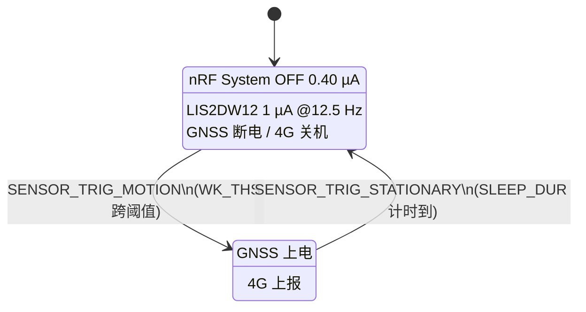

# 架构决策 002：从车电池取电 + 运动传感器选型

状态：**部分被取代** — 见 [ADR-003](ADR-003-48v-nfc-only.md)
日期：2026-08-31
上游：[ADR-001](ADR-001-nrf52840.md)

> **§1 运动传感器（LIS2DW12）全部有效。**
> **§2 全节、§3.3、§3.6、§4 已被 ADR-003 取代**：降压改用成品模块 LX-P160(48V→5V)，
> 电池范围收窄为 48V only，不做欠压保护，不做备份电芯。
> §2 的 LM5164 推导过程保留作为「为什么当初选它」的记录。
> **§3.6 的「2.2 %/天」是算错的**，实际约 0.002 %/天，更正见 ADR-003 §5.1。

已定：

- 运动传感器 = **ST LIS2DW12**（I2C 0x19，与 FM17622 共用 TWIM0，只占 1 个 GPIO）
- 车电池取电 = **TI LM5164**（100 V，10.5 µA 睡眠 Iq）
- 注入点 = 开发板 **VBAT 焊盘，4.0 V**，不是 VCC/EXTVCC，不是 3.3 V

待定：

- **备份电芯要不要**（§4）——不加的话小偷拔电池就等于关掉了追踪器

---

## 0. 先说结论

**振动模组用 LIS2DW12，不要用 SW-420/801S 那类模块。** LM393 比较器模块连续吃
**2~4 mA**，是 nRF52840 System ON 3.16 µA 预算的 **1000 倍**。

**从车电池取电这件事，真正的难点不是降压，是三个隐藏的电流和一个安全问题：**

1. 降压 IC 自己的静态电流（LM5164 是 10.5 µA @84 V = 882 µW，比 MCU 的 10 µW 大 88 倍）
2. 欠压保护分压器（按 TI 推荐的 1 MΩ 画，84 V 下漏 85 µA，是降压 IC 自己的 8 倍）
3. 开发板上那颗 LDO（不关掉就 100 µA）
4. **只从车电池取电，小偷拔电池的瞬间追踪器就死了**——而拔电池是他做的第一件事

---

## 1. 运动传感器：LIS2DW12

### 1.1 为什么不用振动模块

| 方案 | 持续电流 | 结论 |
| --- | --- | --- |
| **SW-420 / SW-18010P / 801S 模块**（LM393） | **~2~4 mA，最坏 5 mA** | **淘汰**，超预算 ~1000 倍 |
| 裸弹簧开关 SW-18010P/SW-18020P、滚珠倾斜开关 SW-520D | 开路 0 A，但闭合时漏 VDD/Rpu | **功能上淘汰** |
| TE LDT0-028K 压电薄膜 | 0 A（无源） | **功能上淘汰** |

**LM393 那个数字是核实过的**：TI SLCS005AH §5.8，`VCC=5 V, RL=∞, 25 °C` 下
LM393 ICC **典型 0.45 mA / 最大 1 mA**。**[推断]** 加上板上电源 LED（~1.3 mA）、
输出 LED（~1.3 mA）、10 kΩ 上拉（0.33 mA）、10 kΩ 电位器分压（0.33 mA），
合计 2~4 mA。**把 LED 焊掉也没用**——光比较器本身就超 140 倍。

裸弹簧开关的问题不是电流而是**它根本回答不了你需要的问题**：
这类开关常态闭合或抖动，任何上拉偏置在闭合期间都在漏电（即使用离谱的 1 MΩ 上拉，
3.3 V/1 MΩ 还是 3.3 µA），而且**没有阈值、没有持续时间过滤，
分不清"有人在骑"和"旁边过了辆卡车"**。后者是关键——你要用它来决定 GNSS/4G 开不开。

压电薄膜是无源的（0 A），`Low Power Wakeup Switch` 也是 TE 自己列的应用，
但它输出的是**电荷不是电平**：双极性尖峰，按负载 RC 衰减，**撑不住 nRF52840 的 SENSE 电平**；
开路输出 >70 V（弯 90° 时），超 nRF52840 绝对最大值，要加钳位；
工作温度 0~85 °C，**户外冬天不够**。要把它变成可靠的数字唤醒就得加比较器——又回到 mA 问题。

### 1.2 候选对比（全部来自厂商数据手册）

| 器件 | **仍在检测运动时的电流**（精确条件） | 最深休眠 | 自主引擎（手册原名） | 接口 | I2C 地址 | Zephyr 驱动 | **真运动 trigger？** |
| --- | --- | --- | --- | --- | --- | --- | --- |
| **LIS2DW12** | **1 µA @ODR 12.5 Hz, Low-power mode 1, low-noise off, Vdd 1.8 V, 25 °C**；0.38 µA @1.6 Hz | 50 nA | `Activity/Inactivity`、`Android stationary/motion detection`（WAKE_UP_THS 34h / WAKE_UP_DUR 35h / CTRL7 3Fh） | I2C + SPI | **0x18/0x19** | `drivers/sensor/st/lis2dw12`，`st,lis2dw12` | **有**：MOTION + STATIONARY + FREEFALL + TAP + DOUBLE_TAP |
| ADXL362 | **0.27 µA** Wake-Up Mode, VS=2.0 V, 25 °C, ~6 Hz 检测率 | 10 nA | `Wake-Up Mode`、`Autosleep`、`Linked/Loop mode`、`AWAKE` 引脚 | **仅 SPI** | — | `drivers/sensor/adi/adxl362`，`adi,adxl362` | **有**：MOTION + STATIONARY |
| BMA400 | 850 nA @25 Hz low-power, osr_lp=0 | 160 nA | `Auto wake-up`、`Generic interrupt 1/2`、`Step counter` | I2C + SPI | 0x14/0x15 | `drivers/sensor/bosch/bma4xx` | **没有**（见下） |
| LIS3DH / LIS2DH12 | 6 µA @50 Hz LP；2 µA @1 Hz | 0.5 µA | `Sleep-to-wake`/`Return-to-sleep`（ACT_THS 3Eh / ACT_DUR 3Fh） | I2C + SPI | 0x18/0x19 | `drivers/sensor/st/lis2dh` | 有：`SENSOR_TRIG_DELTA` |
| KX023 | **[未核实]** | — | — | — | — | **无驱动无 binding** | — |

**BMA400 硅片很好但软件不行**：`drivers/sensor/bosch/bma4xx` 里
`SENSOR_TRIG_` 一个都没有，`sensor_driver_api` 结构体**根本没有 `.trigger_set`**，
只有 `.attr_get/.attr_set/.get_decoder/.submit`——是 RTIO/`SENSOR_ASYNC_API` 专用驱动。
`bma4xx_interrupt.c` 只往 `INT_MAP_DATA`(0x58) 写 FIFO watermark 和 FIFO full。
**要用它的 auto-wakeup 就得自己 `i2c_write_dt` 手写 WKUP_INT_CONFIG0~4 + AUTOWAKEUP_0/1，
绕过整个 sensor API。** 而且它接受 chip id 0x90 时还会
`LOG_WRN("Driver tested for BMA422")`。

KX023 没有 Zephyr 驱动也没有 binding（`dts/bindings/sensor/` 里 `kionix,*` 零命中，
`rohm,*` 只有光传感器），而且拿不到 Kionix/ROHM 原厂数据手册，直接跳过。

### 1.3 为什么是 LIS2DW12 而不是 ADXL362

ADXL362 的 **270 nA 比 1 µA 好 3.7 倍**，而且它的 `loop mode` + `AWAKE` 引脚是这批里
**唯一能在 MCU 完全不参与的情况下直接门控下游电源**的引擎，
Zephyr 侧 `CONFIG_ADXL362_INTERRUPT_MODE=3` + devicetree `wakeup-mode`/`autosleep`
就能配出来，零裸寄存器。

**但它只有 SPI**——硅片没有 I2C，Zephyr binding 也只 include `spi-device.yaml`。
SCK/MOSI/MISO/CS + INT1 = **5 个脚**，而 LIS2DW12 挂在已有的 TWIM0 上
**只要 1 个脚**（INT1）。在 21 个 GPIO、NFCT 已吃掉 P0.09/P0.10 的板子上，4 个脚是真钱。

而且 1 µA 在这个系统里根本不是瓶颈——**降压 IC 的 10.5 µA 和分压器的 5 µA 比它大一个数量级**（§3.5）。
省 730 nA 去花 4 个 GPIO 是错的优化方向。

**如果以后自己画板发现脚有余量，ADXL362 是干净的升级路径**，Zephyr 侧改 compatible 就行。

### 1.4 接线与地址

**SA0/SDO 必须接 VDD_IO（地址 0x19），不能接地。**

LIS2DW12 的 SDO/SA0 有内部上拉，Table 2 给的是 **20.4~54.4 kΩ**。
接地的话这个内部上拉直接对地导通，3.3 V / 20~30 kΩ ≈ **110~160 µA**——
**比传感器本身大 100 倍。** Zephyr 的 `st,lis2dh-common.yaml` 专门有个
`disconnect-sdo-sa0-pull-up` 属性来处理这件事，注释原文就是 `to save current leakage`。

| 引脚 | 接到 |
| --- | --- |
| VDD + VDD_IO | 3.3 V |
| CS | **拉高**（强制 I2C 模式，必须） |
| SA0/SDO | **VDD_IO** → 地址 **0x19** |
| SDA/SCL | 与 FM17622 共用 TWIM0 |
| INT1 | 任意空闲 GPIO，**推挽输出、高有效** |
| INT2 | 不用 |

**INT1 必须配成推挽而不是开漏加上拉**：nRF52840 手册唯一的定性警告是
`When a pin is configured as digital input, increased current consumption occurs when
the input voltage is between VIL and VIH`。推挽保证引脚永远不在线性区，
也省掉外部上拉的电流。

**地址不冲突**：FM17622 的地址仍然**[未核实]**（复旦微 fmsh.com 下载链接全 404，
sekorm 的 8 页说明书第 2 页后付费墙）。它克隆的 PN512 方案是——
NXP PN512 手册 §15.3 原文：`If pin EA is set LOW, the upper 4 bits of the device bus
address are reserved by NXP Semiconductors and set to 0101b`，剩下 3 位由 ADR_0~2 外部拨，
即 7 位地址 **0x28~0x2F**。跟 0x19 差得很远。**但布板前必须找复旦微确认真实地址。**

### 1.5 唤醒路径（核实过能工作）

nRF52840 手册 GPIO 章原文：`Pins can be individually configured through the SENSE field
in the PIN_CNF[n] register to detect either a high or low level input... This mechanism is
functional in both System ON and System OFF mode.`，并明确列出
`POWER — uses the DETECT signal to exit from System OFF mode.`

所以 **21 个 GPIO 里任意一个都能当唤醒脚**，不需要专门的引脚（这是 780EP 只有 7 个
WAKEUP 虚拟脚的对照）。唤醒后 `RESETREAS` 告诉你是 GPIO 唤醒，
`LATCH` 寄存器（0x520，掉电保持）告诉你是哪个脚。`PIN_CNF[n].SENSE`：Disabled=0、High=2、Low=3。

**[未核实]** nRF52840 手册**没有公布**配置了 SENSE 的引脚要额外花多少电流——
GPIO 电气规格表只有 VIH/VIL/VOH/VOL/IOL/IOH、RPU/RPD=13 kΩ 典型、CPAD=3 pF。
0.40 µA / 3.16 µA 那两个头条数字是不带 SENSE 加数给的。

### 1.6 状态机

两个边沿都由硅片判定，MCU 不轮询：



- `SENSOR_TRIG_MOTION`（`CONFIG_LIS2DW12_WAKEUP`，走 `int1_wu`）= 开始骑 → 给
  ATGM336H 和 Air780EP 上电
- `SENSOR_TRIG_STATIONARY`（`CONFIG_LIS2DW12_SLEEP`，走 `int2_sleep_chg`）= 停了 →
  断 GNSS 和模组，重新武装 System OFF。**静止判定时长在硅片里**：
  `sleep-duration` 最多 15 × 512/ODR

阈值：`WAKE_UP_THS`(34h) 的 `WK_THS[5:0]` 是 6 位，1 LSB = FS/64，
**FS=2 g 时一格 31.25 mg**。Zephyr 侧运行时用 `SENSOR_ATTR_UPPER_THRESH`（单位 mg，
驱动用 `MG_TO_WK_THS_LSB` 换算），**注意阈值不是 devicetree 属性，只能运行时设**。
持续时间用 devicetree 的 `wakeup-duration`（1 LSB = 1/ODR）。
电瓶车**从 100~200 mg + wakeup-duration = 2~3 个 ODR 周期起调**，用来滤掉单次敲击。

顺带免费拿到的、对追踪器有用的功能：
**6D/4D 方向检测**（`6D_THS[1:0]`、`SIXD_SRC` 3Ah）——车被放倒或被抬进面包车；
单击/双击——敲击撬动；32 级 FIFO；片上温度传感器。全部路由到同一根 INT1
（`CTRL4_INT1_PAD_CTRL`）。

### 1.7 配置

```ini
CONFIG_LIS2DW12=y
CONFIG_LIS2DW12_TRIGGER_GLOBAL_THREAD=y   # 不额外开线程栈
CONFIG_LIS2DW12_WAKEUP=y                  # → SENSOR_TRIG_MOTION
CONFIG_LIS2DW12_SLEEP=y                   # → SENSOR_TRIG_STATIONARY
CONFIG_LIS2DW12_TAP=y                     # 可选：撬动
CONFIG_LIS2DW12_FREEFALL=y                # 可选
```

```dts
&i2c0 {
    lis2dw12: lis2dw12@19 {
        compatible = "st,lis2dw12";
        reg = <0x19>;
        irq-gpios = <&gpio0 N GPIO_ACTIVE_HIGH>;   /* 注意属性名是 irq-gpios */
        int-pin = <1>;
        odr = <12>;                  /* 12.5 Hz */
        range = <2>;                 /* ±2 g，一格 31.25 mg */
        power-mode = <LIS2DW12_DT_LP_M1>;
        wakeup-duration = <LIS2DW12_DT_WAKEUP_2_ODR>;
    };
};
```

`irq-gpios` 这个名字要记住——**不是** `int1-gpios`（那是 ADXL362 和 BMA400 的）。
它同时是 `CONFIG_LIS2DW12_TRIGGER_*` 生效的前提。

---

## 2. 从车电池取电

### 2.1 最坏情况电压：先定支持哪些电池

| 电池 | 标称 | **充电器满充（最坏持续电压）** | 控制器欠压保护点 |
| --- | --- | --- | --- |
| 48 V 铅酸 | 48 V | **58.8 V** | 42 V |
| 48 V 锂（13S） | 48 V | 54.6 V | 42 V |
| 60 V 锂（16S） | 60 V | **67.2 V** | 52.5 V |
| 72 V 锂（20S） | 72 V | **84.0 V** | 63 V |
| 72 V 铅酸 | 72 V | **87.6~88.2 V** | 63 V |

**[未核实-原厂]** 充电器输出电压来自经销商目录不是厂商数据手册；
控制器保护点来自 Far-Driver 控制器手册（搜索片段，页面本身 403）。

**设计最坏值：要支持 72 V 就是 88.2 V；只支持 48 V 就是 58.8 V。**
这个数字决定了后面所有选型，**必须先定。**

### 2.2 降压 IC：LM5164

| 器件 | Vin 推荐/绝对最大 | Iout | **无载 Iq（精确条件 + 模式名）** | 结论 |
| --- | --- | --- | --- | --- |
| **LM5164** | **6~100 V / 100 V** | 1 A | **10.5 µA 典型 / 25 µA 最大**，`VEN=2.5 V, VFB=1.5 V, VIN=24 V`，"sleep mode"（COT + 二极管仿真模式跳脉冲，空闲 >15 µs 进入，9 µs 唤醒）；关断 3 µA 典型 `VEN=0 V`；工作 600 µA | **选它** |
| LM5163 | 6~100 V / 100 V | 0.5 A | 同上，数字完全一样 | 备选 |
| LM5165 | 3~65 V / **68 V** | 150 mA | 10.5 µA 典型 / 15 µA 最大 `VFB=1.5 V, TA=25 °C`；65 V 时 11 µA | **仅 48 V 包** |
| LM5166 | 3~65 V / **68 V** | 500 mA | **9.7 µA 典型** / 15 µA 最大 `VFB=1.5 V, TJ=25 °C` | **仅 48 V 包** |
| LM5017 | 7.5~100 V / 100 V | 600 mA | **1.75 mA** 非开关工作 `VFB=3 V`；关断 50 µA 典型/225 µA 最大 | **淘汰** |
| TPS54160/A | 3.5~60 V / 65 V | 1.5 A | **116 µA 典型 / 136 µA 最大** 非开关工作 `VSENSE=0.83 V, VIN=12 V, 25 °C`（Eco-mode 跳脉冲） | 超预算 10 倍 |
| TPS54060 | 3.5~60 V | 0.5 A | 116 µA | 同上 |
| TPS54260 | 3.5~60 V | 2.5 A | 138 µA | 超 13 倍 |
| MP4583 | ?~100 V | 2 A | MPS 产品页写 `8µA IQ`，**[未核实]**——测试条件和模式名读不到（官网机器人挑战） | 数字诱人但无据 |
| MP9486A | 4.5~100 V | 3.5 A | **[未核实]**，拿不到 Iq | — |
| MP4459 | 36 V 级 | 0.6 A | **[未核实]**；36 V 耐压本身就上不了 48 V 母线 | 淘汰 |
| MP157 | AC 离线 | — | 类别错误（这是市电非隔离，不是 DC 母线） | 淘汰 |
| SCT2A27（Silergy） | 5.5~100 V | 2 A | **[未核实]** | — |

**TI 自己把 `Battery pack – e-bike, e-scooter, LEV` 列为 LM5164/LM5163 的应用。**

LM5164 细节：集成 0.725 Ω 高边 + 0.33 Ω 低边 NFET、内部 VCC 稳压器和 boot 二极管，
最小可控导通时间 50 ns（84 V→3.3 V @100 kHz 需要 tON ≈ 393 ns，**余量充足**）。
SO-8 PowerPAD，RθJA 43.4 °C/W。3.3 V/200 mA、85% 效率下耗散 ~0.12 W ≈ 升温 5 °C，
**热上完全不是问题**。1.27 mm 引脚间距 TI 明确说是为高压留的——84 V 且在座垫下潮湿腔体里，这条有意义。

### 2.3 两级方案（90 V→12 V→3.3 V）输了

算术很清楚。3.3 V / 3 µA 的睡眠负载是 **10 µW**。
一颗 LM5164 在 84 V 下 = 10.5 µA × 84 V = **882 µW**——**第一级的 Iq 大 88 倍，
而且加不加第二级它都一样。**

第二级用 TPS62840（60 nA 工作 Iq、120 nA 100% 模式、25 nA 关断）只加
12 V × 60 nA ≈ **0.7 µW**，但多一颗料、多一个电感、多一路输出电容漏流。
而 LM5164 单级 84 V→3.3 V 是合法的（50 ns 最小导通时间），**没有功能理由级联。**

### 2.4 欠压截止：整个前端最大的坑

**必须做**——铅酸深放一次就废。

**用降压 IC 自己的 EN/UVLO 分压器，不要另加监控 IC。** 因为监控 IC 要看 48~84 V 就得配外部分压器，
分压器电流本身就超预算。参考：TPS3839 是 150 nA 典型但只到 6.5 V（**只能看 3.3 V 轨，永远看不到电池**）；
TPS3840 是 300 nA 典型、1.5~10 V，看 48 V 节点还是要外部分压器。

LM5164 EN/UVLO：`VEN-RISING` 1.5 V 典型、`VEN-FALLING` 1.4 V 典型，低于 1.1 V 关断。

$$V_{IN(on)} = 1.5\,\text{V} \times \left(1 + \frac{R_{UV1}}{R_{UV2}}\right), \quad
V_{IN(off)} = 1.4\,\text{V} \times \left(1 + \frac{R_{UV1}}{R_{UV2}}\right)$$

**滞环只有 6.7%。**

**坑在这里：TI 推荐 RUV1 ≈ 1 MΩ，在 84 V 下漏 ~85 µA——是降压 IC 自己 Iq 的 8 倍。**

要把分压器漏流压到 ≤5 µA @84 V，总阻值必须 ≥ **16.8 MΩ**。
算例：`RUV1 = 16.2 MΩ, RUV2 = 576 kΩ` → 43.7 V 开、40.8 V 关、84 V 下 5.0 µA。

截止点设定原则：**设在车控制器自己的保护点之上，让追踪器永远先放弃。**

| 系统 | 控制器保护点 | **追踪器截止设** |
| --- | --- | --- |
| 48 V | 42 V | **44 V** |
| 60 V | 52.5 V | **55 V** |
| 72 V | 63 V | **65 V** |

铅酸的物理底线是 1.75 V/cell = 12 V 块 10.5 V，正好对上控制器的点。
锂电有自己的 BMS（2.8~3.0 V/cell），**追踪器截止要设在 BMS 阈值之上，
别让 BMS 因为你而锁定**。**[推断]** 这组数字是电芯化学极限加控制器手册推的。

### 2.5 TVS 钳位：72 V 包在 100 V 器件上无解

| TVS | 标称截止 | 最小击穿 | **最大钳位** | 功率 |
| --- | --- | --- | --- | --- |
| SMBJ58A | 58 V | 64.4 V | **93.6 V** | 600 W, 6.4 A |
| SMBJ100A | 100 V | 111 V | **162 V** | 600 W, 3.7 A |

（经销商参数库；Littelfuse/Vishay 的 PDF 本身 403/404）

- **48 V 包**：充电器 58.8 V < SMBJ58A 最小击穿 64.4 V，钳位 93.6 V < LM5164 绝对最大 100 V。
  **干净的组合。**
- **60 V（67.2 V）/ 72 V（84~88.2 V）包**：需要的截止电压逼你上 SMBJ75A/SMBJ100A，
  **而它们的钳位电压 >100 V，超过降压 IC 的绝对最大值。**
  **一颗 100 V 的 buck 在这两种电池上没法用直接并联的 TVS 保护。**

**没有找到耐压超过 100 V 且 Iq <50 µA 的降压 IC——这是个未解的缺口。**

**[推断]** 三条出路：(a) 把范围限定在 48 V；(b) 在钳位前加串联阻抗
（10~47 Ω 或磁珠）把透过的能量限制在 100 V 以内；(c) 上 150 V 级前端（没找到低 Iq 的）。

### 2.6 反接保护：不要用串联肖特基

**用 P 沟道 MOSFET 理想二极管 + 栅源齐纳，不要串联肖特基。**

理由是这个项目自己的实测证据：`sasodoma/nrf52840-promicro` 记录了
**把 BAT60B 肖特基换成普通硅二极管后板子休眠电流从 4 µA 变 60 µA，纯粹是反向漏流**。
肖特基在 84 V 和高温下的反向漏流是完全一样的失效模式。**[推断]**

pack 级别不要用 LM7480-Q1（3~65 V 理想二极管控制器，教科书方案）：
关断时 2.87 µA，**但使能后整系统 Iq 是 413 µA 典型 / 495 µA 最大 @24 V**——
是降压 IC 的 40 倍。

LM66100（1.5~5.5 V 理想二极管，**IQ 150 nA 典型**，RON 91 mΩ @3.6 V，SC-70-6，
TI 列的应用就有 `GPS and tracking` 和 `Primary and backup batteries`）
在 pack 级别用不上，但它是 §4 备份电芯 ORing 的正确器件。

### 2.7 输入滤波：LM5164 §7.3 有一条硬要求

手册原文：长输入线的寄生电感加低 ESR 陶瓷电容组成**欠阻尼谐振电路**，
每次上下电都产生过压瞬态。修正办法是并一颗铝电解：

> [a] 10 µF electrolytic capacitor with a typical ESR of 0.5 Ω provides enough damping
> for most input circuit configurations

高频陶瓷推荐 2.2 µF 以上，**耐压取最大输入电压的两倍**。

顺带：LM5164/LM5163 手册都说宽输入范围
`minimiz[es] the need for external surge suppression components` 且 `Meets CISPR 25 class 5`,
所以**共模电感是可选而非必须**。

### 2.8 保险丝：注意耐压不是电流

唤醒时输入电流很小：3.3 V × 200 mA ÷ 0.85 ÷ 84 V ≈ **9 mA**。
所以 250~500 mA 按电流是宽裕的。

**坑在耐压**：大多数 0603/0805/1206 贴片保险丝直流耐压只有 **32~63 V**，
**48~84 V 母线上不能用**。要选直流分断能力 ≥100 V 的（引线式，或线束里放高压筒式）。
具体型号留空，不编。

### 2.9 瞬态环境：没有对应标准

**找不到 LEV 专用的传导瞬态标准。**

- **ISO 7637**（1/2/3/5 部分已发布）只覆盖 **12 V 和 24 V** 道路车辆系统，
  **不覆盖 48~84 V LEV 母线**，只能类比借用
- **EN 15194:2017(+A1:2023)** 是欧盟 EPAC 标准，覆盖 ≤0.25 kW 助力自行车的电气安全和 EMC，
  但它是产品安全/EMC 标准，**不是传导瞬态抗扰波形规范**

唯一具体的先例是 TI 自己的 LM7480-Q1 手册：24 V 电池系统用共源背靠背 MOSFET 加 TVS
抵御 200 V 未抑制的 load dump，原文
`During ISO 7637-2 pulse 1 test, the SMBJ33CA clamps at –44 V with 12 V …`。

### 2.10 前端框图

```
  PACK+ （48/60/72 V；带充电器最坏持续 58.8 / 67.2 / 88.2 V）
    |
   [F1]  保险丝 250~500 mA，**直流耐压 ≥100 V**（贴片件通常只有 32~63 V，不能用）
    |
   [Q1]  P 沟道 MOSFET 理想二极管 + 栅源齐纳（反接保护）
    |     不要肖特基：84 V 下反向漏流就是那个 4 µA → 60 µA 的失效模式
    |
   [L1/R1]  小串联阻抗（磁珠 / 10~47 Ω），把 TVS 透过能量压进 buck 绝对最大值以内
    |
    +--[D1] TVS 对 PACK-：48 V 包用 SMBJ58A（钳位 93.6 V < 100 V，干净）
    |                     60/72 V 包无解，见 §2.5
    +--[C1] 2× 2.2 µF / 100 V X7R 陶瓷，紧贴 VIN，回路面积最小
    +--[C2] 10 µF 铝电解，ESR ≈0.5 Ω  ← LM5164 §7.3 **强制要求**
    |
   [U1]  LM5164
    |     EN/UVLO ← 16.2 MΩ / 576 kΩ 分压（44 V 开 / 40.8 V 关，5 µA @84 V）
    |     RON     ← 定频率
    |     BST     ← 2.2 nF 50 V X7R 到 SW（**就是 2.2 nF**，更大会压迫内部 VCC 稳压器）
    |     PGOOD   → nRF52840 GPIO，**下降沿中断 = 线束被剪 / 电池被拔告警**
    |
    +-- 4.0 V ──[U2] LM66100 ──┬──→ 开发板 VBAT 焊盘
                                │
        备份电芯 ──[U3] LM66100 ┘
```

---

## 3. 往开发板灌电：注入哪个焊盘，剪哪条线

### 3.1 决定性事实：VCC/EXTVCC 是 LDO 输出，不是 MCU 供电

**两块板都是这样**：nRF52840 由 **VDDH** 供电，VDDH 来自充电器/power-path 节点，
LDO 挂在 VDDH 下游当外设轨。joric 的 nRFMicro wiki 对 SuperMini/nice!nano 这一类直接写
`VCC pin: output-only`，以及 `RAW (4.2 V charger) and VCC (3.3 V output) are the separate circuits`。

**所以往 VCC/EXTVCC 灌 3.3 V 什么都没供上，只是反灌一个 LDO 的输出。
必须灌 VBAT / RAW / BATTERY+。**

### 3.2 克隆板 J3 焊盘顺序（从 KiCad netlist 直接读的）

从 P0.09 那头数，13 个焊盘依次是：

```
P0.09 → P0.10 → P1.11 → P1.13 → P1.15 → P0.02 → P0.29 → P0.31
      → EXTVCC → RESET → GND → VBAT → VBAT
```

两个 VBAT 焊盘（`promicro.kicad_sch` 里 y=172.72 和 y=175.26 两段导线都落在同一个
VBAT 电源符号上）。

电气拓扑：

```
VBUS → TP4054 VCC
TP4054 BAT → VBAT
VBAT + VBUS ──[NPQ2 P-FET + NBD1 BAT60B 肖特基"W5" + NPR7]──→ VDDH
VDDH → ME6217C33 VIN
ME6217 CE ← POWER_PIN = P0.13（经 NPR1 上拉）
ME6217 VOUT → EXTVCC
```

正品 nice!nano v2：`U2` 图纸上是 BQ24075 但**第二批之后实际发的是 BQ24072**；
`IN←VBUS`、`OUT(pin 10,11)→VDDH`、`BAT(pin 2,3)→VBAT` 配 4.7 µF；
`VDDH→U3=XC6220B331MR VIN`，`CE←P0.13`（R9=10 MΩ 上拉到 VDDH），`VOUT→EXT_VCC`。
`RAW` 焊盘和两个 `BATTERY+` 焊盘是同一个 VBAT 网。

### 3.3 灌 4.0 V，不是 3.3 V

**3.3 V 灌 VBAT 是不够的。** 经 ~0.24 V 肖特基压降到 VDDH 只剩 ~3.06 V，
而 **VDDH 是 ME6217 的输入**——ME6217C33 在 300 mA 下压差 100 mV 典型/180 mV 最大，
EXTVCC 轨会掉出稳压，落到 ~2.96 V。

**灌 4.0~4.2 V（等效一颗合成的单节锂电）。** 这让 VDDH 落在 nRF52840
高压模式窗口内（**[未核实-原厂]** 2.5/3.7/5.5 V min/nom/max，
Nordic 自己的页面 403，这组数字是多家 nRF52840 模组数据手册一致引用的，如 MS88SF2），
同时给 LDO 留出压差余量。

### 3.4 克隆板必须做的三处改动

1. **拆掉 NBD1，短接 NPQ2 的 3-2 脚。** 这是逆向工程作者自己记录的改法。
   它让 nRF 无条件从 VBAT 取电，**并且消除那条在坏批次上要 60 µA 的二极管反向漏流路径。**
2. **开发期插 USB 之前，把 TP4054 拆掉或抬起它的 BAT 脚（pin 3）。**
   否则 USB 一插，TP4054 看到 `VCC=5 V, BAT=4.0 V`（低于 4.2 V 浮充阈值、
   高于 2.9 V 涓流阈值），**会按设定的恒流往你的 buck 输出里倒灌**——
   100 mA，或者桥了充电加速跳线的话 ~300~400 mA。
   **VBUS 不在的时候充电器是无害的**：TP4054 BAT 脚待机电流
   −2.5 µA 典型 / −6 µA 最大 @VBAT=4.2 V；`VCC=0 V` 睡眠时 −1 µA 典型 / −2 µA 最大。
3. **开机就把 P0.13 拉低**，把 ME6217 的 CE 压住（0.1 µA 典型，而不是 100 µA 典型）。
   **这是强制项不是优化项。**

正品 nice!nano v2 **没有干净的切法**：BQ2407x 的 OUT 脚直接喂 VDDH，
所以它的 BAT 脚睡眠电流 **4.3 µA 典型 / 6.5 µA 最大**（`CE=LO或HI, OUT 无负载,
未检测到输入电源, EN1=HI, EN2=HI, TJ=85 °C`）**躲不掉**，除非割断 OUT 走线再
跳线 BAT→VDDH。算进预算。

### 3.5 更正 ADR-001 §5.6 的一个数字

**开发板 3.3 V 轨上那个"60 µA"是我之前记错了归属。**

| 器件 | 实际数字 |
| --- | --- |
| **ME6217C33**（克隆板 LDO，丝印 J2WD） | `ISS1` = **100 µA 典型 / 130 µA 最大**（CE=ON，无载）；`ISS2` = 0.1 µA 典型 / 1.0 µA 最大（CE=OFF）；压差 100 mV 典型 / 180 mV 最大 @300 mA |
| ME6211C33（红板 "S2LC"） | 30 µA 典型 / **60 µA 最大**；待机 0.1 µA 典型 |
| XC6220B331MR（正品 v2） | `ISS2` = **8 µA 典型 / 18 µA 最大**（Power-Save，IOUT=0.1 mA）；`ISS1` = 50 µA 典型 / 108 µA 最大（High-Speed，IOUT=10 mA）；待机 0.01 µA 典型 |
| RT9013-33GB | 经销商文案只有 "55 µA" 接地电流，**[未核实]** |
| TP2028-3.3YN5G | **[未核实]**，拿不到数据手册 |

**那个 60 µA 其实是坏肖特基的反向漏流**（逆向工程仓库的实测值），
不是 LDO 的自耗。ME6217 自己是 **100 µA 典型**，比我原来写的更糟。
**结论方向没变（必须用 P0.13 关掉它），但数字要按 100 µA 记。**

至于要不要彻底绕过 LDO：**MCU 从来不需要这条轨**（它吃 VDDH）。
只有当外设需要 3.3 V 时才值得留着，而且要门控。

### 3.6 休眠预算（拼起来）

| 项 | 电流 | 位置 |
| --- | --- | --- |
| nRF52840 System ON + RAM 保持 + RTC | 3.16 µA | 3.3 V 侧 |
| LIS2DW12 @12.5 Hz LP mode 1 | 1 µA | 3.3 V 侧 |
| **LM5164 sleep mode Iq** | **10.5 µA** | **电池侧（84 V）** |
| **EN/UVLO 分压器 16.8 MΩ** | **5.0 µA** | **电池侧（84 V）** |
| 克隆板 TP4054 BAT 待机 | 2.5 µA 典型 / 6 µA 最大 | 4.0 V 侧 |
| 克隆板 ME6217 CE 拉低 | 0.1 µA 典型 / 1.0 µA 最大 | — |
| （正品 v2 换成：BQ2407x 4.3 µA + XC6220 8 µA PS 模式 / CE 拉低 0.01 µA） | | |

**电池侧合计（克隆板 + LDO 关掉）≈ 10.5 + 5.0 = 15.5 µA @84 V = 1.30 mW。**

**[推断]** 对 72 V / 20 Ah（1.44 kWh）的包大约 **2.2 %/天**。

**注意这个预算的形状**：**主导项是降压 IC 的 Iq 和 UVLO 分压器，不是 MCU。**
把分压器电流减半，收益等于把 MCU 休眠电流减到四分之一。
所以 §1.3 里为了 730 nA 去花 4 个 GPIO 换 ADXL362 是明确错误的取舍。

---

## 4. 必须先解决的问题：小偷拔了电池怎么办

**直说：如果追踪器只从车电池取电，那么小偷拔电池、拔线束插头、或者剪断两根线的那一瞬间，
追踪器立刻彻底失电。**

- **发不出被拆告警**
- **发不出最后一个位置**
- **之后完全找不到**——你只有上一次定时上报，它的时效等于你的上报间隔

**而拔电池是国内电瓶车小偷做的第一件事**，因为电池包是整车最值钱也最好拿的部分。
**所以只靠车电池供电的追踪器，恰好被最可能发生的那种攻击一击致哑。**

**这是设计缺陷，不是取舍。**

商业产品的做法印证了这一点：Teltonika 把 FMB920 宣传为
`the best-selling 2G anti-theft tracker with a back-up battery`，输入 6~30 V DC 带过压保护，
功能列表里明确有 `unplug detection` 和 `towing detection`——
**备份电芯存在的意义就是让"被拔"这个事件本身能被上报。**
备份容量 170 mAh Li-Ion / 0.63 Wh，**[未核实-原厂]**（Teltonika wiki 的 PDF 403，
这个数字来自引用该 wiki 的二手汇编）。

### 建议的改动

```
车电池 → LM5164 → 4.0 V ──[LM66100]──┬──→ 开发板 VBAT
                                      │
              备份电芯 ──[LM66100]────┘
                    ↑
              从 buck 输出涓流补电

LM5164 PGOOD → nRF52840 GPIO 中断 → 下降沿立即发"电源被移除"告警
```

两颗 LM66100 各 150 nA，可以忽略。

**170 mAh 电芯的续航算术**（**[推断]**）：3 µA 睡眠本身是几年的量级，
真正的开销是发射突发——Air780EP 一次 2 s 上报按平均 300 mA 算是 **0.17 mAh**，
所以约 **900 次上报**，即**每 5 分钟一次能撑约 3 天**。

对一个防盗产品，这 3 天就是全部价值所在。

---

## 5. 需要你定的三件事

1. **支持哪些电池电压？** 只 48 V 的话前端干净（SMBJ58A + LM5164 或 LM5166）；
   要上 60/72 V 就撞上 §2.5 那个 TVS 钳位无解的问题，得加串联阻抗限能或者上 150 V 级前端。
2. **加不加备份电芯？** 不加就等于接受"小偷拔电池 = 追踪器静默"（§4）。
   我的建议是加，这是这个产品的核心价值。
3. **开发板是继续用还是走 §5.9 的自绘路线？** 车电池取电这个决定不影响这一点——
   §5.8 那三条（USB 未密封、零认证、无三防/振动认定）仍然成立，
   只是充电 IC 那条（原 §5.7）现在不适用了。

---

## 附：本文未核实项

- **[未核实-原厂]** 国内电瓶车充电器输出电压（经销商目录，非厂商数据手册）
- **[未核实-原厂]** 控制器欠压保护点 42/52.5/63/73.5 V（Far-Driver 手册搜索片段，页面 403）
- **[未核实]** MPS 全部 Iq 数字（MP4583 的 `8µA IQ` 只有产品页一句话，
  测试条件和模式名读不到，官网机器人挑战）；Richtek/Silergy 同类件
- **[未核实]** Littelfuse SMBJ 参数表（经销商参数库；原厂 PDF 403/404）
- **[未核实]** RT9013-33GB、TP2028-3.3YN5G 的 LDO 参数
- **[未核实-原厂]** nRF52840 VDDH 范围 2.5/3.7/5.5 V（Nordic 页面 403，
  取自多家模组数据手册的一致引用）
- **[未核实]** nRF52840 配置 SENSE 的引脚的额外电流——**Nordic 根本没公布这个数字**
- **[未核实]** FM17622 真实 7 位 I2C 地址（复旦微下载链接全失效；
  文中给的 0x28~0x2F 是它所克隆的 PN512 的方案，已明确标注）
- **[未核实]** SW-420 / SW-18010P / SW-18020P / 801S / SW-520D 的任何厂商数据手册——
  这些是无品牌件，无可追溯厂商文档
- **[未核实]** KX023 的全部电气参数、寄存器名、I2C 地址——拿不到原厂手册，拒绝编写
- **[未核实]** LCSC/淘宝价格——产品页全部只返回外壳 HTML，**不引用任何价格数字**
- **[未核实-原厂]** Teltonika FMB920 备份电芯 170 mAh / 0.63 Wh
- **[推断]** LM393 模块整体 2~4 mA（比较器 ICC 是核实的，LED 和上拉是按典型值算的）
- **[推断]** 15.5 µA 电池侧休眠预算折算成 2.2 %/天
- **[推断]** 备份电芯 900 次上报 / 3 天续航
- **[推断]** 铅酸/锂电截止电压建议值（电芯化学极限 + 控制器手册反推）
- **[推断]** 60/72 V 包用串联阻抗限能来保护 100 V buck 的可行性——**这是个方向不是方案**
- **无标准可依**：LEV 48~84 V 母线的传导瞬态抗扰。ISO 7637 只到 24 V，
  EN 15194 是安全/EMC 不是瞬态波形。TVS 选型只能类比 TI 的 24 V 先例
