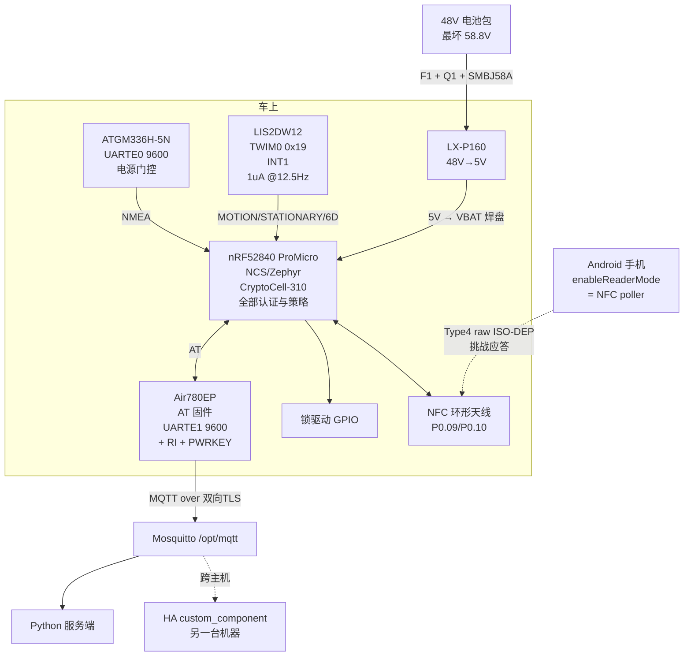
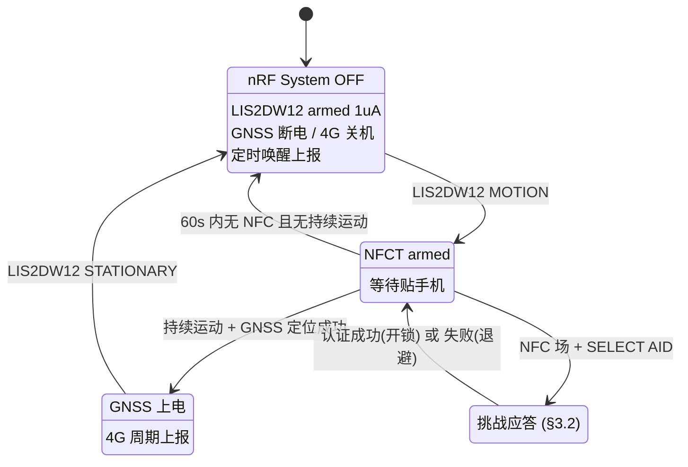

# 架构决策 003：48V 单电压 + 手机 NFC 开锁（去读卡器、去备份电芯）

状态：**已采纳**（§4.3 天线与 §5 功耗需在 R0/R6 实测确认；**§2 的 Android 约束已于
2026-08-31 对照官方文档与 AOSP 源码核实**，§1.2 的 NCS API/Kconfig 同日核实并更正）
日期：2026-08-31
上游：[ADR-001](ADR-001-nrf52840.md)、[ADR-002](ADR-002-power-and-motion.md)

## 本文取代的部分

| 文档 | 章节 | 变化 |
| --- | --- | --- |
| ADR-002 | §2 全部（LM5164 前端） | 换成成品模块 **LX-P160**，28~130V→5V 固定 |
| ADR-002 | §2.4 欠压截止 | **整节作废**，不做欠压保护 |
| ADR-002 | §2.5 TVS 钳位死局 | **解除**，只支持 48V + 130V 耐压 |
| ADR-002 | §3.3 灌 4.0V | 改为灌 **5V** |
| ADR-002 | §3.6 休眠预算 | **重算，尺度完全变了**（见 §5） |
| ADR-002 | §4 备份电芯 | **不做**，后果见 §7 |
| ADR-001 | §0、§2 中 FM17622 部分 | **不装读卡器**，放弃实体卡 |
| ADR-001 | §5.7 充电管理 | 不适用（不从 USB 充电，无电芯） |
| ADR-001 | Q7~Q10 | 重排为 R6~R8，去掉读卡三阶段 |

**ADR-001 §5.1~§5.6、§5.8~§5.10（板子核实、UICR、pinctrl、批次差异、工具链）全部仍然有效。**
**PLAN.md §5 MQTT 契约 / §6 服务端 / §7 HA 集成仍然完全不变**——这是第三次确认这个契约的价值。

## 已定

- 电池范围收窄为 **48V only**（铅酸或 13S 锂）
- 降压 = **LX-P160** 成品模块，28~130V 输入 / 5V 固定输出
- 运动 = **LIS2DW12**，I2C 0x19，TWIM0，INT1 一根中断线
- 开锁 = **手机 NFC 贴一下**，nRF52840 内建 NFCT，Type 4 Tag raw ISO-DEP
- 只支持 **Android**

## 已放弃（都是明确决定，不是遗漏）

- 欠压保护 → §3.6
- 备份电芯 → §7
- FM17622 读卡器与实体卡（NTAG424 / DESFire）→ §7
- iOS

---

## 0. 直接回答：能，不加任何 NFC 芯片

ADR-001 §0 核实过 nRF52840 的 NFCT「只有 NFC-A listen 模式」，产品手册原文
`an implementation of an NFC Forum compliant listening device NFC-A`，
物理原因是它只有 load modulator，**产生不了载波，供不了无源卡的电**。

那一节的结论是「读实体卡必须外挂 IC」。但它同时给出了另一半：

| 场景 | 需要额外芯片？ |
| --- | --- |
| 手机贴上来开锁（手机 = poller，nRF = tag） | **不需要** |
| 用户的实体卡（卡 = 无源，nRF 要供电） | 需要 FM17622 |

**手机开锁用的正是 nRF52840 唯一具备的那个模式。** 本方案只做第一行，所以读卡器整颗省掉。

---

## 1. 链路怎么搭

### 1.1 角色分配

```
Android 手机                          nRF52840
NfcAdapter.enableReaderMode()   ←→    nfc_t4t_lib (raw ISO-DEP)
= NFC reader / poller / PCD           = NFC-A listen / tag / PICC
产生 13.56 MHz 载波                   load modulator 应答
IsoDep.transceive(APDU)               NFC_T4T_EVENT_DATA_IND
                                      → nfc_t4t_response_pdu_send()
```

手机出场、出载波、出时钟，nRF 只做负载调制——**这正好落在硅片能做的那一侧。**

### 1.2 nRF 侧：raw ISO-DEP 而不是 NDEF

`nfc_t4t_lib` 有三种模式，要用第三种（ADR-001 §2.2 已引原文）：

> Use the raw ISO-DEP mode only when you need full control over the APDU exchange and do
> not want the library to emulate an NDEF tag file system.

**[已核实 2026-08-31]** 对照 `sdk-nrfxlib/nfc/include/nfc_t4t_lib.h` 原文，
**原稿这一段的 API 写错了，正确用法比原来更简单**：

> The library support 3 different Modes of Emulation:
> - Raw ISO-Dep exchanges. All PDUs are signaled through the callback.
> - Read-Only T4T NDEF-Tag. …
> - Read-Write T4T NDEF-Tag. …
>
> **The default mode is Raw ISO-Dep mode.** The two other NDEF T4T modes are activated
> through the corresponding `nfc_t4t_ndef_rwpayload_set` / `nfc_t4t_ndef_staticpayload_set`
> functions. The mode is locked in with a call to `nfc_t4t_emulation_start`.

也就是说：

- **头文件里没有 `nfc_t4t_emulation_setup()` 这个函数**，实际入口是
  `int nfc_t4t_setup(nfc_t4t_callback_t callback, void *context)`，**它不带 mode 参数**。
- `NFC_T4T_EMUMODE_PICC`（注释 `Run just ISO-DEP, deliver I-Frames up.`）确实存在于
  `nfc_t4t_emu_mode_t`，但**不是我们要传的参数**，而是库内部/查询用的状态枚举。
- **raw ISO-DEP 是默认模式**——只要**不调用**那两个 `ndef_*payload_set`，
  然后直接 `nfc_t4t_emulation_start()`，拿到的就是 raw ISO-DEP。**我们要的是「什么都不做」。**

流程因此是：

```c
nfc_t4t_setup(t4t_callback, NULL);   /* 默认 = raw ISO-DEP */
nfc_t4t_emulation_start();           /* 锁定模式并开始监听 */
/* 回调里 NFC_T4T_EVENT_DATA_IND 收 C-APDU → nfc_t4t_response_pdu_send() 回 R-APDU */
```

`nfc_t4t_response_pdu_send()` 的原文保证了分片不用我们管：

> The lower ISODEP layer will handle the defragmentation of a long response PDU
> into smalleR pieces that the PCD can understand.

`NFC_T4T_MAX_PAYLOAD_SIZE` = `0xFFF0`，我们的 24 B 应答远在其下。
**这是一条完整的 ISO7816-4 通道，等于 nRF52840 对手机而言就是一张安全元件。**

关键 Kconfig（**已核实，原稿三个符号名有两个是错的**）：

```ini
# NFC —— 核实自 sdk-nrfxlib/nfc/Kconfig 与 sdk-nrf/subsys/nfc/lib/Kconfig
CONFIG_NFC_T4T_NRFXLIB=y      # ← 正确符号名。原稿的 CONFIG_NFC_T4T_LIB 不存在
CONFIG_NFC_PLATFORM=y         # default y if NFC_T2T_NRFXLIB || NFC_T4T_NRFXLIB
                              #   depends on HAS_HW_NRF_NFCT；会 select NRFX_NFCT + CLOCK_CONTROL
CONFIG_NFC_THREAD_CALLBACK=y  # 默认已是 y，见下

# 密码学 —— 核实自 sdk-nrf/samples/crypto/hmac/prj.conf
CONFIG_PSA_CRYPTO=y
CONFIG_PSA_WANT_GENERATE_RANDOM=y
CONFIG_PSA_WANT_ALG_HMAC=y
CONFIG_PSA_WANT_ALG_SHA_256=y
CONFIG_PSA_WANT_KEY_TYPE_HMAC=y   # ← 原稿写的 KEY_TYPE_AES 是错的，HMAC 密钥不是 AES 密钥
CONFIG_PSA_CRYPTO_DRIVER_CC3XX=y  # 存在；nrf_cc3xx 可用时默认就是 y，不必显式写

CONFIG_SETTINGS=y
CONFIG_SETTINGS_NVS=y
```

**原稿的 `CONFIG_NFC_T4T_NFCDEP` 不存在**，凭空造的。
另外 `sdk-nrf/subsys/nfc/t4t/Kconfig` 里那一组 `CONFIG_NFC_T4T_ISODEP` /
`NFC_T4T_APDU` / `NFC_T4T_CC_FILE` / `NFC_T4T_HL_PROCEDURE` 看着很像我们要的，
**但它们是「读卡器侧」的 T4T 上层协议库（配 NFC 轮询设备用），本方案一个都不需要**——
容易踩的坑，记在这里。

⚠ **`CONFIG_NFC_THREAD_CALLBACK` 默认 `y`，对 §3.2 很重要**。原文：

> Use this option to decouple the user NFC callback from the NFC interrupt context.
> When enabled, the user callback is called from a thread (System Workqueue or a
> dedicated thread depending on the `CONFIG_NFC_OWN_THREAD` setting) instead of being
> called from the interrupt context. Using this option ensures robust NFC communication
> (deterministic time of the interrupt handling) and allows deferred callback execution

所以在回调里做 `psa_mac_verify` + `settings_save`（都是可能阻塞的操作）**是允许的**，
因为它跑在工作队列线程而不是中断上下文。如果为省内存关掉这个选项，
**上述两个调用就不能在回调里做了**，必须自己往工作队列丢。**不要关它。**

### 1.3 三个门槛（全部在 ADR-001 已核实，照做即可）

1. **UICR `NFCPINS.PROTECT` 必须是 NFC 态。** ADR-001 §5.3：出厂 Adafruit bootloader
   大概率已锁成 GPIO，要 `nrfjprog --recover` + 重刷 bootloader 恢复 REGOUT0=3V3。
   **单向写入，不先解开后面全卡住。**
2. **pinctrl 里占了 P0.09/P0.10 的默认项要挪走**（ADR-001 §5.4）：
   ZMK 的 `spi1_default` 把 MOSI 分给 P0.10；上游 `promicro_nrf52840-pinctrl.dtsi`
   的 `uart0` TX/RX 正好是这两个脚。
3. **场唤醒**：POWER 章节列了 `The SENSE signal, optionally generated by the NFC module
   to wake-on-field`，代价 +0.10 µA。但见 §2.5——本方案**不用**它。

---

## 2. Android 侧的约束（已核实）

**[已核实 2026-08-31]** 本节原来整节标着「未核实、来自既有知识、web 搜索不可用」。
现已用 `omp` 逐条对照原始来源核实完毕：

| 来源 | 用途 |
| --- | --- |
| `developer.android.com/reference/android/nfc/NfcAdapter` | `enableReaderMode` 与各 FLAG/EXTRA 的官方措辞 |
| `developer.android.com/reference/android/nfc/tech/IsoDep` | `transceive` 线程要求、异常、扩展 APDU |
| AOSP `packages/apps/Nfc/src/com/android/nfc/NfcService.java` | 屏幕状态门控的实际代码 |
| AOSP `.../nfc/ScreenStateHelper.java` | 屏幕状态常量数值 |
| AOSP `.../nfc/ForegroundUtils.java` | 「前台」的判定口径 |

**结论：原稿四条结论全部成立，但理由和边界比原来精确得多，其中两处措辞需要修正。**

### 2.1 手机必须解锁并且 App 在前台 —— 体验上限就在这里

原稿说的「要求一个 resumed 的 Activity」**措辞不准，但结论正确，而且是两道独立的门**：

**门一：前台检查（AOSP 代码级证据）。** `NfcService.setReaderMode()` 里：

```java
if (!privilegedCaller
        && !mForegroundUtils.registerUidToBackgroundCallback(NfcService.this, callingUid)) {
    Log.e(TAG, "setReaderMode: Caller is not in foreground and is not system process.");
    return;
}
```

判定口径不是「resumed Activity」而是 **UID 级的前台性**（`ForegroundUtils.isInForegroundLocked`
回落到 `mActivityManager.getUidImportance(uid) == IMPORTANCE_FOREGROUND`）。
而且**注册的是「转入后台」回调**——App 一进后台，`onUidToBackground()` 就会
`resetReaderModeParams()`，日志原文 `Disabling reader mode because app died or moved to background`。
**reader mode 会被主动撤销，不只是不生效。**

官方文档的措辞也印证：`enableReaderMode` 的一句话摘要是

> Limit the NFC controller to reader mode **while this Activity is in the foreground**.

注意 `setReaderMode` 在这两种失败路径上都是 **`return` 而不是抛异常** —— 
**App 侧不会收到任何错误**，只是永远等不到 `onTagDiscovered`。
（这正是搜到的那批 StackOverflow「enableReaderMode callback not called」帖子的根因。）

**门二：屏幕状态门控（AOSP 代码级证据）。**

```java
// minimum screen state that enables NFC polling
static final int NFC_POLLING_MODE = ScreenStateHelper.SCREEN_STATE_ON_UNLOCKED;
```

`computeDiscoveryParameters(int screenState)` 里 **reader mode 的 techMask
整个包在 `if (screenState >= NFC_POLLING_MODE)` 内部**。
`ScreenStateHelper` 的数值是 `OFF_UNLOCKED=0x01 < OFF_LOCKED=0x02 < ON_LOCKED=0x04 < ON_UNLOCKED=0x08`，
**门槛就是最高的那一档**，所以只有「屏亮 + 已解锁」才轮询。判定用
`PowerManager.isInteractive()` + `KeyguardManager.isKeyguardLocked()`。

**所以「锁屏贴一下就开」做不到**，实际操作确认为：

```
掏手机 → 解锁 → 打开 App → 贴到车上 → 开锁
```

**原稿关于 privileged 路径的猜测被证实了。** 同一个函数里确有锁屏轮询分支：

```java
} else if (screenState == ScreenStateHelper.SCREEN_STATE_ON_LOCKED &&
    mNfcUnlockManager.isLockscreenPollingEnabled()) { ... }
```

但它由 `NfcUnlockManager.addUnlockHandler()` 驱动，是系统内部机制；
`setReaderMode` 的 privileged 白名单硬编码为 `Process.SYSTEM_UID` 或包名等于 `SYSTEM_UI`。
**普通 App 拿不到，不要指望。** 而且注意：**这条锁屏分支走的是普通 tag dispatch，
不是 reader mode**，所以即使拿到也不能用我们的 APDU 通道。

### 2.2 reader mode 的正确参数

```java
nfcAdapter.enableReaderMode(activity, callback,
      NfcAdapter.FLAG_READER_NFC_A               // 0x01，"enables polling for Nfc-A technology"
    | NfcAdapter.FLAG_READER_SKIP_NDEF_CHECK     // 0x80
    | NfcAdapter.FLAG_READER_NO_PLATFORM_SOUNDS, // 0x100
    extras);
```

三个 flag 的常量值和措辞均已核实（均 API 19 起）。**关键是官方文档这一句直接背书了我们的用法**：

> For interacting with tags that are emulated on another Android device using Android's
> host-based card-emulation, the recommended flags are `FLAG_READER_NFC_A` and
> `FLAG_READER_SKIP_NDEF_CHECK`.

HCE 手机和我们的 nRF 在手机 reader 眼里是同一类目标（NFC-A + ISO-DEP，不模拟 NDEF），
**所以这就是官方推荐组合**。

**修正一处**：原稿说不加 `SKIP_NDEF_CHECK` 会「白挨一次 SELECT NDEF AID 的失败往返」——
方向对，但文档给的理由更硬：

> Use `FLAG_READER_SKIP_NDEF_CHECK` to prevent the platform from performing any NDEF
> checks in reader mode. Note that this will prevent the `Ndef` tag technology from being
> enumerated on the tag, and that NDEF-based tag dispatch will not be functional.

即它不止省一次往返，**还会改变 `getTechList()` 的枚举结果**。我们只用 `IsoDep`，无影响。

`FLAG_READER_NO_PLATFORM_SOUNDS` = `prevent the platform from playing sounds when it
discovers a tag`，纯体验项。

**原稿「reader mode 生效期间平台的 tag dispatch 被接管」核实通过**，文档原文：

> In this mode the NFC controller will only act as an NFC tag reader/writer, thus disabling
> any peer-to-peer (Android Beam) and card-emulation modes of the NFC adapter on this device.

代码侧对应 `if (mIsHceCapable && mReaderModeParams == null)` 才开 host routing——
**进 reader mode 就把本机的卡模拟关了**，这对我们无害（我们不做 HCE）。

**新增一条可调项**：`EXTRA_READER_PRESENCE_CHECK_DELAY`（API 19，常量值就是字符串 `"presence"`）
控制平台对已发现 tag 做存在性轮询的间隔，`NfcService` 里 `DEFAULT_PRESENCE_CHECK_DELAY = 125`（ms）。
**这与 §2.3 的 `TagLostException` 直接相关**：存在性检查过于频繁会插入我们的 APDU 交换之间。
R6 阶段如果发现挑战应答被 presence check 打断，**把这个值调大是第一个要试的旋钮**。

**修正原稿一处措辞错误**：原稿写「`onTagDiscovered` 跑在 binder 线程，**可以**阻塞做 I/O；
在主线程调 `transceive` 会抛异常」。后半句不准——`IsoDep.transceive` 的文档原文是：

> This is an I/O operation and will block until complete. **It must not be called from the
> main application thread.** A blocked call will be canceled with `IOException` if `close()`
> is called from another thread.

文档只说「must not」，**并没有承诺会抛异常**（实际是 `NetworkOnMainThreadException` 那类
StrictMode 行为，视版本而异）。结论不变：**在回调线程里同步做完两个往返是正确写法**，
但不要依赖「主线程会抛异常」来发现 bug。

### 2.3 三个必须运行时查询的量（原来是两个）

- **`isoDep.getMaxTransceiveLength()`** —— 官方定义 `the maximum number of bytes that can
  be sent with transceive(byte[])`。我们的 payload ≤64 B（§3.2），任何实现都够，但要查一次别假设。
- **`isoDep.isExtendedLengthApduSupported()`**（API 16）—— **新增，但我们不需要它**。
  文档：标准 APDU 长度字段 1 字节 → 最大 255 payload / 261 总长；扩展 APDU 3 字节 → 65535。
  **§3.2 的报文全在 255 以内，故意如此**——这样连 Nexus S / Galaxy Nexus 那种不支持扩展 APDU
  的老设备也能跑。记在这里是为了将来有人想加长 payload 时知道天花板在哪。
- **`NfcAdapter.isSecureNfcEnabled()`**（**核实为 API 29 = Android 10**，与原稿一致）——
  用户可开的开关。**但原稿「开了之后锁屏状态 NFC 完全不工作」这个描述需要修正。**
  AOSP 里 Secure NFC 的实现是：`setNfcSecure()` 下到 `mDeviceHost`，
  并在 `MSG_RF_FIELD_ACTIVATED` 时 `if (mIsSecureNfcEnabled) sendRequireUnlockIntent();`，
  同时 `mCardEmulationManager.onSecureNfcToggled()` 去刷 AID / T3T 路由表。
  **也就是说 Secure NFC 主要约束的是卡模拟（本机当卡被别人读）那一侧**，
  而我们要的 reader mode 本来就已经被 §2.1 的 `ON_UNLOCKED` 门槛限死了。

  ⚠ **净结论**：Secure NFC 对本方案**大概率无额外影响**（因为我们已经要求解锁），
  但它是免费的一次查询，且 `isSecureNfcSupported()` 为 false 时
  `isSecureNfcEnabled()` **会抛 `UnsupportedOperationException`**（文档明确列出）——
  **所以要么先查 supported，要么 try/catch，不能裸调**。这是原稿没有的一个真实崩溃点。

`TagLostException` 已核实为 `transceive` 的声明异常之一（`if the tag leaves the field`），
另外还有 `IOException`（I/O 失败或被取消）和 **`SecurityException`（`if the tag object is
reused after the tag has left the field`）**。后者是原稿漏掉的：**脱场后不能复用旧 `Tag` 对象，
必须等新的 `onTagDiscovered`**。在手持场景手一抖就脱场是常态，
App 侧必须做重连 + 重新 SELECT 的重试循环，**且每次重试都要用新 Tag 对象**。

**[未核实]** 只剩一项：`NfcAdapter.ReaderCallback.onTagDiscovered()` 的官方参考页
**没有任何关于线程上下文的说明**（整个页面只有方法签名和参数表，一句描述都没有）。
「跑在 binder 线程」这个说法来自既有知识，**文档不支持也不否认**。
实践上不影响写法（反正不能在主线程 transceive，也反正要在回调里同步做完），
R6 阶段打一行 `Thread.currentThread().getName()` 就知道了。

### 2.4 Android 15/16 的新 NFC API 对本方案没用（查过了，别再追）

搜索过程中冒出来 `setObserveModeEnabled()`、`registerNfcEventCallback()`、
`EXTRA_READER_TECH_A_POLLING_LOOP_ANNOTATION` 这几个新 API，看着像能绕开 §2.1 的限制。
**核实结论：一个都不适用，方向正好相反。**

| API | API level | 为什么用不上 |
| --- | --- | --- |
| `EXTRA_READER_TECH_A_POLLING_LOOP_ANNOTATION` | **37** | 让本机 reader 发一个非标准轮询帧，供**对面另一台 Android** 的 `HostApduService.processPollingFrames()` 收。对面是 nRF52840，不是 HCE 手机，收不了也不需要 |
| `setObserveModeEnabled(boolean)` | 35 | 「NFC 硬件监听 reader 但不应答」——这是**本机当卡**时用的，与我们让手机当 reader 相反 |
| `setDiscoveryTechnology(activity, poll, listen)` | 35 | 同样要求 `while this Activity is in the foreground`，**没有放宽前台限制**；文档还明确警告 `it is incompatible with enableReaderMode() API`。**不要混用** |

`isReaderModeAnnotationSupported()`（API 37）只是上面第一项的能力查询。
**§2.1 的两道门（前台 + `ON_UNLOCKED`）到 API 37 为止没有任何官方旁路。**

### 2.5 场唤醒不用，改用运动唤醒 —— 这是本方案的一个关键取舍

ADR-001 §2.3 记了场唤醒的坑：从 System OFF 被场唤醒是**一次复位**
（`As a consequence of a reset, NFCT is disabled`），而且
`If the system is put into System OFF mode while a field is already present, the NFCT
Low Power Field Detect function will wake the system up right away`——手机搁在天线上
会醒/睡死循环。

更要紧的是**时序**：复位 → 重新初始化 NFCT → 才能应答。而手机 reader mode 一旦发现
NFC-A 目标就立即开始 ISO-DEP 激活，nRF 这边还没准备好，**第一次贴必然失败**。

**本方案的决定：NFC 不当唤醒源。**

```
用户走近 → 动一下车（LIS2DW12 SENSOR_TRIG_MOTION）→ nRF 醒 → NFCT 武装
→ 保持 armed 一段时间（比如 60 s）→ 用户贴手机 → 开锁
→ 超时无操作 → 回 System OFF
```

**理由**：开锁这件事天然伴随物理接近和触碰车辆。LIS2DW12 的 MOTION trigger
本来就要为定位做（ADR-002 §1.6），**复用它当 NFC 的前置唤醒是零额外成本**，
而且绕开了「第一次贴失败」和「醒睡死循环」两个坑。

代价：**用户必须先碰一下车再贴手机**。实践上掏手机的动作本身通常已经碰到车了，
但这条要在 R6 用真人试一次。**如果体验不可接受**，退路是牺牲功耗让 NFCT 常驻
System ON（多 3.16 µA，在 §5 的新预算下完全无所谓）——**这条退路很便宜，
不用现在就纠结。**

---

## 3. 安全设计：手机不是可信的，读到 UID 更不是

### 3.1 一条底线

**不要用「手机的 NFC UID」当凭证。** Android 在 card emulation 侧用的是随机 UID，
而在本方案里 nRF 是 tag、手机是 reader，**根本没有「手机的 UID」这个东西可读**。
凭证必须来自 APDU 层的密码学交换。

同样，PLAN.md §3.1 关于 Mifare Classic 的整段论证（UID 明文广播、CRYPTO1 2008 年即被破、
魔术卡可克隆任意 UID）在这里依然是背景知识，但**本方案不涉及任何 Mifare 卡**，
所以那部分只作为「为什么不能用标识符当秘密」的原则保留。

### 3.2 挑战-应答（离线，不需要 4G）

nRF 是被动方，所以挑战由 **nRF 出**，这正是我们要的方向——
攻击者控制手机，不能控制挑战。

```
1. 手机 SELECT AID (自定义 AID，比如 F0 45 42 49 4B 45 01)
   nRF → 9000

2. 手机 → GET CHALLENGE  (00 84 00 00 10)
   nRF: psa_generate_random(nonce, 16)          ← CryptoCell TRNG
        存入 RAM，标记 pending
   nRF → nonce(16) || 9000

3. 手机 → UNLOCK (80 10 00 00 Lc [user_id(4) || counter(4) || mac(16)] 00)
   其中 mac = HMAC-SHA256(secret, nonce || counter || cmd)[0..15]

4. nRF: psa_mac_verify(PSA_ALG_HMAC(PSA_ALG_SHA_256), ...)   ← CryptoCell 硬件
        + 校验 counter > stored_counter（严格递增）
        + 单次 nonce，用完立即失效
        + 恒定时间比较（psa_mac_verify 自带）
   通过 → settings_save 新 counter → 驱动锁 GPIO → 9000
   失败 → 计数 + 指数退避 → 6982 (Security status not satisfied)
```

**报文尺寸**：挑战 16 B，应答 24 B，都远小于任何 `getMaxTransceiveLength()`。
一次贴合两个往返（GET CHALLENGE + UNLOCK），ISO-DEP 下毫秒级。

**为什么是 HMAC-SHA256 而不是 AES-CMAC**：ADR-001 §2.1 核实过 CryptoCell-310
两者都硬件加速。CMAC 原本是为了对话 NTAG424/DESFire 的固定协议（`AuthenticateEV2First`）
才必需的；**本方案没有实体卡，协议是我们自己定的**，HMAC-SHA256 更简单、
Android 侧 `javax.crypto.Mac` 一行就有，不用引任何库。**这是去掉读卡器后白捡的简化。**

### 3.3 密钥存哪

- **nRF 侧**：`settings` 子系统（NVS 后端）存 per-user secret 和 counter。
  ADR-001 §2.1 提到 CryptoCell 有 128 位 `KDR` 设备根密钥，
  Secure LCS 下一次性写入、只写不可读，可以用它派生每用户密钥。
  **[未核实]** KDR 在 nRF52840 上的实际写入流程和 NCS 支持程度，
  R7 阶段再评估；先用 `settings` 里的明文 secret 跑通，量产前再收紧。
- **手机侧**：Android Keystore，`setUserAuthenticationRequired(true)`
  让 secret 的使用绑定到指纹/PIN。这样丢手机不等于丢车钥匙。
- **下发**：在线时（4G 可用）由服务端下发 per-user secret，走 PLAN.md §5 的 MQTT 契约。

### 3.4 防重放与暴力

| 攻击 | 防御 |
| --- | --- |
| 重放旧 UNLOCK 报文 | nonce 单次使用 + counter 严格递增（settings 持久化，跨掉电） |
| 中继/接力（把场转发到远处的手机） | **NFC 的 ~4 cm 作用距离本身就是最强的防御**——这是它相对蓝牙 10~20 m 的核心优势 |
| 暴力试 MAC | 失败计数 + 指数退避，存 settings（跨掉电） |
| 拆开设备读 flash | APPROTECT + 长期看用 KDR。**[未核实]** nRF52840 的 APPROTECT 在
  某些批次有已公开的绕过手法，量产前需要评估；开发阶段不阻塞 |

**NFC 的物理距离限制在这里是安全特性而不是缺陷。** 蓝牙方案要专门做
Proximity Check 防中继（PLAN.md §3.1 提到 DESFire EV3 才有），NFC 白送。

---

## 4. 硬件

### 4.1 前端（48V only，比 ADR-002 简单得多）

```
  PACK+ （48V；铅酸充电器满充最坏持续 58.8V）
    |
   [F1]  保险丝 250~500 mA，**直流耐压 ≥100V**
    |     （贴片件通常只有 32~63V，不能用——ADR-002 §2.8）
    |
   [Q1]  P 沟道 MOSFET 理想二极管 + 栅源齐纳（反接保护）
    |     不要串联肖特基：ADR-002 §2.6 记录的 4µA→60µA 反向漏流失效模式
    |
    +--[D1] TVS SMBJ58A 对 PACK-
    |       58.8V < 最小击穿 64.4V，钳位 93.6V << 模块 130V 耐压。**宽裕。**
    |
   [U1]  LX-P160 模块（28~130V → 5V 固定）
    |
    +-- 5V ──→ 开发板 VBAT 焊盘
```

**只支持 48V 换来的简化**：ADR-002 §2.5 那个「60/72V 包的 TVS 钳位超过 buck 绝对最大值」
的死局**彻底消失**。93.6V 钳位对 130V 耐压有 36V 余量，是三种电池里唯一干净的组合，
而且现在余量比原来配 100V 的 LM5164 时还大。

### 4.2 灌电到开发板

ADR-002 §3.1 的决定性事实不变：**VCC/EXTVCC 是 LDO 输出，不是 MCU 供电**，
nRF52840 吃 VDDH。所以灌 **VBAT 焊盘**（克隆板 J3 从 P0.09 数第 12、13 个焊盘）。

**5V 而不是 ADR-002 说的 4.0V**，因为模块输出固定。VDDH 上限 5.5V
（ADR-002 附录标 `[未核实-原厂]`，Nordic 页面 403，取自多家模组手册一致引用），
**5V 落在窗口内但只剩 0.5V 余量**。

⚠ **R0 必须实测**：廉价 buck 在近无载时输出常有过冲。测「58.8V 输入 + 输出无载」
下的实际输出电压，**超过 5.2V 就要加一级降压或串一只二极管压掉 0.3V**。

克隆板三处改动（ADR-002 §3.4，两条仍然强制、一条变简单）：

1. **拆掉 NBD1，短接 NPQ2 的 3-2 脚。** 让 nRF 无条件从 VBAT 取电，
   并消除坏批次上那条 60µA 的二极管反向漏流路径。**仍然强制。**
2. **拆掉 TP4054（或抬起 pin 3）。** ADR-002 说的是「插 USB 前」，
   现在更硬：VBAT 被顶到 **5V，已高于 TP4054 的 4.2V 浮充阈值**，
   充电 IC 行为不可预期。**没有电芯要充，直接拆掉最干净。**
3. **开机拉低 P0.13 关掉 ME6217 LDO**（100µA 典型，ADR-002 §3.5 更正后的数字）。
   **仍然强制**——除非 LIS2DW12 需要 3.3V 而你不想再加 LDO，
   那就留着但接受这 100µA（在 §5 的新预算下可以接受，见下）。

### 4.3 NFC 天线：本方案唯一的新硬件工作

ADR-001 §5.1 核实了 P0.09/P0.10 在两种板子上都引出了
（正品 nice!nano v2 丝印 `009`/`010`；克隆板 J3 第 1、2 脚），两个焊盘物理相邻。

但同一节也警告：**2.54mm 排针焊盘不是调阻抗的差分对，天线要自己调谐。**

需要做的：

| 项 | 说明 |
| --- | --- |
| 天线 | 13.56 MHz NFC 环形天线。**[未核实]** 现成模块（比如 PN532 板配的那种方形天线）能不能直接用——阻抗和匝数不一定匹配，但值得先试，比自绕快 |
| 调谐 | 两颗串联电容配到 NFCT 输出。Nordic DevZone 有专门的 `NFC tag antenna tuning` 文档 |
| 走线 | 尽量短，差分对称 |
| 安装 | 天线要能被手机贴到——**不能被金属车架或电池包屏蔽**。这是机械设计约束，比电气部分更容易翻车 |

⚠ **这是本方案风险最集中的一处。** 去掉 FM17622 省下了读卡器的驱动、
ISO14443-4 传输层（PLAN.md §3.3 估的「几百行协议状态机」）和 AES-CMAC 手写工作，
**但天线调谐是新增的、需要示波器/网络分析仪的模拟工作**，不能靠读文档解决。

### 4.4 GPIO 预算（大幅宽松）

21 个可用 GPIO（ADR-001 §5.2），NFCT 占掉 P0.09/P0.10：

| 用途 | 数量 |
| --- | --- |
| NFC 天线（P0.09/P0.10 专用） | 2 |
| GNSS UARTE0 | 2 |
| GNSS 电源门控 | 1 |
| Air780EP AT (UARTE1) | 2 |
| Air780EP RI | 1 |
| Air780EP PWRKEY | 1 |
| LIS2DW12 I2C (TWIM0) | 2 |
| LIS2DW12 INT1 | 1 |
| 锁驱动 | 1~3 |
| 锁位置反馈（可选） | 1 |
| **合计** | **14~16 / 21** |

**去掉 FM17622 省了 4 个脚**（SDA/SCL 共用不算省，NPD + IRQ 是净省 2，
加上不再需要为读卡器留余量）。ADR-001 §5.2 担心的「用 3 根驱动锁 + 反馈就零余量」
**消失了，现在有 5~7 个余量。**

TWIM0 上只挂 LIS2DW12 一个器件，**ADR-002 §1.4 担心的「FM17622 地址未核实、
可能与 0x19 冲突」这个未解项一并消失**——总线上没有第二个器件了。

### 4.5 LIS2DW12 接线（ADR-002 §1.4 不变，重列以便照做）

| 引脚 | 接到 |
| --- | --- |
| VDD + VDD_IO | 3.3V |
| CS | **拉高**（强制 I2C 模式，必须） |
| SA0/SDO | **VDD_IO** → 地址 **0x19**。接地会让内部 20.4~54.4kΩ 上拉漏 110~160µA |
| SDA/SCL | TWIM0，需上拉 |
| INT1 | 任意空闲 GPIO，**推挽、高有效** |
| INT2 | 不用 |

**3.3V 从哪来**：模块输出 5V，nRF 吃 VDDH。如果按 §4.2 第 3 条关掉了板上 LDO，
LIS2DW12 就没有 3.3V 可用。两个选择：

- **留着板上 ME6217 LDO 供它**（不拉低 P0.13），代价 100µA 典型
- **另加一颗低 Iq LDO**（比如 TPS62840 那个量级的，或任何 <1µA Iq 的 3.3V LDO）

在 §5 的新预算下**前者完全可以接受**，少一颗料。这是 LX-P160 的 Iq 把整个预算尺度
抬高之后的连带简化。

---

## 5. 功耗预算：重算，而且先要更正 ADR-002 的一处算错

### 5.1 ADR-002 §3.6 的「2.2 %/天」错了 1000 倍

原文：15.5µA @84V = 1.30mW，「对 72V/20Ah（1.44kWh）的包大约 **2.2 %/天**」，标 `[推断]`。

**除数用错了单位。** 1.30mW × 24h = 31.2mWh/天。
31.2mWh ÷ 1.44**kWh** = **0.0022 %/天**，文档除成了 1.44**Wh**。

按电荷独立验算：15.5µA × 24h = 0.372mAh ÷ 20000mAh = **0.0019 %/天**，
即约 **0.7 %/年**。两种算法一致。

**方向上是保守错误**（真实情况比文档写的宽裕 1000 倍），所以不推翻 ADR-002 的任何选型，
**但它彻底改变了「能不能用一颗 Iq 大得多的成品模块」这个判断。**

### 5.2 LX-P160 的 Iq 是未知项，但已经不重要了

48V 系统，铅酸 20Ah = 960Wh（比 ADR-002 假设的 72V/20Ah 小，按这个算）：

| 假设模块无载 Iq | 功率 @48V | 每天 | 占 960Wh |
| --- | --- | --- | --- |
| 10µA（等于 LM5164） | 0.48mW | 11.5mWh | 0.0012 %/天 |
| 100µA | 4.8mW | 115mWh | 0.012 %/天 |
| **1mA**（廉价异步 buck 的现实值） | 48mW | 1.15Wh | **0.12 %/天** |
| 5mA（很差的模块） | 240mW | 5.76Wh | 0.6 %/天 |

**即使模块是 1mA，也只是 0.12%/天——放三个月掉 11%。** 加上 nRF 的 3.16µA
和 LIS2DW12 的 1µA（合计 4.2µA @3.3V ≈ 14µW，**在 mW 尺度下是噪声**）。

**结论：MCU 侧的微安级优化在这个系统里已经完全不是矛盾焦点。**
ADR-002 §1.3「为了 730nA 花 4 个 GPIO 换 ADXL362 是错的」这个判断**更加成立**了。
§4.5 留着 100µA 的板上 LDO 也一样无所谓。

⚠ **但仍然要在 R0 实测**，因为上表最后一行（5mA）会让「停放三个月还能找到车」变成
「掉 54%」。**要测的是：58.8V 输入、输出接 nRF 但让它进 System OFF，测输入电流。**

### 5.3 电解电容漏流：模块特有的隐藏项

板上 2× 22µF/160V + 470µF/35V 铝电解。铝电解漏流规格通常是 `0.01CV` 量级：
470µF/35V 算出来上限 164µA，22µF/160V 是 35µA。

**实际工作电压远低于额定值时会小得多**（输出电容只承受 5V 而非 35V），
但这是个几µA 到几十µA 的不确定项，**已经包含在 §5.2 要实测的那个数里**，
不用单独测。列在这里是为了解释「为什么成品模块的 Iq 不能靠查主控 IC 的手册来推」。

### 5.4 不做欠压保护的功耗侧后果

省掉了 ADR-002 §2.4 那个 16.8MΩ 分压器的 5µA。在 §5.2 的尺度下这是零头，
**所以不做欠压保护在功耗上没有收益**——它的理由纯粹是省事。后果见 §6。

---

## 6. 不做欠压保护：后果与建议的软件兜底

**LX-P160 的自身 UVLO 是 28V，而 48V 系统的控制器保护点是 42V。**
所以车控制器已经停止放电之后，追踪器还会继续抽到 28V。

| 电池 | 后果 |
| --- | --- |
| **48V 铅酸（4×12V）** | 28V ÷ 4 = **7V/块**。铅酸物理底线是 1.75V/cell = 10.5V/块。
  **深放到 7V 会永久损坏电池包**，一次就废 |
| **48V 锂（13S）** | 28V ÷ 13 = **2.15V/cell**，远低于 2.8~3.0V 的 BMS 阈值。
  **BMS 会先锁定**，电池不至于损坏，但用户要拆下来激活 |

按 §5.2 的数字估时间尺度（**[推断]**）：模块 1mA 的话，48V/20Ah 从满充放到 28V
需要**很长时间**（数百天量级），所以这在正常使用中不会发生——
**只在车长期闲置时发生**，而那正是铅酸车最常见的场景（冬天停三个月）。

### 建议的软件兜底（可选，成本 1 GPIO + 1 ADC）

既然不做硬件欠压保护，**至少让固件知道电压并且能自杀**：

```
门控分压器（低边接 GPIO，不常通）+ ADC 读 PACK 电压
  → 低于 44V：停止上报，只保留最低限度心跳
  → 低于 42V：写 settings 记录原因，进 System OFF 永不自醒
              （靠 NFC 场唤醒或人工复位恢复）
```

ADC 脚从 P0.02/P0.29/P0.31 三个里出一个（ADR-001 §5.2：**只有这三个是真 AIN**，
ZMK 的 A6~A10 别名不是 SAADC 通道）。分压器**必须低边门控**——
ADR-002 §5.6 给的表：1M+1M 在 4.2V 下就漏 2.1µA，48V 下更多。

**这条不是必须做的，但它便宜（预算里有 5~7 个 GPIO 余量），
而且是「不做硬件欠压保护」唯一的补救。** 建议至少读电压并上报，
让用户能在 HA 里看到「电池快没了」——**这本身就是个有用的功能，不只是保护。**

---

## 7. 三个被接受的能力缺口

这些是你明确决定的，记录在此以免以后当成 bug 追查。

### 7.1 拔电池 = 追踪器立即静默（无备份电芯）

ADR-002 §4 整节论证过，原文定性是「**这是设计缺陷，不是取舍**」。
不做备份电芯的后果，逐条重述：

- **发不出「电源被移除」告警**
- **发不出最后一个位置**
- **之后完全找不到**——只有上一次定时上报，时效 = 上报间隔

而拔电池是国内电瓶车小偷做的第一件事。ADR-002 引 Teltonika FMB920
（`unplug detection` + 备份电芯）说明商业产品的做法。

**缓解措施（不用电芯，都只是减轻）**：

| 措施 | 效果 |
| --- | --- |
| **缩短 PARKED 上报间隔** | 直接决定「最后已知位置」的时效。5 分钟一次 → 最坏丢 5 分钟的位移 |
| **LIS2DW12 MOTION 立即上报** | 车被搬动时先发一次位置，**不等定时**。这是最有价值的一条，而且已经在做 |
| **6D 方向检测**（ADR-002 §1.6 白送） | 车被放倒/抬进面包车 → 立即上报 |
| 输出电压塌陷检测 | 门控分压器接 GPIO，掉电瞬间中断。**但没有电芯，中断触发后没有电发出去** |

**最后一条是关键的不对称**：没有备份电源，「检测到断电」和「上报断电」之间隔着一个
无法跨越的物理鸿沟。Air780EP 从关机到 MQTT 发出至少要十几秒（附着网络 + TLS + 连接），
**470µF 的输出电容撑不了 1 秒**。

⚠ **如果以后改主意，加一颗 170mAh 电芯 + 两颗 LM66100（各 150nA）就能补上**
（ADR-002 §4 有框图）。届时**必须同时解决 ADR-001 §5.7 的低温充电问题**——
室外锂电 0°C 以下充电会析锂，需要带 NTC 和 GPIO 可控 CE 的充电 IC。
**ADR-002 把 ADR-001 §5.7 整条标成「不适用」时，把备份电芯自己的充电安全需求一起划掉了，
这是个遗留的文档缺口。**

### 7.2 没有实体卡（无 FM17622）

放弃的能力：给家人一张卡、丢手机时的备用凭证、不掏手机开锁。

**代价评估**：如果只有 NFC 一条开锁路径，**手机没电就完全打不开车**。
ADR-001 原方案有三条路径（BLE / 手机 NFC / 实体卡），本方案只剩一条。

**建议保留一条物理退路**：机械钥匙孔，或者一个藏起来的复位/应急触点。
**这是产品设计问题不是电子问题，但不能不想。**

### 7.3 没有蓝牙路径

你明确说不走蓝牙。记录一下这条的连带影响：

- **失去了「远距离预开锁」**（走近就开）。NFC 必须贴合 ~4cm
- **失去了调试便利**：BLE 可以当无线日志/配置通道。**替代方案是 RTT**
  （ADR-001 §2.4 提到两个 UARTE 都占满了，没串口给调试台），
  或者需要时临时启用 BLE
- **好处**：§3.4 的中继攻击防御白送；少一套 GATT 攻击面；少写一套配对/连接管理

nRF52840 的 BLE 是原生的，**以后想加随时能加，不占额外硬件**。
这条决定是纯软件的，可逆。

---

## 8. 系统框图



对比 ADR-001 §4 的框图：**少了 FM17622 和实体卡，少了手机 BLE 那条线，
多了 LX-P160 前端。** 右半边（MQTT → 服务端 → HA）**一个字没变。**

---

## 9. 状态机



**AWAKE 是本方案新增的状态**，因为 NFC 不当唤醒源（§2.5）。
它同时服务两个目的：等手机贴上来，以及判断这次运动是「有人来骑」还是「路过的卡车」。

⚠ **ADR-002 §1.6 有一处内部矛盾需要在 R2 解决**：
§1.6 写 `SENSOR_TRIG_STATIONARY` 走 `int2_sleep_chg`，
但 §1.4 的接线表写「INT2 不用」，§1.7 的 DTS 又是 `int-pin = <1>`。
**如果 stationary 真的只能路由到 INT2，那 RIDING→PARKED 这条边永远不触发。**
R2 阶段要读 Zephyr `drivers/sensor/st/lis2dw12` 源码确认
`CONFIG_LIS2DW12_SLEEP` 往哪个 `CTRL4_INT1_PAD_CTRL`/`CTRL5_INT2_PAD_CTRL` 写。
**退路**：软件计时判静止（丢掉硅片自主判定，但只是多耗一点电）。

---

## 10. 分期实施

替代 ADR-001 §6 的 Q0~Q10。**R3/R4 与原 Q3/Q4 完全相同，契约不变。**

| 阶段 | 内容 | 验收 |
| --- | --- | --- |
| **R0 板子 + 前端实测** | ①J-Link 读 UICR.NFCPINS，锁了就 `--recover` + 重刷 bootloader；②**测 LX-P160：58.8V 输入下的无载输出电压（>5.2V 要处理）和无载输入电流**；③测板子休眠电流判断批次（ADR-001 §5.6：4µA vs 750µA） | UICR=NFC；输出 ≤5.2V；模块 Iq 记录在案；板子休眠 ≤5µA |
| **R1 nRF 基线** | NCS 骨架（`promicro_nrf52840/nrf52840/uf2`），两级 DC/DC 开，**改掉 pinctrl 里占 P0.09/P0.10 的默认项**，拆 NBD1/短接 NPQ2/拆 TP4054，P0.13 决策 | 点灯 + RTT + System OFF 实测 |
| **R2 运动传感器** | LIS2DW12 over TWIM0，MOTION + STATIONARY trigger，**解决 §9 的 INT1/INT2 矛盾**，阈值从 100~200mg + 2~3 ODR 起调 | 拍一下车触发 MOTION；静止后触发 STATIONARY；两者都能从 System OFF 唤醒 |
| **R3 GNSS** | UARTE0 读 ATGM336H，NMEA 解析，`$PCAS03` 裁剪，电源门控 | 定位成功 |
| **R4 4G 上报** | AT 状态机 → MQTT over 双向 TLS（ADR-001 §3，**[推断]** 2000~4000 行 C） | 服务端收到报文 |
| **R5 服务端 + HA** | **与 PLAN.md §5 的 P2/P3 完全相同，契约不变** | 地图上出现车 |
| **R6 NFC 通道** | 天线制作 + 调谐；`nfc_t4t_setup()` + `nfc_t4t_emulation_start()`（默认 raw ISO-DEP，§1.2）；Android App reader mode；**验证 §2 的约束在目标机型 ROM 上成立** | 手机 App 贴一下能收到 SELECT AID 并回 9000；记录 `getMaxTransceiveLength()`、`onTagDiscovered` 所在线程名、`presence check delay` 是否需调大 |
| **R7 NFC 认证** | `psa_generate_random` 挑战 + `psa_mac_verify(HMAC-SHA256)` + settings counter + 退避；Android Keystore | 正确密钥开锁；重放被拒；错误密钥退避 |
| **R8 低功耗整合** | System OFF + AWAKE 超时 + 模组 PRO/PSM+ 双档 + 电池电压上报（§6 兜底） | PARKED 实测达标；整机静态电流记录 |
| **R9 收尾** | AGPS、LBS 降级、告警自动化、文档；机械退路（§7.2） | 冷启动 TTFF ≤10s |

**R0 不能跳**（ADR-001 说过一次，这里两个理由都还在，还多了第三个）：
UICR 单向写入、批次休眠电流差异、**以及模块输出电压可能超 VDDH 上限**。

**去掉的原阶段**：Q6（BLE 通道）、Q7 拆成 R6/R7、Q8~Q10（NFC 读卡三阶段 + ISO14443-4
传输层 + AES-CMAC）**全部删除**。这是本方案最大的工作量节省——
PLAN.md §3.3 估的「几百行协议状态机」和 §3.2 的「Lua 手写 RFC 4493 CMAC」都不用写了，
换来的是 §4.3 的天线调谐。

---

## 11. 净变化总结

**省掉的工作**：

- FM17622 驱动 + ISO14443-4 传输层（RATS/PPS/PCB 块号/I-block 分片/S(WTX)）
- AES-CMAC 实现（HMAC-SHA256 够用，且 Android 侧 `javax.crypto.Mac` 现成）
- BLE GATT + 配对/连接管理
- LM5164 前端设计（EN/UVLO 分压、BST 电容、输入滤波、PGOOD）
- 备份电芯 + ORing + 充电管理 + 低温保护
- 60/72V 的 TVS 死局
- 4 个 GPIO，一整条 I2C 地址冲突未解项

**新增的工作**：

- NFC 天线制作与调谐（**唯一需要模拟仪器的活**，§4.3）
- Android App（reader mode + Keystore + 重试循环）
- 模块输出电压/Iq 的实测确认（§5.2、§4.2）

**接受的缺口**：拔电池即静默、无实体卡、无 BLE、无欠压保护（§6、§7）。

---

## 附：本文未核实项

### 已核实、可从本表移除的项（2026-08-31 用 `omp` 完成）

- ~~§2 全节的 Android 行为~~ → **已核实**，见 §2 开头的来源表。官方 `NfcAdapter` /
  `IsoDep` 参考页 + AOSP `NfcService.java` / `ScreenStateHelper.java` / `ForegroundUtils.java`
  源码。四条结论全部成立；修正了三处措辞（前台判定口径是 UID importance 而非 resumed
  Activity；Secure NFC 主要约束卡模拟侧；`transceive` 文档只说 must not 不承诺抛异常），
  新增两个真实坑（`isSecureNfcEnabled()` 在不支持的设备上抛
  `UnsupportedOperationException`；脱场后复用 `Tag` 对象抛 `SecurityException`）。
- ~~`nfc_t4t_lib` 的 Kconfig 符号名与 `NFC_T4T_EMUMODE_PICC` 枚举名~~ → **已核实**，见 §1.2。
  原稿三个 Kconfig 符号里两个不存在（`NFC_T4T_LIB`、`NFC_T4T_NFCDEP`），正确的是
  `CONFIG_NFC_T4T_NRFXLIB`；且**没有 `nfc_t4t_emulation_setup()` 这个函数**，
  raw ISO-DEP 是 `nfc_t4t_setup()` 的默认模式。

### 仍然未核实

- **[未核实]** `ReaderCallback.onTagDiscovered()` 的线程上下文——**官方参考页对此一字未写**。
  「binder 线程」来自既有知识。不影响写法，R6 打一行 `Thread.currentThread().getName()` 即知。
- **[未核实]** 上述 AOSP 源码取自 `aospapp/aosp` 的 main 分支镜像（`packages/apps/Nfc`），
  不是 googlesource 原站（本次会话能直接 curl 到 raw 文件）。**各厂商 ROM 可能改过
  `NFC_POLLING_MODE` 与锁屏分支**——小米/华为的定制尤其。R6 真机验证仍不可省。
- **[未核实]** LX-P160 的主控 IC 型号（丝印不可辨）、无载 Iq、无载输出电压、
  实际输出电流上限（商品图被裁）。**§5.2 那张表全是假设值，R0 必须实测。**
- **[未核实]** 现成 NFC 天线模块（如 PN532 配的方形天线）能否直接配 nRF52840 NFCT——
  阻抗/匝数不一定匹配。
- **[未核实]** SMBJ58A 参数（ADR-002 已标：经销商参数库，Littelfuse/Vishay 原厂 PDF 403/404）。
- **[未核实]** 48V 铅酸充电器满充 58.8V（ADR-002 标 `[未核实-原厂]`，经销商目录）。
- **[未核实-原厂]** nRF52840 VDDH 上限 5.5V（ADR-002 附录：Nordic 页面 403，
  取自多家模组手册一致引用）。**5V 注入只有 0.5V 余量，这个数字值得再查一次原厂 PDF。**
- **[未核实]** CryptoCell KDR 在 nRF52840 上的写入流程与 NCS 支持程度（§3.3）。
- **[未核实]** nRF52840 APPROTECT 的已知绕过手法对本产品的实际威胁程度（§3.4）。
- **[未核实]** nRF52840 配置了 SENSE 的引脚的额外电流——ADR-002 附录已记：
  **Nordic 根本没公布这个数字**。
- **[待解决-文档内部矛盾]** ADR-002 §1.6 vs §1.4/§1.7 的 INT1/INT2 路由（§9）。
- **[待解决-文档缺口]** ADR-002 把 ADR-001 §5.7 标为「不适用」时，
  把备份电芯自己的低温充电安全需求一起划掉了（§7.1）。若将来加电芯需补回。
- **[推断]** §6 的「模块 1mA 时放到 28V 需要数百天」——按 §5.2 的假设值算的，
  模块 Iq 实测后要重算。
- **[推断]** §5.2 整张表除了「10µA（等于 LM5164）」那行，其余都是假设。

