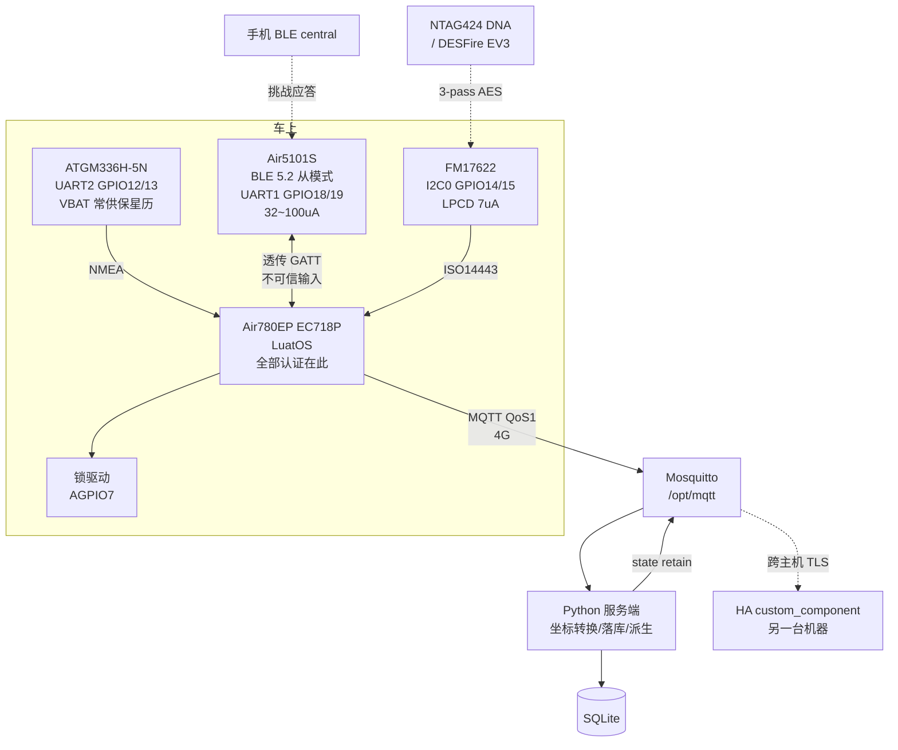

# 电瓶车定位 + NFC/BLE 开锁 项目规划

目录：`/opt/ebike-tracker`
硬件：Air780EP（复用投币器板，**从模组焊盘飞线**）
HA：不在本机，独立主机

> **本文档描述的是 Air780EP 单芯片方案。**
> 架构已改为 nRF52840 做主控、Air780EP 降级为纯 4G 模组：见
> [`ADR-001-nrf52840.md`](ADR-001-nrf52840.md)（**已采纳**）。
> 供电与运动传感器选型见 [`ADR-002-power-and-motion.md`](ADR-002-power-and-motion.md)。
> 最新方案见 [`ADR-003-48v-nfc-only.md`](ADR-003-48v-nfc-only.md)：**48V only + 手机 NFC 开锁**，
> 去掉 FM17622 读卡器、BLE 和备份电芯，并取代 ADR-002 的 §2/§3.3/§3.6/§4。
> **本文档的 §0~§3（引脚/BLE/NFC 选型）已作废**，
> **§5 的 MQTT 契约、§6 服务端、§7 HA 集成完全不变**，仍然是有效的实施依据——
> 三次架构变更之后契约一字未改，当初把它固化在服务端是对的。

---

## 0. 直接答案

### 0.1 最少 GPIO：3 个（定位基线）

飞线之后所有 PAD 都可用，硬件 UART 回来了，`uart.createSoft` 那一整套软件位翻转的
复杂度全部作废。定位功能的最小引脚集：

| 用途 | PAD | GPIO | 模组脚 | 能否省 |
| --- | --- | --- | --- | --- |
| UART2_RXD ← ATGM336H TXD | 27 | 12 | 28 | 不能 |
| UART2_TXD → ATGM336H RXD | 28 | 13 | 29 | 见下 |
| GNSS 电源门控（负载开关使能） | 51 | 26(AGPIO6) | 25 | 不能 |

电池电压不占 GPIO——`adc.CH_VBAT` 是内部通道。信号强度、IMEI 走 `mobile.*`，也不占脚。

`mcu.altfun(mcu.UART, 2, 27, 3, true)` / `(…, 28, 3, false)` 显式设置，或直接用固件默认
（`luat_uart_ec7xx.c` 里 UART2 默认就是 PAD27/28 ALT3，不调 altfun 也对）。

**TX 能不能省？** 技术上能——只读 NMEA 就够定位。但省掉它会丢两个东西：
`$PCAS03` 裁剪语句、以及 **AGPS 注入**。AGPS 是把冷启动 TTFF 从 ≤35 s 压到 ≤10 s 的唯一手段，
而 GNSS 每次多亮 25 s × 25 mA 是这个电池产品最大的一笔浪费。**不要省 TX。**

电源门控更不能省：ATGM336H 连续 <25 mA，而 780EP 自己低功耗模式才 0.38 mA。
GNSS 常开的话，模组省到 0.38 mA 还是 3 µA 完全没有意义。

**所以定位基线 = 3 个 GPIO。** 加上振动唤醒是 4 个（见 §0.2）。

### 0.2 振动唤醒必须占一个 WAKEUP 脚

官方 GPIO 表原文：`系统休眠后外部只能通过WAKEUP管脚或者LPUART串口唤醒`，
`非wakeup的普通GPIO, 是不支持休眠唤醒的`。

虚拟 GPIO 一共 7 个，实际可用 3~4 个：

| 虚拟号 | 名称 | 物理 | 可用性 |
| --- | --- | --- | --- |
| 39 | wakeup0 | 模组脚 101 | **可用** |
| 40 | wakeup1 / VBUS | USB VBUS | 不做 USB 插入检测则可用 |
| 41 | wakeup2 / USIM_DET | — | 不做 SIM 热插拔则可用 |
| 42 | wakeup3 / AGPIOWU0 | GPIO20，PAD45 | **可用** |
| 43 | wakeup4 / AGPIOWU1 | GPIO21，PAD46 | **可用** |
| 44 | wakeup5 / MAIN_DTR | — | 可用 |
| 46 | pwrkey | 开机键 | 开机后可当普通输入 |

WAKEUP 脚是输入专用、2 V 域、驱动能力 <30 µA，**不能被 VDD_EXT 或普通 GPIO 拉**。
接振动传感器要注意这个电气约束。

`pm.dtimerStart` 定时唤醒不占任何 GPIO，是保底路径（id=0/1 最长 2.5 h，id≥2 最长 740 h）。

### 0.3 NFC + BLE 各要多少：4 + 2

| 功能 | 方案 | GPIO 数 | 具体 |
| --- | --- | --- | --- |
| BLE 开锁 | Air5101S over UART1/MAIN | **2** | GPIO18/19（PAD33/34 ALT1） |
| NFC 开锁 | FM17622 over I2C0 | **4** | GPIO14/15（PAD29/30 ALT5）+ NPD + IRQ |
| 锁驱动 | MOSFET/继电器 | **1** | +1 可选位置反馈 |

**全功能总计 11 个 GPIO**（3 定位 + 1 振动 + 2 BLE + 4 NFC + 1 锁）。
Air780EP 有 39 个可复用 GPIO，容量完全不是问题；约束在**外设资源**和**冲突关系**上。

---

## 1. 全功能引脚分配表

单卡（用 SIM2 会额外吃掉 GPIO4/5/6/23，其中 GPIO23 是 AGPIO3，尽量别用双卡）。

| 用途 | PAD | GPIO | 模组脚 | ALT | 属性 | 备注 |
| --- | --- | --- | --- | --- | --- | --- |
| **定位** | | | | | | |
| GNSS ← TXD | 27 | 12 | 28 | 3 | UART2_RXD | 固件默认 |
| GNSS → RXD | 28 | 13 | 29 | 3 | UART2_TXD | 固件默认 |
| GNSS 电源使能 | 51 | 26 | 25 | 0 | **AGPIO6** | 休眠保持电平 |
| 振动传感器 | 45 | 20→虚拟42 | — | — | **wakeup3** | `gpio.setup(42, cb, gpio.PULLUP)` |
| **BLE** | | | | | | |
| Air5101S TXD → | 33 | 18 | 17 | 1 | UART1_RXD | **MAIN_UART，LPUART 可唤醒** |
| Air5101S ← RXD | 34 | 19 | 18 | 1 | UART1_TXD | |
| （可选）5101 WAKEUP | 46 | 21→虚拟43 | — | — | wakeup4 | 5101 主动唤醒主控 |
| **NFC** | | | | | | |
| FM17622 SDA | 29 | 14 | 58 | 5 | I2C0_SDA | 固件默认，需外部上拉 |
| FM17622 SCL | 30 | 15 | 57 | 5 | I2C0_SCL | 固件默认，需外部上拉 |
| FM17622 NPD | 50 | 25 | — | 0 | **AGPIO5** | 休眠保持复位态 |
| FM17622 IRQ | 101 | →虚拟39 | 101 | — | **wakeup0** | LPCD 唤醒主控 |
| **锁** | | | | | | |
| 锁驱动 | 52 | 27 | 16 | 0 | AGPIO7 / PWM4 | 原 NetLed；需 PWM 调压时用软通道 4 |
| （可选）锁位置反馈 | — | 任意普通 GPIO | — | 0 | 输入 | 不需休眠唤醒 |

### 1.1 冲突核对（已逐条查官方复用表）

| 关系 | 结论 |
| --- | --- |
| I2C0(PAD29/30) vs UART2(PAD27/28) | **无冲突**，物理上不同 PAD |
| I2C0(PAD29/30) vs UART1(PAD33/34) | **无冲突** |
| I2C0 vs SPI1 | **冲突**——PAD27~30 同时是 SPI1 的 CS/MOSI/MISO/SCLK。但 UART2 已占 PAD27/28，SPI1 本来就没了，所以 I2C0 是**零增量代价** |
| I2C0 vs UART3 | PAD29/30 的 ALT2 是 UART3_RXD/TXD。用 I2C0 就放弃 UART3-on-PAD29/30；UART3 还能走 PAD40/41(GPIO34/35) |
| SPI0 vs I2C1 | **冲突**，PAD23/24 既是 SPI0_CS/MOSI(ALT1) 又是 I2C1_SDA/SCL(ALT2)。**所以别用 I2C1，用 I2C0** |
| AGPIO 电流预算 | AGPIO3~8 **共享 5 mA 总预算**。这里用了 AGPIO5/6/7 三个，都只做逻辑控制（驱动 MOSFET 栅极/使能脚），不直接带负载，够用。AGPIOWU0/1/3 只有 30 µA |

顺带解决一个文档矛盾：wiki 的 I2C 表写 `I2C1_SCL=GPIO18 PAD13`，同时 MAIN_UART 也写
GPIO18/19，看起来自相矛盾。查官方复用表 PDF 后清楚了——**GPIO18/19 是逻辑 GPIO 索引，
各自出现在两个 PAD 上**：

- PAD13（脚 67，SWCLK1）：ALT2=I2C0_SCL，ALT3=I2C1_SCL，**ALT4=GPIO18**，ALT5=PWM0
- PAD14（脚 66，SWDIO1）：ALT2=I2C0_SDA，ALT3=I2C1_SDA，**ALT4=GPIO19**，ALT5=PWM1
- PAD33（脚 17，MAIN_RXD）：**ALT0=GPIO18**，ALT1=UART1_RXD
- PAD34（脚 18，MAIN_TXD）：**ALT0=GPIO19**，ALT1=UART1_TXD

wiki 的 I2C 行写的是 PAD13/14 的 ALT4 索引，不是 MAIN_UART 那两个 PAD。
`mcu.altfun` 在 CAT1 上按 **PAD 号**索引（文档原话"专用SOC，比如CAT1的，是以PAD号为序号"），
所以按 PAD 写就不会歧义。

### 1.2 一个全局决定：IO 电平必须设 3.3 V

三个外设的要求：

| 器件 | 要求 |
| --- | --- |
| ATGM336H | `Vih ≥ 0.7×Vcc` = 2.31 V（模块手册）/ `VDD_IO×0.8` = 2.64 V（AT6558 手册）。1.8 V 打不动 |
| Air5101S | `Air5101内置LDO...因此，Air5101的全部IO电平固定3.3V`。VBAT 3.3~5.5 V（建议 4 V） |
| FM17622 | `宽电压工作范围 2.5V~3.6V`，但 **host 接口独立供电，PVDD 低至 1.7 V** ——它是唯一能直连 1.8 V 的 |

两个器件强制 3.3 V，所以：**`IO_SEL`(PIN100) 拉低，全局 3.3 V。**
软件兜底 `pm.ioVol(pm.IOVOL_ALL_GPIO, 3300)`（优先级高于硬件 IO_SEL，但开机瞬间仍走硬件配置，
所以硬件拉低更稳）。

**先确认投币器板原有电路是按 1.8 V 还是 3.3 V 设计的。** IO_SEL 是全局的，
抬高会连带影响 USIM 和板上所有 IO。

### 1.3 供电分区（决定"休眠时谁还活着"）

`VDD_EXT` 休眠时会塌陷，且普通 GPIO 在休眠/唤醒过程会甩出**数百毫秒高脉冲**
（官方设计指南建议加 10 K 下拉）。所以：

```
电池 4.2V ──┬── 780EP VBAT
            ├── Air5101S VBAT（3.3~5.5V，直接接，休眠中继续广播）
            ├── LDO 3.3V ──┬── ATGM336H VCC（经 AGPIO26 控制的负载开关）
            │              ├── ATGM336H VBAT（10µA 常供，保星历！）
            │              └── FM17622 VDD（经 AGPIO25/NPD 控制）
            └── 锁驱动 MOSFET
```

三条硬约束：

1. **Air5101S 不能挂 VDD_EXT**——否则 780EP 一休眠 BLE 就死，手机连不上，开锁失效。
2. **ATGM336H 的 VBAT 必须常供**（10 µA），否则每次唤醒都是 ≤35 s 冷启动。
   常见 5 脚淘宝小板只有 VCC/GND/TX/RX/PPS，**没有 VBAT 引出**，买板时务必确认。
3. **关 GNSS 电源前必须先把 UART2_TXD 拉低**。AT6558 §10.6.1 明文：模块 `VDD_IO` 掉电时
   外部必须把接到它输入脚的信号置低，否则电流经 ESD 二极管灌入未上电的模块。顺序错了会持续漏电。

---

## 1.5 GNSS 选型：NEO-7M 能用，但不建议

能用——`libgnss` 是通用 NMEA0183 解析器，NEO-7M 出厂就是 9600 8N1 输出
GGA/GLL/GSA/GSV/RMC/VTG/TXT 纯 NMEA（UBX 输出默认关闭），`libgnss.bind(2)` 直接就能读，
读取路径零改动。UART 电平是 0 V~VCC，VCC=3.3 V 正好对上 §1.2 的决定，不用电平转换。
D_SEL 脚保持悬空/高就是 UART 模式（拉低会切到 SPI）。

但有四个问题，第一个是硬伤。

### 1.5.1 NEO-7M 完全没有北斗，而且 GPS 和 GLONASS 不能同时用

NEO-7 数据手册（UBX-13003830-R07）§1.5 原文：

> u-blox 7 positioning modules are GNSS receivers and can singly receive and track
> GPS, GLONASS, or Galileo signals. QZSS signals may be received concurrently with GPS
> signals.

以及明确的一句：

> GLONASS and GPS signals cannot be received and tracked simultaneously by u-blox 7 modules.

**BeiDou 这个词在整份数据手册里一次都没出现。** Product Summary(UBX-13003342) 的
产品选型矩阵里 `Galileo BeiDou` 那一列，NEO-7M 和 NEO-7N 都是空的。

这不是配置选项也不是固件选项——协议规范 §4.2 的 `gnssId` 枚举在 u-blox 7 上只有
`0=GPS, 1=SBAS, 5=QZSS, 6=GLONASS`，北斗在协议层面就没有编号。

所以在中国，NEO-7M 能用的最好星座组合是 **GPS + SBAS + QZSS**，
而它支持的 SBAS 只有 WAAS/EGNOS/MSAS——**没有一个覆盖中国**。
想用 GLONASS 补？那就得放弃 GPS，而且：

- 导航率从 10 Hz 掉到 **1 Hz**
- 精度从 2.5 m 掉到 **4.0 m**
- **Power Save Mode 在 GLONASS 模式下完全不可用**（数据手册 §1.13.2.2 + 协议规范 §11.2 各说一遍）

ATGM336H 是 BDS+GPS 双模并发。在中国城市峡谷里，可用卫星数的差距是实打实的。

### 1.5.2 NEO-7M 已经 EOL，AGPS 服务也已经停止支持

u-blox 官方产品页横幅：`NEO-7 series is an older generation product`，
NEO-7M 条目原文 `EOL: ... This product is not longer available`（7N、7P 同样 EOL）。
**今天能买到的全是灰色库存或翻新/假货。**

AGPS 更糟。u-blox 7 只会说 legacy `UBX-AID-*`，对应的 AssistNow Online/Offline 服务：

| 日期 | 事件 | 依据 |
| --- | --- | --- |
| 2025-06-03 | **停止发放新 token** | PCN UBXDOC-199822977-208025 |
| **2026-05-31** | End of Maintenance + End of Support | 同上 |
| 2028-05-31 | 所有 token 停用 | 同上 |

今天是 2026-08-31，**EoM/EoS 已经过去了**。而替代服务
（AssistNow Live/Predictive Orbits）的前置条件写得很直白：

> Your design must use a u-blox Series 9 or Series 10 GNSS receiver. Earlier generations
> and third-party receivers are generally not supported.

而且新服务按设备注册要读 `UBX-SEC-UNIQID`——**u-blox 7 的消息集里根本没有这个消息**。
这条路彻底堵死。

唯一还活着的是 legacy `alp.u-blox.com`（AssistNow Offline AlmanacPlus，
无需 token，实测今天仍在服务，提供 `current_{1,2,3,5,7,10,14}d.alp`）。
但它是**仅 GPS** 的差分历书，且要用 `UBX-AID-ALP`(0x0B 0x50) 分块推送
（每块 ≤~700 B 且必须偶数字节），还要从 UBX 流里解 ACK(0x01)/NAK(0x00)——
**收到 NAK 要整个重传，没有重发机制**。预期 TTFF 5~20 s。

### 1.5.3 LuatOS 对 u-blox 是零支持，AGPS 全部要自己写

已核实：整个 LuatOS 仓库（递归 tree 全量搜索）**没有任何 ubx/ublox/u-blox 相关代码**。

`libgnss` 注册的 18 个函数里，17 个是协议无关的 NMEA 取值器，唯一的厂商专用函数就是
`libgnss.casic_aid`——它产出 CASIC 的 `0xBA 0xCE` 帧，**u-blox 收到会直接丢弃**。
`script/libs/` 里唯一的 GNSS 高层库 `exgnss.lua` 头部自己写着
`只能用于合宙内部集成GNSS功能的产品`，用的是 Unicore 的 `$CFG*` 命令。

官方文档的 5 个星历地址全部不是 UBX 格式：

| 地址 | 格式 | 适用 |
| --- | --- | --- |
| `HXXT_GPS_BDS_AGNSS_DATA.dat` / `HXXT_BDS_AGNSS_DATA.dat` | RTCM3.2 | Air510U / Air780EG |
| `CASIC_data.dat` / `CASIC_data_bds.dat` | CASIC 0xBACE | Air530Z / **ATGM336H** |
| `HD_GPS_BDS.hdb` | RTCM | Air780EPVH |

换成 NEO-7M，下面这些要在 Lua 里从零写（ATGM336H 全部现成）：

1. **UBX 帧构造器**：`0xB5 0x62` + class + id + LE u16 长度 + payload + 8-bit Fletcher 校验（CK_A/CK_B）
2. **UBX-AID-INI 打包器**（0x0B 0x01，48 字节 payload）——替代 `libgnss.casic_aid` 那**一个 C 调用**
3. **整套 AGNSS 获取路径**：`alp.u-blox.com` 下载 + `AID-ALP` 分块 + ACK/NAK 解析
   （要用 `libgnss.on("raw", fn)` 自己解 UBX 流，`libgnss` 帮不了）
4. **配置**：波特率和语句开关能用 `$PUBX,41` / `$PUBX,40` 走 ASCII 绕开 UBX，
   但导航率(`CFG-RATE`)、星座(`CFG-GNSS`)、省电(`CFG-PM2`)、热/温/冷复位(`CFG-RST`) 只能用 UBX
5. **每次开机重发全部配置**：NEO-7M 是 ROM 版，**没有 flash**，`CFG-CFG` 保存只能进
   V_BCKP 供电的 BBR。唯一免电池的持久化是**一次性可编程的 eFuse**（烧了不能改）

估计 200~400 行 Lua。ATGM336H 那边对应的是社区库 `luatos-lib-at6558r`
（6.7 KB Lua，现成）加一个 `libgnss.casic_aid()` 调用。

一个附带的好消息：`libgnss` 不会被 UBX 二进制噎住。
`luat_gnss.c` 的解析链是按 `0x0A` 切行 → `minmea_check`（要求 `$` 开头、全可打印、
XOR 校验对）→ `minmea_sentence_id` 白名单比对，不认识的直接 `return -1`，
不改状态不发回调。所以即使误开了 UBX 输出也不会污染定位状态。
**但**：`nmea_tmp_buff` 是 `char[120]`，`[推断]` 循环结束后的
`nmea_tmp_buff[offset]=0` 在 `offset==120` 时会越界写一个字节，
触发条件正是"超过 120 字节且不含 `0x0A` 的连续流"——也就是持续的 UBX 二进制流。
**保持 UBX 输出关闭**（这也是 NEO-7M 的出厂默认）。

### 1.5.4 功耗其实也没赢

| | NEO-7M | ATGM336H-5N |
| --- | --- | --- |
| 连续跟踪 | 17 mA @3 V | <25 mA @3.3 V |
| 捕获 | 22 mA | — |
| **PSM 1 Hz 循环跟踪** | **5 mA @3 V** | 无对应文档值 |
| 峰值 | 67 mA | 100 mA |
| VCC 范围 | **1.65~3.6 V** | 2.7~3.6 V |
| 备电 | V_BCKP 1.4~3.6 V @15 µA | VBAT 1.5~3.6 V @10 µA |
| 跟踪灵敏度 | -161 dBm | -162 dBm |
| 冷启动 TTFF | 30 s | ≤35 s |

NEO-7M 在**连续跟踪**和**PSM**上确实更省（17 vs 25 mA，PSM 5 mA 是有文档的数字，
ATGM336H 没有对应的占空比平均值），峰值也低（67 vs 100 mA），供电范围更宽。

但本项目的省电策略是 **GNSS 整体断电门控**（§1.3），PARKED 时 GNSS 是 0 mA 而不是 5 mA。
在这个架构下 PSM 的优势用不上。而 GLONASS 模式下 PSM 还完全不可用。

### 1.5.5 结论

**保持 ATGM336H-5N。**

`libgnss` 层面 NEO-7M 确实即插即用，但代价是：中国市场丢掉北斗、
器件 EOL 只能买灰色库存、AGPS 服务已过 EoS 且新服务不支持这代硬件、
以及 200~400 行 Lua 去重写 ATGM336H 免费得到的东西。换来的是本架构用不上的 PSM 优势。

**如果你手上已经有 NEO-7M 现货想先验证链路**，那完全可以——
P0/P1 阶段用它跑通 `libgnss.bind` + MQTT 上报完全没问题，读取路径和最终方案一致，
只是不要做 AGPS(P5)，量产再换 ATGM336H。这是合理的分期用法。

**如果一定要 u-blox 血统**，别选 7 代：官方指定的替代型号是 **NEO-M9N** 或 **NEO-F10N**，
两者都支持北斗，也在新 AssistNow 服务的支持范围内。代价是价格和仍然要自己写 UBX 层
（LuatOS 对 u-blox 的零支持跟型号无关）。

---


## 2. BLE 开锁

### 2.1 Air780EP 没有蓝牙，硅片层面就没有

三个独立官方来源：

- 芯片对照选型表（<https://wiki-zh.luatos.org/chips/chips.html>）`ble` 行：
  Air101=1，Air103=1，ESP32C3=1，**Air780EP/Air780EPV=✖**。图例 `✖ 不支持 Not supported`。
  同表 `wifi` 行 Air780EP 也是 ✖。
- 模组页原文：`支持双卡单待, 仅支持4G网络, 不支持 2G/3G/5G, 也不支持Wifi通信`，
  LuatOS 功能列表只有 `基础外设: GPIO/SPI/I2C/PWM/ADC` + 网络功能，无 BT。
- 硬件手册 V1.1 外设接口原文：`3 路串口、1 路 SPI、1 路 I2C、4 路 ADC、4 路 PWM、N 路 GPIO`，
  射频指标只列 LTE 频段。

LuatOS 的三个蓝牙库，Air780EP 一个都不在适配列表里：

| 库 | 适配状态 |
| --- | --- |
| `nimble` | 页面标 `适配状态未知`；demo 注释 `本库当前支持Air101/Air103/ESP32/ESP32C3/ESP32S3`；`api/supported.html` 里 Air780EP 列为 X；`chips/supported.html` 为 ✖ |
| `bluetooth`（总库） | `当前仅支持BLE, 经典蓝牙未实现` |
| `ble` | 核心库索引表：780EPM/780EHM/780EHV/780EGH 全为**否**，只有 Air8000/Air8101 为**是** |

所以只能外挂协处理器。

### 2.2 方案：Air5101S over UART，2 个 GPIO

这是合宙自己给无蓝牙模组的官方答案——Air8000 的 demo readme 原文：
`适用于Air8000D，Air8000DB，Air8000T三款没有内置蓝牙功能的模组`。

- **驱动现成**：`exril_5101` 一等公民扩展库（`script/libs/exril_5101.lua`，v1.7，2026.4.16）。
  自带 ril AT 引擎（`集成了ril AT命令处理模块，无需额外的ril.lua文件`），
  API：`exril_5101.on/mode/set/get/send/disconnect/status/wakeup/config_uart/restart/save/power`
  + `exril_5101.wdt.{init,feed,close,status}`。默认 `UART_ID=1`、9600 bps，
  `exril_5101.config_uart(uart_id, baudrate)` 可改。
  纯 Lua，只碰 `uart.setup/on/write` 和 `sys`，与具体模组无关。
- 官方 demo 在 `module/Air780EPM/demo/ble/peripheral/Air780EPM_Air5101S`。
  Air780EPM 与 Air780EP 同属 EC718P 族。
  **[推断]** 没有 Air780EP 专属 demo，但 `exril_5101.lua` 里没有任何机型相关代码。
- 规格：BLE 5.2，**仅从模式**，10~20 m，MTU 23~512（默认 23）。
  功耗：广播低功耗 32 µA@10 s / 75 µA@1 s，连接低功耗 70 µA@1 s / 100 µA@500 ms，
  常规约 2.2 mA。在 GNSS 的 25 mA 面前是零头。
- 尺寸 6×15.3×2.25 mm。

**接到 UART1/MAIN（GPIO18/19）而不是 UART2**，理由是 MAIN_UART 的 LPUART RX 是
**唯一的串口唤醒路径**——手机一连上来，Air5101S 往 780EP 的 RX 上一发数据就把模组唤醒了，
**零额外引脚**。用 UART2 的话得再花一个 WAKEUP 脚接 Air5101S 的 WAKEUP 输出。

白送的好处：Air5101S 的 SWITCH 脚（pin8）可以接到 780EP 的 `RESET_N` 当**外部硬件看门狗**
（`AT+WDCFG=1,45,1,100`），不占 GPIO。反向 780EP 也能用 RESET 脚（pin9）复位它，互为看门狗。
一个挂在电瓶车上没人管的设备，这个很值。
注意：喂狗要在 AT 模式下，透传模式必须在超时窗口内 `AT+UA` 切回来，否则自己把自己重启了。

### 2.3 安全边界只能在 780EP 上，这条没有商量

**Air5101S 的 AT 指令集里没有 pairing、bonding、passkey、LE Secure Connections、
白名单、链路加密——一条都没有。** 能配的只有 name / MAC / 广播类型 / 广播数据 /
扫描响应 / 发射功率 / MTU / 波特率 / 休眠 / 唤醒 / 看门狗。

而且它的 GATT 是**固定且公开**的：

```
Service  160a1040-d19f-4c6c-b455-e3f700ff0000
Char1    ...01ff0000   NOTIFY | INDICATE
Char2    ...02ff0000   WRITE  | WRITE NO RESPONSE
```

`AdvType=0x03`（可连接广播）下，**任何人都能连上来往 Char2 写东西**。

结论：**BLE 模块是一根哑的无线管道，不是安全边界。** 780EP 必须把从 BLE UART
进来的每一个字节当成攻击者可控的不可信输入。

好消息是 780EP 该有的都有（全部 `已适配 Air780EP`）：
`crypto.trng(len)` 真随机、`crypto.hmac_sha256`、`crypto.cipher_encrypt('AES-128-ECB'/'AES-128-CBC')`、
`gmssl`（SM2/SM3/SM4）、`rsa`、`fskv`（掉电不丢的 KV 存储）、`otp`（不可变密钥，
但蜂窝模组上写 OTP 要在飞行模式下）。

**离线挑战-应答流程**（开锁时不需要网络）：

```
在线时（4G 可用）：服务端下发 per-user 密钥 → 780EP 存入 fskv

开锁时（离线）：
  1. 手机连上 BLE，写入 {user_id, cmd="unlock"}
  2. 780EP: nonce = crypto.trng(16)，notify 出去
  3. 手机: resp = HMAC-SHA256(secret, nonce || counter || cmd)
  4. 780EP: 重算 → 恒定时间比较 → 校验 counter 严格递增（fskv 持久化，防重放）
  5. 通过 → 驱动锁 GPIO；失败 → 计数 + 指数退避锁定
```

一次往返，两个方向都 ≤80 字节，塞得进单个 `AT+BS` 包
（手册：`实际测试AT指令发送数据单次最大 80字节`），透传模式下更宽松（MTU-3，最高 509 B）。

不用 TOTP，因为它依赖 RTC 同步；电瓶车这个场景挑战-应答更稳。

**永远不要把认证挪到 BLE 模块里**——它没有任何密码学原语，也无法自证。

### 2.4 休眠配合

Air5101S 保持在 P1/P3 低功耗（仍可被发现、可连接，32~100 µA），780EP 该睡就睡。
手机一连上，Air5101S 的 UART 输出直接经 MAIN_UART LPUART 唤醒 780EP。

手册警告：`低功耗模式下唤醒（无论是蓝牙自己唤醒起来广播，还是串口、IO 唤醒），
都会重新从 flash 内读取配置信息，所以不要在有低功耗的情况下更改以上配置`。
所以进低功耗前必须 `AT+SAVE` 把配置落盘。

---

## 3. NFC 开锁

### 3.1 先定卡，再定读卡器——这一步决定产品是否有安全性

**Mifare Classic UID 认证是可完整克隆的。** UID 在 ISO14443-3 防冲突阶段就明文广播出去，
在任何认证之前；1K/4K 上只有 4 字节；它是标识符不是秘密。UID 可写的"魔术卡"
加上手机/Proxmark 模拟能逐字节复现任何 UID。**UID 门 = 明文密码门，而且密码对
射程内所有读卡器广播。不要发货。**

**Mifare Classic 的 CRYPTO1 自 2008 年起公开破解。** Radboud 大学 Digital Security 组
（Garcia、de Koning Gans、Verdult 等，ESORICS 2008《Dismantling MIFARE Classic》；
CARDIS 2008《A Practical Attack on the MIFARE Classic》）原文：

> the (48 bit) cryptographic keys to be relatively easily retrieved… we can compute,
> off-line, the secret key within a second. There is no precomputation required, and only
> a small amount of RAM. Moreover, when one has an intercepted a "trace" of the
> communication between a card and a reader, we can compute all the cryptographic keys
> from this single trace, and decrypt it.

Nohl 与 Plötz 在 24C3(2007) 独立逆向。NXP 申请禁令阻止发表，2008-07-18 败诉。
48 位密钥 + 已破算法 + nested/darkside/hardnested 攻击 = **Classic 等同条形码**。

合宙自己的 AirRC522_1000 demo 日志里，扇区尾块是
`000000000000FF078069FFFFFFFFFFFF`——**出厂默认密钥 FFFFFFFFFFFF，等于完全没有安全性。**

**必须用 AES 卡：**

| 卡 | 关键能力 |
| --- | --- |
| **NTAG 424 DNA**（NT4H2421Gx） | AES-128，CC EAL4(HW+SW)，5 个 AES 密钥，3-pass 双向认证，Random ID，ECC 原厂签名。SUN/SDM 用 NIST SP800-38B CMAC，24 位读计数器 |
| **DESFire EV2/EV3**（MF3D(H)x3） | AES-128，**CC EAL5+**，8 字节 CMAC，3-pass 双向认证，每应用 14 密钥 × 16 密钥集可滚动，Transaction MAC，**Proximity Check 防中继攻击**，EV3 还有 Transaction Timer 防 MITM |

**注意 SUN 不能单独用。** NTAG424 数据手册 §9.3 自己就警告：

> As SDM allows free reading of the secured message, i.e. without any up-front reader
> authentication, anybody can read out the message. This means that also a potential
> attacker is able to read out and store one ore multiple messages, and play them at a
> later point in time to the verifier.

电瓶车锁必须用 **3-pass 双向认证**（`AuthenticateEV2First`），设备端出随机挑战，
或者用 DESFire EV2/EV3 加 Proximity Check。

### 3.2 AES 一定跑在 780EP 上

三款读卡器（PN532 / MFRC522 / FM17622）**都只硬件加速已死的 Crypto1**，
DESFire/NTAG424 的 AES、CMAC、会话密钥派生、挑战应答状态机**全部在 780EP 的 Lua 里跑**。

一个必须提前知道的缺口：**LuatOS 的 `crypto` 库没有 CMAC 原语。**
`crypto` 有 `cipher_encrypt/cipher_decrypt`（`AES-128-ECB` / `AES-128-CBC`，
padding 可选 `NONE`）、`trng`、`hmac_sha1/256/512`、`md`，
但 AES-CMAC（RFC 4493 的 K1/K2 子密钥生成、padding、末块 XOR）要自己用
`cipher_encrypt('AES-128-ECB', 'NONE', …)` 在 Lua 里写。这是一笔要预留的工。

### 3.3 读卡器选 FM17622（I2C0，4 个 GPIO）

| | FM17622 | MFRC522 | PN532 |
| --- | --- | --- | --- |
| 待机电流 | **LPCD 7 µA@340ms 扫描周期；深度掉电 50 nA 典型** | 硬掉电 5 mA max | 手册自相矛盾，见下 |
| Host 接口电源 | **独立供电，PVDD 低至 1.7 V** | PVDD 1.6/1.8/3.6 V，但须 ≤VDDD | PVDD 1.6~3.6 V |
| 接口 | I2C 400k/3.4M、SPI 10M、UART 1.2M | SPI/I2C/UART，**上电时按引脚电平自动检测**，红板固定焊死 SPI | SPI/I2C/HSU，由 I0/I1 上电采样决定 |
| ISO14443-4 传输层 | 只到 -3 层 | 只到 -3 层 | **固件内实现 T=CL** |
| LuatOS 驱动 | `olddemo/lib/fm17622.lua`（未文档化，有 bug） | `rc522`（官方，`适配状态未知`）+ 合宙 EC718P 实测 demo | **无** |
| GPIO 数 | 4（SDA/SCL/NPD/IRQ） | 5（CS/SCK/MOSI/MISO/RST），+IRQ=6 | 4（SDA/SCL/IRQ/RSTPD_N） |

**选 FM17622 的决定性理由是待机电流。** 整机低功耗预算是 0.38 mA（或 PSM+ 3 µA），
MFRC522 最好的硬掉电是 5 mA——比整机预算高一个数量级，等于读卡器一开就别想省电。
FM17622 的 LPCD（低功耗卡检测）7 µA 是唯一能"在模组休眠时保持待刷状态"的方案。
而且它 PVDD 能到 1.7 V，本来就不需要动 IO 电平（虽然本项目因为 BLE/GNSS 还是要抬 3.3 V）。

**PN532 不选**，两个原因。一是它的数据手册自己前后矛盾：特性列表说
`Hard-Power-Down mode (1 mA typical)` / `Soft-Power-Down mode (22 mA typical)`，
Table 1 给 IHPD max 2 mA / ISPD max 45 mA，Table 131 给 2 mA / 40~45 mA，
可 §8.4.1 的 LDO 曲线又写 `<20uA` `<7 uA` `<5 uA`。mA 那组几乎肯定是单位笔误，
**但我不会替它下结论——待机电流列为未核实，进电池产品前必须自己实测。**
二是 LuatOS 完全没有 PN532 驱动（整树 grep 无 pn532/pn5180/mfrc630/clrc663，
`api/libs/index.html` 55 个扩展库里 NFC 只有 `rc522` 一个）。
常见 Elechouse V3 红板还标 `On-board level shifter, Standard 5V TTL`，是给 5 V 主机设计的。

**代价要说清楚**：FM17622 和 MFRC522 都只到 ISO14443-3（成帧 + CRC_A），
所以 RATS、可选 PPS、PCB 块号翻转、I-block 分片、S(WTX) 都要在 Lua 里手写。
PN532 靠 `InListPassiveTarget` 的 `fAutomaticRATS` 自动发 RATS，
`InDataExchange` 帮你处理 `Chaining, Waiting time Extension, Error handling`，
C-APDU 最大 261 字节，主机只管投 APDU。**这是几百行协议状态机的差距。**

选 FM17622 是拿"一次性写几百行协议代码"换"7 µA vs 5 mA"。
后者是买不回来的，前者写一次就完了。

一个实际的减负：**FM17622 的寄存器映射就是 MFRC522 的映射**
（`JREG_COMMAND 0x01` … `JREG_VERSION 0x37`，加上 `JREG_EXT_REG_ENTRANCE 0x0F` 的扩展窗口），
所以现有 `rc522.lua` 里每一个寄存器、命令、初始化技巧都能直接搬——
ISO14443-3 那一半驱动等于已经写好了，而且被合宙自己的 AirRC522_1000 demo 在 EC718P 上验证过。

### 3.4 现有 LuatOS NFC 驱动的真实状态

| 库 | 状态 |
| --- | --- |
| `rc522` | 官方在树、有文档，但 `适配状态未知`，且 `api/supported.html` 里根本没这一行。仅 SPI。文档说源码在 `script/libs/rc522.lua`——**该路径已 404**，活的副本在 `olddemo/lib/rc522.lua`(20600 B) 和 `module/Air780EPM/demo/accessory_board/AirRC522_1000/rc522.lua`。硬编码 `Key_A=Key_B=FFFFFFFFFFFF`。用了 `sys.wait()`，所有 API 必须在协程里调 |
| `fm17622` | **未文档化**（wiki 的 `api/libs/index.html` 里完全没有），无适配列表，无 demo，只存在于 `olddemo/lib/fm17622.lua`(33596 B，杨壮壮，2023/11/20)。I2C 地址 0x28，有完整 LPCD 支持。**已知 bug：`setup()` 收 IRQ 参数但函数体忽略它，硬编码 `gpio.debounce(32,200)` + `gpio.setup(32, cb, gpio.PULLDOWN, gpio.FALLING)`**，必须改 |
| 其他 | 没有了。整树无 pn532/pn5180/mfrc630/clrc663/通用 nfc |

`fm17622.lua` 的 IRQ 硬编码是要花时间处理的第一件事，把它改成用传入的引脚号，
并且配成 `gpio.PULLUP` + 落在 wakeup 虚拟脚上。

### 3.5 FM17622 接线要点

- SDA/SCL 走 I2C0 默认映射 PAD29/30（**不需要调 `mcu.altfun`**），`i2c.setup(0, i2c.FAST)`。
  **需要外部上拉**（Air780E/EP 硬件手册：`用作I2C时需外加上拉`）。
  `i2c.setup` 有个 `pullup` 参数（`是否软件上拉, 默认不开启，需要硬件支持`），
  **[未核实]** EC718P 上是否真的接通了内部 1.8k/20k 上拉——按需要外部上拉来设计。
- **NPD 放 AGPIO**（本方案 AGPIO5/GPIO25），让复位态在休眠中保持。
  合宙自己的 RC522 demo 用 GPIO22(PAD47)，也是 AON 保持的。
- **IRQ 必须落在 wakeup 虚拟脚**（本方案 39/wakeup0），否则 LPCD 检测到卡也唤不醒模组。
  睡前先注册：`gpio.setup(39, function() end, gpio.PULLUP)`。
- **FM17622 的 IRQ 脚要配成推挽**（`JREG_LPCDRFTIMER` 0x3C 的 `LPCD_IRQ_PUSHPULL=0x10`），
  不要开漏——WAKEUP 脚只有 <30 µA 的上拉能力，固定 1.8 V 域，开漏拉不动。
- LCSC 料号 C5359847。**[未核实]** 供货周期与 MFRC522 的易得性差距。

---

## 4. 系统架构



服务端不是纯转发，承担五件设备端做不了的事：坐标系转换（`libgnss` 输出 WGS84）、
轨迹持久化（设备端**无缓存无重发**，`mqtt` 文档把"没有重发机制"重复了三遍）、
AGPS 星历缓存分发、状态派生（移动/越界/离线）、以及跟 HA 解耦。

**跨主机 MQTT 如果过公网必须上 TLS(8883)。** 明文 1883 过公网等于把 MQTT 账号、
全部车辆位置、以及开锁相关的遥测公开广播。内网/WireGuard 之间可以明文。

---

## 5. 分期实施

关键原则：**定位先跑通再碰开锁。** 开锁涉及密码学和物理执行机构，
在定位链路（尤其是低功耗和唤醒）没稳定之前引入，会让问题不可归因。

| 阶段 | 内容 | 验收 |
| --- | --- | --- |
| **P0 硬件定型** | 飞线 UART2(脚 28/29) + AGPIO26；`IO_SEL` 拉低；确认投币板原电路电平；选带 VBAT 的 ATGM336H + 有源天线（手上有 NEO-7M 可先代跑，见 §1.5）；拆 GPIO26/27 原 LED | `libgnss.debug(true)` 打出 NMEA；`libgnss.isFix()` 为 true |
| **P1 定位链路** | `libgnss.bind(2)` + `$PCAS03/04` 配置 + MQTT 上报 + `adc.CH_VBAT` + `fskv` 补发队列 | 实车静态 30 min 无丢报；断网 5 min 后补发成功 |
| **P2 契约 + 服务端** | 主题/schema 固化；设备 MQTT 账号 + ACL；aiomqtt→校验→落库→坐标转换→retain 重发布；FastAPI + Bearer | 灌 20 条造的报文，`/track` 正确；`state` retain 生效 |
| **P3 HA 集成** | manifest/config_flow/coordinator/实体，跨主机连 broker | HA 加载无错误，地图上出现车，误差圈可见；重启 HA 立即有位置 |
| **P4 低功耗** | 三态状态机 + `pm.dtimerStart` + 振动唤醒(虚拟 42) + `fskv` 跨唤醒状态 | 万用表实测 PARKED 均值 ≤1 mA；`pm.check()` 返回 true；拍一下车 10 s 内收到 ALARM |
| **P5 AGPS** | 星历下载注入 + `libgnss.casic_aid` | 冷启动 TTFF 从 ≥35 s 降到 ≤10 s；`$GPTXT` 星历数 >0 |
| **P6 BLE 通道** | Air5101S 接 UART1 + `exril_5101` 跑通 + LPUART 唤醒验证 | 手机连上能透传收发；780EP 休眠中被连接唤醒 |
| **P7 BLE 认证** | `crypto.trng` 挑战 + `hmac_sha256` 应答 + `fskv` 计数器防重放 + 失败退避 | 正确密钥开锁；重放旧报文被拒；错误密钥触发退避 |
| **P8 NFC 硬件层** | 修 `fm17622.lua` 的 IRQ 硬编码；I2C0 通信 + `JREG_VERSION==0xA2` + LPCD | 刷卡读到 UID；LPCD 7 µA 实测；休眠中刷卡能唤醒 |
| **P9 NFC 传输层** | ISO14443-4：RATS / PPS / PCB 块号 / I-block 分片 / S(WTX) | 能对 NTAG424 发 APDU 并收到正确响应 |
| **P10 NFC 认证** | Lua 实现 AES-CMAC(RFC 4493) + `AuthenticateEV2First` 3-pass | 正卡开锁；Classic 卡和克隆 UID 被拒 |
| **P11 收尾** | LBS 降级、告警自动化示例、烧录与部署文档 | 拔 GNSS 天线仍出 `src=lbs` 的点且 accuracy 反映粗糙度 |

P6~P7 和 P8~P10 相互独立，可并行。

---

## 6. 待你拍板

1. **投币器板原有电路是 1.8 V 还是 3.3 V 设计？** IO_SEL 是全局的，
   BLE 和 GNSS 都强制要 3.3 V，抬高会连带影响板上所有 IO 和 USIM。这是最优先要确认的。
2. **GNSS 用哪颗**（详见 §1.5）。手上已有 NEO-7M 可以先用它跑通 P0/P1 验证链路，
   但量产建议 ATGM336H——NEO-7M 无北斗、已 EOL、AGPS 服务已过 EoS。
   若坚持 u-blox，换 NEO-M9N / NEO-F10N（官方指定替代，支持北斗）。
3. **ATGM336H 板子有没有 VBAT 引出脚？** 没有就必须把 AGPS(P5) 提到 P1 之后立刻做，
   或者换板。
4. **振动唤醒要不要**（占虚拟 42 一个脚）。不要 → PARKED 只能靠定时唤醒发现异动。
5. **HA 主机与本机的网络关系**：同内网 / WireGuard / 公网？决定 MQTT 要不要上 TLS。
6. **锁的执行机构类型**：电磁铁瞬时脉冲 / 电机正反转 / 舵机？决定是 1 个 GPIO 还是 2~3 个，
   以及要不要 PWM（PWM 软通道只有 0/1/2/4，对应 GPIO1/24/25/27）。
7. **NFC 卡型**：NTAG424 DNA（便宜、贴纸/卡片形态）还是 DESFire EV3（EAL5+、
   有 Proximity Check 防中继）。EV3 更安全但更贵，且都需要在 Lua 里写 AES-CMAC。
8. `lbsLoc2` 官方标注"适配状态未知"，P11 实测；不可用则改服务端调第三方定位 API。

**MQTT ACL** 需要改 `/opt/mqtt/config/mosquitto.conf` 加 `acl_file` 并重启 mosquitto。
这动的是在跑的服务，实施前会先跟你确认。不加 ACL 的话任何一台设备被撬开就能读全部车辆位置。
